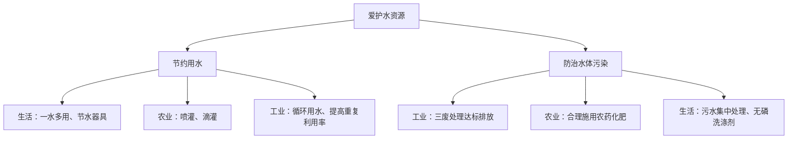

# 课题1 爱护水资源

## 核心概念

| 概念 | 要点 |
|---|---|
| 水资源现状 | 地球表面约71%被水覆盖，但淡水只占全球水储量的2.53%，可利用淡水不足1% |
| 水资源短缺 | 我国水资源总量居世界前列，但人均水量少、分布不均（南多北少、东多西少） |
| 爱护水资源 | 一方面节约用水，另一方面防治水体污染 |

## 知识梳理

海洋是地球上最大的储水库，海水中含有80多种元素，但海水不能直接饮用或灌溉。淡水资源主要来自江河、湖泊、冰川和地下水，其中人类可方便利用的只有江河湖泊水和浅层地下水。

随着人口增长和工农业发展，人类对水的需求量不断增大，同时水体污染加剧了淡水危机，因此爱护水资源人人有责。

## 水体污染的来源与危害

| 污染来源 | 具体表现 |
|---|---|
| 工业污染 | 废水、废渣、废气（"三废"）未经处理任意排放 |
| 农业污染 | 农药、化肥的不合理施用，随雨水流入水体 |
| 生活污染 | 生活污水任意排放、含磷洗涤剂的大量使用 |

危害：影响水生动植物生长、破坏生态平衡、危害人体健康；水中氮磷过多引起水体富营养化，出现"水华"（淡水）和"赤潮"（海水）。

## 防治水体污染的措施

- 工业上：应用新技术新工艺减少污染物产生，污水处理达标后排放。
- 农业上：合理施用农药和化肥，提倡使用农家肥。
- 生活中：生活污水集中处理后排放，使用无磷洗涤剂。

## 节约用水的途径

- 生活中：随手关水龙头、一水多用（淘米水浇花、洗衣水冲厕所）、使用节水器具。
- 农业上：改大水漫灌为喷灌、滴灌。
- 工业上：提高水的重复利用率，循环用水。
- 节水标志：由水滴、手掌和地球变形而成，表示节约每一滴水。

## 图解：爱护水资源两大途径

## 对比分析

| 项目 | 节约用水 | 防治污染 |
|---|---|---|
| 目的 | 减少水的消耗量 | 保证水的质量 |
| 典型做法 | 一水多用、喷灌滴灌 | 污水达标排放、禁用含磷洗涤剂 |

## 背记要点

1. 地球上淡水约占全球水储量的2.53%，可利用淡水不足1%。
2. 我国人均水量少，水资源分布南多北少。
3. 水体污染三大来源：工业、农业、生活。
4. 水体富营养化的原因：含氮、磷的污水大量排入水体。
5. 爱护水资源两大措施：节约用水 + 防治水体污染。

## 自测题

1. 水体污染的主要来源有哪三个方面？各举一例。
2. 为什么提倡使用无磷洗涤剂？
3. 举出三种生活中节约用水的具体做法。

## 相关知识点

[[课题2 水的净化]] [[课题3 水的组成]] [[课题1 空气]]
