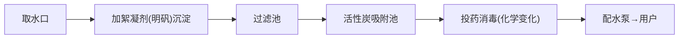

# 课题2 水的净化

## 核心概念

| 净化方法 | 作用 | 能否降低硬度 |
|---|---|---|
| 静置沉淀 | 除去大颗粒不溶性杂质 | 否 |
| 吸附沉淀（加明矾） | 明矾溶于水形成胶状物，吸附悬浮杂质使其沉降 | 否 |
| 过滤 | 除去不溶性杂质 | 否 |
| 吸附（活性炭） | 除去色素和异味（物理变化） | 否 |
| 蒸馏 | 除去可溶性杂质，净化程度最高 | 能 |

## 知识梳理

自来水厂净水过程：取水→加絮凝剂（明矾）沉淀→过滤→活性炭吸附→投药消毒（化学变化）→配水。净化后的自来水仍是混合物。

净化程度由低到高：静置沉淀 < 吸附沉淀 < 过滤 < 蒸馏。蒸馏得到的蒸馏水可视为纯净物。

## 图解：自来水厂净水流程

## 实验要点：过滤

操作要点"一贴二低三靠"：

- 一贴：滤纸紧贴漏斗内壁（用水润湿，赶走气泡）。
- 二低：滤纸边缘低于漏斗边缘；液面低于滤纸边缘。
- 三靠：烧杯口紧靠玻璃棒；玻璃棒下端斜靠三层滤纸处；漏斗下端紧靠烧杯内壁。
- 玻璃棒的作用：引流。
- 过滤后滤液仍浑浊的可能原因：滤纸破损、液面高于滤纸边缘、仪器不干净。处理办法：重新过滤。

## 图解：过滤装置（一贴二低三靠）

<svg viewBox="0 0 560 280" xmlns="http://www.w3.org/2000/svg" style="max-width:560px;width:100%;font-family:sans-serif">
  <path d="M180 40 L260 40 L220 110 Z" fill="#f8fafc" stroke="#334155" stroke-width="2"/>
  <path d="M190 44 L250 44 L220 100 Z" fill="#e0f2fe" stroke="#0284c7"/>
  <line x1="220" y1="110" x2="220" y2="160" stroke="#334155" stroke-width="4"/>
  <path d="M170 160 H280 V240 H170 Z" fill="none" stroke="#334155" stroke-width="2"/>
  <rect x="172" y="205" width="106" height="33" fill="#bae6fd"/>
  <line x1="270" y1="20" x2="245 " y2="38" stroke="#64748b" stroke-width="1.2"/>
  <rect x="230" y="0" width="8" height="46" transform="rotate(35 234 23)" fill="#94a3b8"/>
  <text x="290" y="24" font-size="13" fill="#0f172a">玻璃棒引流（靠三层滤纸处）</text>
  <line x1="252" y1="46" x2="330" y2="66" stroke="#64748b" stroke-width="1.2"/>
  <text x="336" y="70" font-size="13" fill="#0f172a">滤纸边缘低于漏斗边缘</text>
  <line x1="222" y1="150" x2="330" y2="130" stroke="#64748b" stroke-width="1.2"/>
  <text x="336" y="134" font-size="13" fill="#0f172a">漏斗下端紧靠烧杯内壁</text>
  <text x="225" y="270" text-anchor="middle" font-size="12" fill="#475569">一贴：滤纸紧贴漏斗内壁（润湿赶气泡）</text>
</svg>

## 硬水与软水

| 项目 | 硬水 | 软水 |
|---|---|---|
| 定义 | 含有较多可溶性钙、镁化合物的水 | 不含或含较少可溶性钙、镁化合物的水 |
| 鉴别（加肥皂水） | 泡沫少、浮渣多 | 泡沫多、浮渣少 |
| 危害 | 锅炉结水垢（浪费燃料、可能爆炸）、洗衣浪费肥皂 | — |

硬水软化的方法：生活中煮沸（水壶中水垢的成因）；实验室蒸馏。

## 实验要点：蒸馏

- 蒸馏烧瓶中加几粒沸石（碎瓷片），防止暴沸。
- 温度计水银球位于支管口处。
- 冷凝水从下口进、上口出（逆流冷凝效果好）。
- 弃去开始馏出的部分液体。

## 背记要点

1. 净化程度最高的方法是蒸馏；单一操作中除杂能力最强。
2. 活性炭疏松多孔，具有吸附性，除色除味是物理变化。
3. 过滤"一贴二低三靠"，玻璃棒引流。
4. 鉴别硬水软水用肥皂水；生活中软化硬水用煮沸。
5. 明矾净水是吸附沉淀；杀菌消毒（如加氯）是化学变化。

## 自测题

1. 过滤操作中玻璃棒的作用是什么？过滤后滤液仍浑浊的原因可能有哪些？
2. 如何鉴别一瓶水是硬水还是软水？
3. 自来水厂净水过程中哪一步属于化学变化？

## 相关知识点

[[课题1 爱护水资源]] [[课题3 水的组成]] [[课题3 走进化学实验室]] [[课题1 金刚石、石墨和C60]]
