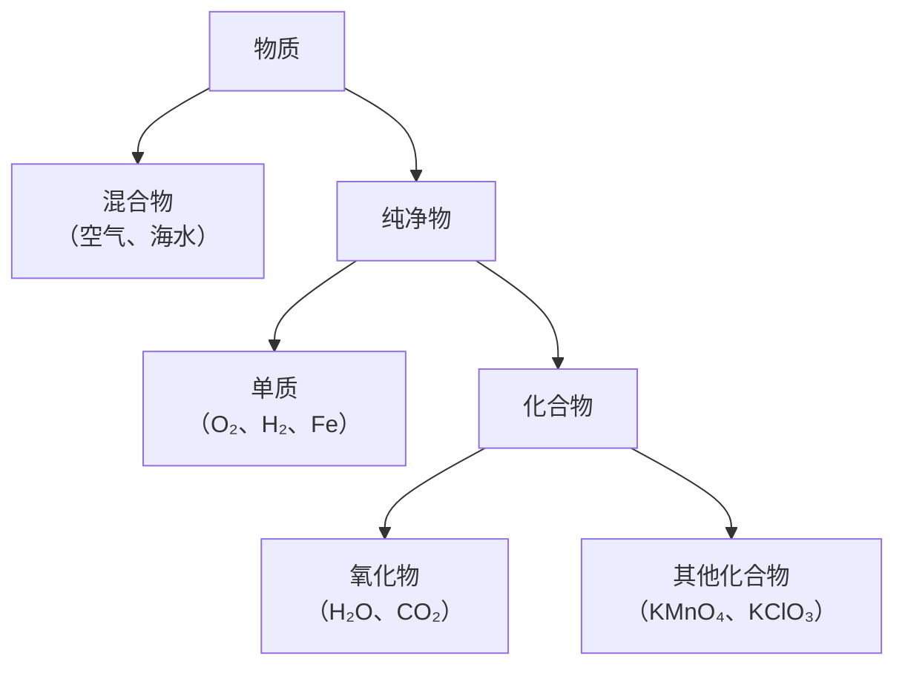

# 课题3 水的组成

## 核心概念

| 概念 | 定义 | 举例 |
|---|---|---|
| 单质 | 由同种元素组成的纯净物 | O₂、H₂、Fe、C |
| 化合物 | 由不同种元素组成的纯净物 | H₂O、CO₂、KMnO₄ |
| 氧化物 | 由两种元素组成、其中一种是氧元素的化合物 | H₂O、CO₂、Fe₃O₄ |

## 氢气的性质

- 物理性质：无色无味气体，密度比空气小（相同条件下密度最小的气体），难溶于水。
- 化学性质：可燃性。纯净的氢气在空气中安静燃烧，产生淡蓝色火焰，罩在火焰上方的干冷烧杯内壁出现水雾。

$$
2H_2 + O_2 \xrightarrow{点燃} 2H_2O
$$

- 验纯：点燃前必须检验纯度。收集一试管氢气，拇指堵住管口移近火焰，发出尖锐爆鸣声表示不纯，声音很小则较纯。
- 氢气与空气（氧气）混合点燃可能爆炸，爆炸极限为体积分数4%~74.2%。

## 实验要点:电解水实验

- 水中加少量氢氧化钠或稀硫酸：增强导电性。
- 现象：两电极上都有气泡产生，与电源正极相连的玻璃管内气体体积小，负极相连的体积大，体积比约为1:2（"正氧负氢、氢二氧一"）。
- 检验：正极气体使带火星木条复燃（氧气）；负极气体被点燃产生淡蓝色火焰（氢气）。

$$
2H_2O \xrightarrow{通电} 2H_2\uparrow + O_2\uparrow
$$

- 结论：水是由氢元素和氧元素组成的；化学变化中分子可分而原子不可分。

## 图解：电解水实验装置

<svg viewBox="0 0 560 280" xmlns="http://www.w3.org/2000/svg" style="max-width:560px;width:100%;font-family:sans-serif">
  <rect x="120" y="150" width="240" height="90" rx="8" fill="#bfdbfe" stroke="#2563eb" stroke-width="2"/>
  <rect x="160" y="40" width="40" height="140" fill="#dbeafe" stroke="#334155" stroke-width="2"/>
  <rect x="160" y="60" width="40" height="120" fill="#93c5fd"/>
  <rect x="280" y="40" width="40" height="140" fill="#dbeafe" stroke="#334155" stroke-width="2"/>
  <rect x="280" y="100" width="40" height="80" fill="#93c5fd"/>
  <rect x="160" y="40" width="40" height="20" fill="#f0f9ff"/>
  <rect x="280" y="40" width="40" height="60" fill="#f0f9ff"/>
  <line x1="180" y1="240" x2="180" y2="258" stroke="#334155" stroke-width="2"/>
  <line x1="300" y1="240" x2="300" y2="258" stroke="#334155" stroke-width="2"/>
  <text x="180" y="274" text-anchor="middle" font-size="14" fill="#b91c1c">正极 O₂（体积1）</text>
  <text x="300" y="274" text-anchor="middle" font-size="14" fill="#1e40af">负极 H₂（体积2）</text>
  <line x1="202" y1="50" x2="400" y2="46" stroke="#64748b" stroke-width="1.2"/>
  <text x="406" y="50" font-size="13" fill="#0f172a">气体少：带火星木条复燃</text>
  <line x1="322" y1="70" x2="400" y2="90" stroke="#64748b" stroke-width="1.2"/>
  <text x="406" y="94" font-size="13" fill="#0f172a">气体多：点燃有淡蓝色火焰</text>
  <text x="240" y="216" text-anchor="middle" font-size="12" fill="#1e3a8a">水中加少量NaOH或稀硫酸增强导电性</text>
  <text x="240" y="30" text-anchor="middle" font-size="13" fill="#b45309">口诀：正氧负氢、氢二氧一</text>
</svg>

## 知识梳理

电解水实验说明水由氢、氧两种元素组成——依据是化学反应前后元素种类不变，生成物中有氢元素和氧元素，则反应物水中必含氢、氧元素。

实际实验中氧气与氢气体积比略小于1:2，原因是氧气比氢气在水中溶解得稍多，且氧气可能与电极发生反应。

## 图解：物质分类体系

## 物质的简单分类

| 分类 | 判断要点 |
|---|---|
| 混合物 | 多种物质，如空气、自来水 |
| 纯净物→单质 | 一种物质、一种元素，如O₂ |
| 纯净物→化合物→氧化物 | 两种元素、含氧，如H₂O |

注意：由同种元素组成的物质不一定是单质（如O₂和O₃的混合物）；含氧的化合物不一定是氧化物（如KMnO₄含三种元素）。

## 背记要点

1. 电解水"正氧负氢、氢二氧一"（体积比）。
2. 水由氢元素和氧元素组成；水是氧化物、化合物、纯净物。
3. 氢气是密度最小的气体，点燃前必须验纯。
4. 氢气燃烧淡蓝色火焰，产物只有水，是最清洁的燃料。
5. 单质与化合物的前提都是纯净物。

## 自测题

1. 电解水时正、负极产生的气体分别是什么？体积比是多少？如何检验？
2. 电解水实验能得出水的组成的依据是什么定律（规律）？
3. 将H₂O、O₂、KMnO₄、海水按混合物、单质、化合物、氧化物分类。

## 相关知识点

[[课题1 分子和原子]] [[课题3 元素]] [[课题4 化学式与化合价]] [[课题2 水的净化]] [[课题2 燃料的合理利用与开发]]
