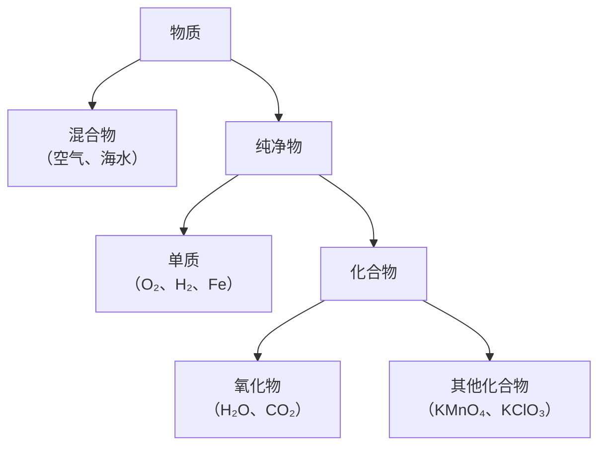

# 课题3 水的组成

## 核心概念

| 概念 | 定义 | 举例 |
|---|---|---|
| 单质 | 同种元素组成的纯净物 | O₂、H₂、Fe |
| 化合物 | 不同种元素组成的纯净物 | H₂O、CO₂、KMnO₄ |
| 氧化物 | 两种元素、其一为氧的化合物 | H₂O、CO₂、Fe₃O₄ |

## 氢气的性质

- 物理：无色无味，密度最小的气体，难溶于水。
- 化学：可燃性，纯氢安静燃烧、淡蓝色火焰，火焰上方干冷烧杯内壁出现水雾。
- 点燃前必须验纯：试管口移近火焰，尖锐爆鸣声表示不纯。与空气混合点燃可能爆炸（爆炸极限4%~74.2%）。

$$
2H_2 + O_2 \xrightarrow{点燃} 2H_2O
$$

## 实验要点:电解水实验

- 加少量NaOH或稀硫酸增强导电性。
- 现象：正极气体体积小、负极大，体积比约1:2（"正氧负氢、氢二氧一"）。
- 检验：正极气体使带火星木条复燃（O₂）；负极气体点燃有淡蓝色火焰（H₂）。
- 结论：水由氢、氧元素组成（依据反应前后元素种类不变）；化学变化中分子可分、原子不可分。
- 实际O₂:H₂略小于1:2：氧气溶解稍多且可能与电极反应。

$$
2H_2O \xrightarrow{通电} 2H_2\uparrow + O_2\uparrow
$$

## 图解：电解水实验装置

<svg viewBox="0 0 560 280" xmlns="http://www.w3.org/2000/svg" style="max-width:560px;width:100%;font-family:sans-serif">
  <rect x="120" y="150" width="240" height="90" rx="8" fill="#bfdbfe" stroke="#2563eb" stroke-width="2"/>
  <rect x="160" y="40" width="40" height="140" fill="#dbeafe" stroke="#334155" stroke-width="2"/>
  <rect x="160" y="60" width="40" height="120" fill="#93c5fd"/>
  <rect x="280" y="40" width="40" height="140" fill="#dbeafe" stroke="#334155" stroke-width="2"/>
  <rect x="280" y="100" width="40" height="80" fill="#93c5fd"/>
  <rect x="160" y="40" width="40" height="20" fill="#f0f9ff"/>
  <rect x="280" y="40" width="40" height="60" fill="#f0f9ff"/>
  <line x1="180" y1="240" x2="180" y2="258" stroke="#334155" stroke-width="2"/>
  <line x1="300" y1="240" x2="300" y2="258" stroke="#334155" stroke-width="2"/>
  <text x="180" y="274" text-anchor="middle" font-size="14" fill="#b91c1c">正极 O₂（体积1）</text>
  <text x="300" y="274" text-anchor="middle" font-size="14" fill="#1e40af">负极 H₂（体积2）</text>
  <line x1="202" y1="50" x2="400" y2="46" stroke="#64748b" stroke-width="1.2"/>
  <text x="406" y="50" font-size="13" fill="#0f172a">气体少：带火星木条复燃</text>
  <line x1="322" y1="70" x2="400" y2="90" stroke="#64748b" stroke-width="1.2"/>
  <text x="406" y="94" font-size="13" fill="#0f172a">气体多：点燃有淡蓝色火焰</text>
  <text x="240" y="216" text-anchor="middle" font-size="12" fill="#1e3a8a">水中加少量NaOH或稀硫酸增强导电性</text>
  <text x="240" y="30" text-anchor="middle" font-size="13" fill="#b45309">口诀：正氧负氢、氢二氧一</text>
</svg>

## 图解：物质分类体系

注意：同种元素组成的物质不一定是单质（如O₂与O₃混合物）；含氧化合物不一定是氧化物（如KMnO₄含三种元素）。

## 背记要点

1. 电解水"正氧负氢、氢二氧一"（体积比）。
2. 水由氢、氧元素组成；水是氧化物、化合物、纯净物。
3. 氢气密度最小，点燃前必须验纯；燃烧淡蓝色火焰，产物只有水，最清洁燃料。
4. 单质与化合物的前提都是纯净物。

## 自测题

1. 电解水时正、负极气体各是什么？体积比多少？如何检验？
2. 将H₂O、O₂、KMnO₄、海水按混合物、单质、化合物、氧化物分类。

## 相关知识点

[[课题1 分子和原子]] [[课题3 元素]] [[课题4 化学式与化合价]] [[课题2 水的净化]] [[课题2 燃料的合理利用与开发]]
