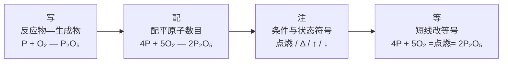

# 课题2 如何正确书写化学方程式

## 核心概念

| 概念 | 内容 |
|---|---|
| 化学方程式 | 用化学式表示化学反应的式子 |
| 书写两原则 | 以客观事实为基础，不能臆造事实上不存在的物质和反应；遵守质量守恒定律，等号两边各原子种类与数目必须相等 |

## 书写步骤（以磷燃烧为例）

1. 写：根据事实写出反应物和生成物的化学式，中间连短线。P + O₂ — P₂O₅
2. 配：配平，使两边每种原子数目相等。4P + 5O₂ — 2P₂O₅
3. 注：注明反应条件（点燃、加热Δ、催化剂、通电等）和生成物状态（↑、↓）。
4. 等：把短线改为等号。

$$
4P + 5O_2 \xrightarrow{点燃} 2P_2O_5
$$

## 图解：书写化学方程式四步法

## 配平方法

- 最小公倍数法：找出两边出现次数多、原子数相差大的元素，求最小公倍数确定化学计量数。如配平铁与氧气反应，先看氧：2和4的最小公倍数配平Fe₃O₄中氧。
- 观察法：从组成最复杂的化学式入手，推出其他物质的化学计量数。
- 奇数配偶法：选择两边出现次数较多且原子总数一奇一偶的元素，先把奇数配成偶数。
- 化学计量数必须是最简整数比，配平后要检查。

## "↑"与"↓"的使用规则

| 符号 | 使用条件 | 不使用的情况 |
|---|---|---|
| ↑ | 反应物中无气体，生成物是气体 | 反应物中已有气体（如CO燃烧生成CO₂不标↑） |
| ↓ | 溶液中反应生成不溶性固体 | 反应物中已有固体 |

## 常错示例分析

| 错误写法 | 错误原因 |
|---|---|
| 2P + 5O → P₂O₅ | 臆造化学式，氧气应写O₂ |
| P₂ + O₅ = P₂O₅ | 违背客观事实臆造反应物 |
| 4P + 5O₂ = 2P₂O₅（无条件） | 漏写反应条件"点燃" |
| H₂O 通电 H₂ + O₂ | 未配平且漏写"↑" |

## 必背方程式自查（本册重点）

$$
2KMnO_4 \xrightarrow{\Delta} K_2MnO_4 + MnO_2 + O_2\uparrow
$$

$$
2H_2O_2 \xrightarrow{MnO_2} 2H_2O + O_2\uparrow
$$

$$
3Fe + 2O_2 \xrightarrow{点燃} Fe_3O_4
$$

$$
2H_2O \xrightarrow{通电} 2H_2\uparrow + O_2\uparrow
$$

## 背记要点

1. 两原则：尊重客观事实、遵守质量守恒定律。
2. 四步骤：写、配、注、等。
3. 配平只能改化学计量数，绝不能改化学式右下角的数字。
4. 条件写在等号上方；↑↓按"反应物中没有才标"的规则使用。
5. 检查三项：化学式是否正确、是否配平、条件和状态符号是否齐全。

## 自测题

1. 用最小公倍数法配平：Al + O₂ — Al₂O₃。
2. 指出错误并改正：Mg + O₂ = MgO₂。
3. 写出实验室加热高锰酸钾制氧气的化学方程式，并说明每个符号的含义。

## 相关知识点

[[课题1 质量守恒定律]] [[课题3 利用化学方程式的简单计算]] [[课题4 化学式与化合价]] [[课题3 制取氧气]]
