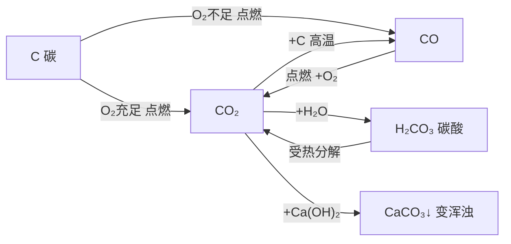

# 课题3 二氧化碳和一氧化碳

## 二氧化碳的性质

物理性质：无色无味，密度比空气大，能溶于水；固态CO₂叫干冰，升华吸热。

化学性质：不燃烧、不支持燃烧、不供呼吸（久未开启菜窖先做灯火试验）；与水反应生成碳酸（使紫色石蕊变红，碳酸不稳定受热分解）；与澄清石灰水反应（检验CO₂）。

$$
CO_2 + H_2O = H_2CO_3 \qquad H_2CO_3 = H_2O + CO_2\uparrow \qquad CO_2 + Ca(OH)_2 = CaCO_3\downarrow + H_2O
$$

## 实验要点

- 倾倒CO₂：阶梯蜡烛下层先熄、上层后熄——密度大且不燃不助燃。
- 塑料瓶变瘪：满CO₂瓶加水振荡变瘪——能溶于水。
- 石蕊变红的是碳酸，不是CO₂本身也不是水（四朵纸花对比）。

## 图解：倾倒CO₂实验（阶梯蜡烛）

<svg viewBox="0 0 560 250" xmlns="http://www.w3.org/2000/svg" style="max-width:560px;width:100%;font-family:sans-serif">
  <g transform="rotate(-30 130 80)">
    <path d="M100 60 Q90 60 90 75 V110 Q90 122 104 122 H156 Q170 122 170 110 V75 Q170 60 160 60 Z" fill="#f0f9ff" stroke="#334155" stroke-width="2"/>
  </g>
  <text x="95" y="30" font-size="13" fill="#334155">集气瓶（CO₂）</text>
  <path d="M155 105 q30 22 60 40" fill="none" stroke="#94a3b8" stroke-width="6" stroke-linecap="round" opacity="0.6"/>
  <path d="M230 130 H420 V220 H230 Z" fill="none" stroke="#334155" stroke-width="2"/>
  <rect x="255" y="185" width="12" height="35" fill="#fef3c7" stroke="#d97706"/>
  <text x="261" y="176" text-anchor="middle" font-size="16" fill="#94a3b8">✕</text>
  <rect x="330" y="160" width="12" height="26" fill="#fef3c7" stroke="#d97706"/>
  <rect x="318" y="186" width="36" height="34" fill="#e2e8f0" stroke="#94a3b8"/>
  <ellipse cx="336" cy="150" rx="6" ry="10" fill="#fbbf24"/>
  <line x1="261" y1="200" x2="180" y2="245" stroke="#64748b" stroke-width="1"/>
  <text x="70" y="248" font-size="12" fill="#b91c1c">下层蜡烛先熄灭</text>
  <line x1="342" y1="150" x2="450" y2="160" stroke="#64748b" stroke-width="1"/>
  <text x="456" y="164" font-size="12" fill="#166534">上层蜡烛后熄灭</text>
  <text x="325" y="242" text-anchor="middle" font-size="12" fill="#475569">结论：CO₂密度比空气大，不燃烧也不支持燃烧</text>
</svg>

## 二氧化碳的用途与影响

用途：灭火（物理+化学性质）、干冰人工降雨和制冷、气体肥料、化工原料。温室效应：CO₂等增多致全球变暖，缓解措施有减少化石燃料、开发清洁能源、植树造林、低碳生活。

## 一氧化碳的性质

物理性质：无色无味，密度比空气略小，难溶于水。化学性质：可燃性（蓝色火焰，可作燃料）、还原性（冶炼金属）、剧毒性——极易与血红蛋白结合（约为O₂的200~300倍）致缺氧中毒；煤炉取暖须通风，CO难溶于水，放一盆水不能防中毒。

$$
2CO + O_2 \xrightarrow{点燃} 2CO_2 \qquad CO + CuO \xrightarrow{\Delta} Cu + CO_2
$$

## 对比表格：CO₂与CO

| 项目 | CO₂ | CO |
|---|---|---|
| 密度/溶解性 | 比空气大，能溶于水 | 略小，难溶于水 |
| 可燃性/毒性 | 不可燃；无毒但不供呼吸 | 可燃蓝色火焰；剧毒 |
| 与石灰水 | 变浑浊 | 不反应 |

## 图解：碳及其氧化物的转化关系

## 背记要点

1. CO₂密度大、能溶于水、不燃不助燃——灭火原理；石灰水变浑浊是检验方法。
2. 使石蕊变红的是碳酸；干冰升华吸热用于人工降雨。
3. CO有可燃性、还原性、剧毒（与血红蛋白结合）。
4. 区分CO₂与CO：石灰水、点燃、通入紫色石蕊溶液均可。

## 自测题

1. 写出CO₂与水、与澄清石灰水反应的化学方程式。
2. 用两种方法鉴别CO₂和CO两瓶气体。

## 相关知识点

[[课题1 金刚石、石墨和C60]] [[课题2 二氧化碳制取的研究]] [[课题1 空气]] [[课题1 燃烧和灭火]] [[课题2 燃料的合理利用与开发]]
