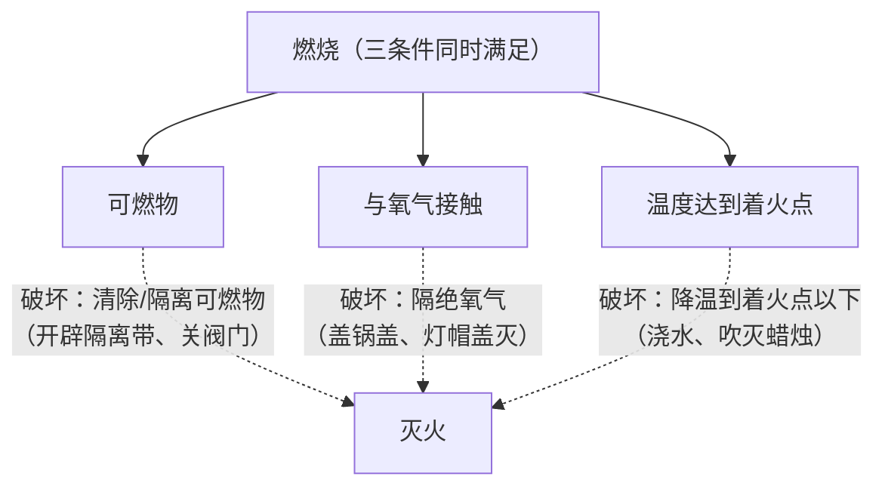

# 课题1 燃烧和灭火

## 核心概念

| 概念 | 定义 |
|---|---|
| 燃烧 | 可燃物与氧气发生的一种发光、放热的剧烈的氧化反应 |
| 着火点 | 可燃物燃烧所需的最低温度，是物质的固有属性，一般不能改变 |
| 爆炸 | 可燃物在有限空间内急剧燃烧，短时间聚积大量热，气体体积迅速膨胀 |

## 燃烧的三个条件（缺一不可）

1. 可燃物。
2. 与氧气（或空气）接触。
3. 温度达到着火点。

实验探究（薄铜片上的白磷与红磷、热水中的白磷）：

- 铜片上白磷燃烧、红磷不燃烧：温度未达到红磷的着火点（对比说明需要温度达到着火点）。
- 铜片上白磷燃烧、水中白磷不燃烧：水中白磷不与氧气接触（说明需要氧气）。
- 向热水中白磷通入氧气后燃烧：进一步证明燃烧需要氧气。

$$
4P + 5O_2 \xrightarrow{点燃} 2P_2O_5
$$

## 图解：燃烧条件的探究（白磷与红磷对比）

<svg viewBox="0 0 560 270" xmlns="http://www.w3.org/2000/svg" style="max-width:560px;width:100%;font-family:sans-serif">
  <rect x="80" y="150" width="340" height="90" rx="8" fill="#bfdbfe" stroke="#2563eb" stroke-width="2"/>
  <text x="440" y="200" font-size="13" fill="#1e3a8a">80℃热水</text>
  <rect x="120" y="118" width="260" height="10" rx="3" fill="#f59e0b"/>
  <text x="440" y="128" font-size="13" fill="#92400e">薄铜片</text>
  <circle cx="170" cy="106" r="11" fill="#fde68a" stroke="#d97706"/>
  <path d="M170 88 q-7 8 0 14 q7 -6 0 -14" fill="#f97316"/>
  <text x="170" y="70" text-anchor="middle" font-size="13" fill="#c2410c">白磷：燃烧 ✓</text>
  <circle cx="330" cy="106" r="11" fill="#fca5a5" stroke="#dc2626"/>
  <text x="330" y="70" text-anchor="middle" font-size="13" fill="#7f1d1d">红磷：不燃烧 ✗</text>
  <text x="330" y="88" text-anchor="middle" font-size="11" fill="#64748b">（未达着火点240℃）</text>
  <circle cx="250" cy="210" r="11" fill="#fde68a" stroke="#d97706"/>
  <text x="250" y="238" text-anchor="middle" font-size="13" fill="#1e3a8a">水中白磷：不燃烧 ✗（不接触O₂）</text>
  <text x="250" y="262" text-anchor="middle" font-size="12" fill="#b45309">通入O₂后水中白磷也燃烧 → 三条件缺一不可</text>
</svg>

## 灭火的原理（破坏任一燃烧条件即可）

| 灭火原理 | 实例 |
|---|---|
| 清除或隔离可燃物 | 森林火灾开辟隔离带、关闭燃气阀门 |
| 隔绝氧气（空气） | 油锅着火盖锅盖、灯帽盖灭酒精灯、湿抹布盖灭 |
| 降温到着火点以下 | 用水浇灭木材火、吹灭蜡烛 |

注意：是"降温到着火点以下"，不能说"降低着火点"。

## 图解：燃烧三条件与灭火三原理

## 常用灭火器

| 灭火器 | 适用范围 |
|---|---|
| 干粉灭火器 | 一般失火及油、气等燃烧引起的失火 |
| 二氧化碳灭火器 | 图书、档案、贵重设备、精密仪器（无残留） |
| 水基型（泡沫）灭火器 | 木材、棉布等失火，不可用于电器和油类火灾 |

## 易燃易爆安全常识

- 可燃性气体（氢气、CO、甲烷）与空气混合点燃可能爆炸，点燃前必须验纯。
- 面粉厂、加油站、煤矿矿井等场所严禁烟火：空气中飘散可燃性粉尘或气体，遇明火可能爆炸。
- 认识常见消防安全标志：禁止烟火、禁止放易燃物、当心爆炸等。
- 影响燃烧剧烈程度的因素：氧气浓度越大、与氧气接触面积越大，燃烧越剧烈。

## 背记要点

1. 燃烧三条件同时满足；灭火破坏其中之一即可。
2. 着火点是物质属性，只能"降温到着火点以下"。
3. 白磷着火点低（40℃），保存在水中；红磷着火点约240℃。
4. 油锅着火盖锅盖（隔绝氧气），不能浇水。
5. 有限空间内急剧燃烧引起爆炸；可燃性气体点燃前必验纯。

## 自测题

1. 热水中的白磷通入氧气前后现象有何不同？说明燃烧需要什么条件？
2. "钻木取火""釜底抽薪""杯水车薪"各涉及什么燃烧或灭火原理？
3. 扑灭图书档案失火应选用哪种灭火器？为什么？

## 相关知识点

[[课题2 氧气]] [[课题1 空气]] [[课题2 燃料的合理利用与开发]] [[课题3 二氧化碳和一氧化碳]]
