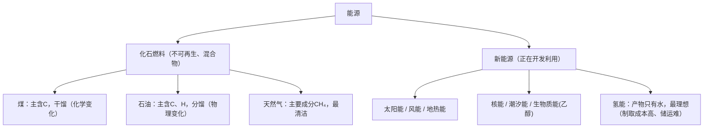

# 课题2 燃料的合理利用与开发

## 核心概念

| 概念 | 内容 |
|---|---|
| 化石燃料 | 煤、石油、天然气，均为不可再生能源、混合物 |
| 热值观念 | 燃料燃烧放出热量，化学能转化为热能 |
| 放热反应 | 放出热量的反应，如燃烧、金属与酸反应、生石灰与水反应 |
| 吸热反应 | 吸收热量的反应，如碳与二氧化碳高温反应 |

## 三大化石燃料

| 燃料 | 主要成分/元素 | 加工与利用 |
|---|---|---|
| 煤 | 主要含碳元素（"工业的粮食"） | 干馏（化学变化）得焦炭、煤焦油、煤气 |
| 石油 | 主要含碳、氢元素（"工业的血液"） | 分馏（物理变化）得汽油、煤油、柴油等 |
| 天然气 | 主要成分甲烷CH₄ | 最清洁的化石燃料 |

甲烷燃烧（蓝色火焰）：

$$
CH_4 + 2O_2 \xrightarrow{点燃} CO_2 + 2H_2O
$$

检验甲烷燃烧产物：干冷烧杯罩火焰上方见水雾（含H元素），蘸石灰水的烧杯变浑浊（含C元素）。

## 图解：化石燃料与新能源

## 图解：甲烷燃烧产物的检验

<svg viewBox="0 0 560 230" xmlns="http://www.w3.org/2000/svg" style="max-width:560px;width:100%;font-family:sans-serif">
  <rect x="110" y="150" width="50" height="60" rx="6" fill="#e2e8f0" stroke="#64748b"/>
  <line x1="135" y1="150" x2="135" y2="120" stroke="#334155" stroke-width="4"/>
  <ellipse cx="135" cy="100" rx="12" ry="22" fill="#93c5fd" opacity="0.9"/>
  <text x="135" y="228" text-anchor="middle" font-size="13" fill="#334155">甲烷（蓝色火焰）</text>
  <path d="M240 40 H330 V110 H240 Z" fill="none" stroke="#334155" stroke-width="2" transform="rotate(180 285 75)"/>
  <circle cx="262" cy="72" r="3" fill="#7dd3fc"/><circle cx="285" cy="60" r="3" fill="#7dd3fc"/><circle cx="308" cy="74" r="3" fill="#7dd3fc"/>
  <text x="285" y="26" text-anchor="middle" font-size="13" fill="#0f172a">干冷烧杯：内壁出现水雾 → 含H元素</text>
  <path d="M420 60 H510 V130 H420 Z" fill="none" stroke="#334155" stroke-width="2" transform="rotate(180 465 95)"/>
  <rect x="428" y="66" width="74" height="14" fill="#f8fafc" stroke="#94a3b8" stroke-dasharray="3 2"/>
  <text x="465" y="46" text-anchor="middle" font-size="13" fill="#0f172a">蘸石灰水烧杯：变浑浊 → 含C元素</text>
  <line x1="150" y1="95" x2="250" y2="80" stroke="#64748b" stroke-width="1" stroke-dasharray="4 3"/>
  <line x1="150" y1="100" x2="430" y2="100" stroke="#64748b" stroke-width="1" stroke-dasharray="4 3"/>
  <text x="285" y="180" text-anchor="middle" font-size="12" fill="#475569">依据质量守恒定律：产物含C、H → 甲烷由碳、氢元素组成</text>
</svg>

## 燃料燃烧对环境的影响

- 煤燃烧排放SO₂、NO₂，形成酸雨（pH<5.6）。酸雨危害：腐蚀建筑和金属、酸化土壤和水体、损害植物。
- 防治：使用脱硫煤、开发清洁能源。
- 汽车尾气：CO、未燃烧的碳氢化合物、氮氧化物、含铅化合物和烟尘。改进：使用催化净化装置、乙醇汽油、车用压缩天然气。
- 化石燃料燃烧大量排放CO₂，加剧温室效应。

## 燃料的充分燃烧

条件：燃烧时有足够多的空气；燃料与空气有足够大的接触面积（如煤粉碎、液体燃料雾化）。

不充分燃烧的后果：产生CO污染空气、浪费资源。

## 新能源与理想燃料

- 正在开发利用的新能源：太阳能、风能、地热能、潮汐能、核能、生物质能（乙醇——可再生，C₂H₅OH + 3O₂ 点燃生成 2CO₂ + 3H₂O）。
- 氢气是最清洁的理想燃料：燃烧产物只有水、热值高、来源广（水）。

$$
2H_2 + O_2 \xrightarrow{点燃} 2H_2O
$$

- 目前氢能源未普及的原因：制取成本高、储存和运输困难。

## 背记要点

1. 三大化石燃料：煤、石油、天然气，都是不可再生的混合物。
2. 天然气主要成分是甲烷CH₄，是最简单的有机物。
3. 煤的干馏是化学变化；石油的分馏是物理变化。
4. 酸雨主要由SO₂、NO₂造成；CO₂不形成酸雨但加剧温室效应。
5. 充分燃烧两条件：足量空气 + 足够接触面积。
6. 最理想的清洁燃料是氢气：产物只有水。

## 自测题

1. 点燃甲烷，如何用实验证明其中含有碳、氢两种元素？
2. 酸雨是如何形成的？主要危害有哪些？
3. 氢气作为燃料有哪些优点？为什么尚未广泛使用？

## 相关知识点

[[课题1 燃烧和灭火]] [[课题3 二氧化碳和一氧化碳]] [[课题3 水的组成]] [[课题1 空气]]
