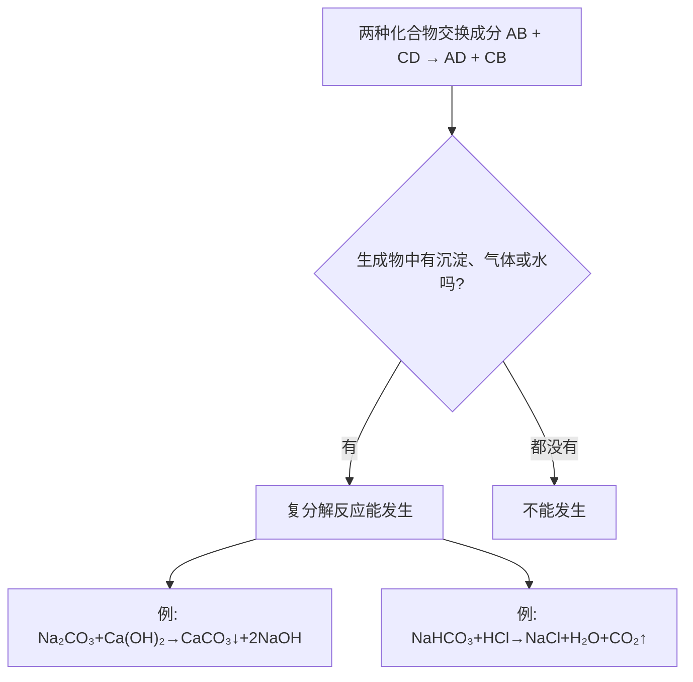

# 课题1 生活中常见的盐

## 核心概念表

| 盐 | 化学式 | 俗名 | 主要用途 |
|---|---|---|---|
| 氯化钠 | NaCl | 食盐 | 调味、配生理盐水、融雪、腌渍 |
| 碳酸钠 | Na₂CO₃ | 纯碱、苏打 | 制玻璃、造纸、洗涤剂 |
| 碳酸氢钠 | NaHCO₃ | 小苏打 | 发酵粉、治胃酸过多 |
| 碳酸钙 | CaCO₃ | 石灰石/大理石主要成分 | 建筑材料、补钙剂 |

## 知识梳理

**复分解反应**：两种化合物互相交换成分，生成另外两种化合物（AB+CD→AD+CB）。**发生条件**：生成物中有**沉淀、气体或水**三者之一。反应物还须满足：酸参加的反应一般均可；无酸时反应物须都**可溶**。

**碳酸根离子（CO₃²⁻/HCO₃⁻）的检验**：取样加稀盐酸，产生使澄清石灰水变浑浊的气体，则含碳酸根（或碳酸氢根）离子。

**常见沉淀**（复分解判断必背）：不溶于稀硝酸的——AgCl（白）、BaSO₄（白）；溶于酸的——CaCO₃、BaCO₃（白）；碱类——Cu(OH)₂（蓝）、Fe(OH)₃（红褐）、Mg(OH)₂（白）。

**粗盐提纯**：溶解→过滤→蒸发结晶，除去不溶性杂质；玻璃棒作用依次为搅拌、引流、防止局部过热飞溅。

## 图示：复分解反应发生条件

## 化学方程式汇总

$$\text{Na}_2\text{CO}_3 + 2\text{HCl} = 2\text{NaCl} + \text{H}_2\text{O} + \text{CO}_2\uparrow \qquad \text{NaHCO}_3 + \text{HCl} = \text{NaCl} + \text{H}_2\text{O} + \text{CO}_2\uparrow$$

$$\text{CaCO}_3 + 2\text{HCl} = \text{CaCl}_2 + \text{H}_2\text{O} + \text{CO}_2\uparrow \qquad \text{Na}_2\text{CO}_3 + \text{Ca(OH)}_2 = \text{CaCO}_3\downarrow + 2\text{NaOH}$$

$$\text{NaCl} + \text{AgNO}_3 = \text{AgCl}\downarrow + \text{NaNO}_3 \qquad \text{Na}_2\text{SO}_4 + \text{BaCl}_2 = \text{BaSO}_4\downarrow + 2\text{NaCl}$$

其中"碳酸钠+熟石灰"是工业制烧碱的原理。

## 实验要点

1. 检验 Cl⁻：加 AgNO₃ 溶液和稀硝酸，产生不溶的白色沉淀。检验 SO₄²⁻：加 Ba(NO₃)₂（或 BaCl₂）溶液和稀硝酸，产生不溶的白色沉淀。
2. 鉴别 NaCl 与 Na₂CO₃：分别加稀盐酸，有气泡者为 Na₂CO₃。
3. 除杂原则：不增（不引入新杂质）、不减（不消耗被提纯物）、易分离。例：NaCl 中混 Na₂CO₃，加**适量稀盐酸**。

## 易错点

1. 盐不都能食用（亚硝酸钠 NaNO₂ 有毒）；"盐"是一类化合物，食盐只是其中一种。
2. 复分解反应中各元素**化合价均不变**；置换反应中有化合价改变。
3. 碳酸钠俗称纯碱，但它属于**盐**，只是水溶液显碱性。
4. 检验 SO₄²⁻ 时加稀硝酸是为排除 CO₃²⁻、Ag⁺ 等干扰。

## 背记要点

1. 四大盐：食盐 NaCl、纯碱 Na₂CO₃、小苏打 NaHCO₃、石灰石 CaCO₃。
2. 复分解条件：有沉淀、或气体、或水生成。
3. 沉淀口诀：氯化银硫酸钡，不溶稀硝酸；碳酸盐沉淀遇酸冒泡。
4. 碳酸根检验：稀盐酸+澄清石灰水。

## 自测题

1. 写出用石灰石与稀盐酸反应制 CO₂ 的化学方程式，属于什么反应类型？
2. 如何鉴别失去标签的 NaCl、Na₂CO₃、NaOH 三瓶无色溶液？
3. 判断下列反应能否发生并说明理由：①KNO₃+NaCl ②Na₂CO₃+CaCl₂。

## 相关知识点

[[课题2 化学肥料]] [[课题2 酸和碱的中和反应]] [[课题1 常见的酸和碱]] [[课题2 溶解度]]
