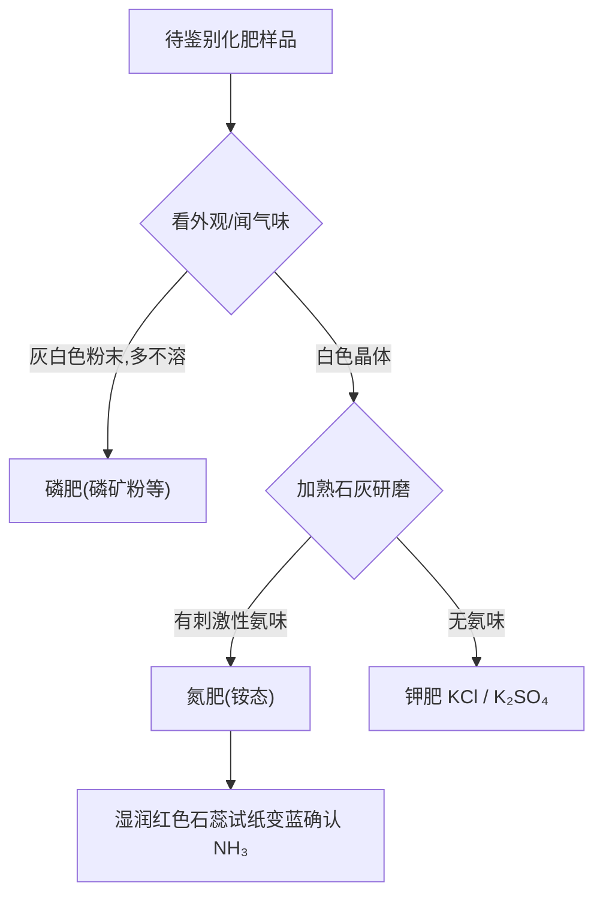

# 课题2 化学肥料

## 核心概念表

| 肥料 | 作用 | 缺乏症状 | 常见品种 |
|---|---|---|---|
| 氮肥 | 促叶生长，叶色浓绿 | 叶黄、植株矮小 | 尿素 CO(NH₂)₂、NH₄HCO₃、NH₄NO₃、NH₄Cl、(NH₄)₂SO₄ |
| 磷肥 | 促根系发达、穗粒增多，抗寒抗旱 | 生长迟缓、穗粒少 | 磷矿粉、钙镁磷肥、过磷酸钙 |
| 钾肥 | 茎秆健壮，抗倒伏、抗病虫害 | 茎秆软弱易倒伏、叶片有褐斑 | KCl、K₂SO₄ |
| 复合肥 | 同时含 N、P、K 中两种或以上 | — | KNO₃、NH₄H₂PO₄、(NH₄)₂HPO₄ |

## 知识梳理

**尿素**是含氮量最高的常用氮肥（约 46.7%）。**草木灰**的主要成分是 K₂CO₃，属钾肥，水溶液显碱性。

**铵态氮肥使用禁忌**：铵盐（含 NH₄⁺）不能与**碱性物质**（熟石灰、草木灰）混合施用或存放，否则反应放出氨气，降低肥效：

$$\text{NH}_4\text{Cl} + \text{NaOH} \xrightarrow{\Delta} \text{NaCl} + \text{H}_2\text{O} + \text{NH}_3\uparrow$$

**铵根离子（NH₄⁺）的检验**：取样与熟石灰混合研磨（或加碱液加热），产生有刺激性气味、能使**湿润的红色石蕊试纸变蓝**的气体（氨气），则含铵根离子。

$$2\text{NH}_4\text{Cl} + \text{Ca(OH)}_2 \xrightarrow{\Delta} \text{CaCl}_2 + 2\text{H}_2\text{O} + 2\text{NH}_3\uparrow$$

**化肥与农药的利与弊**：提高产量，但过量施用会造成土壤板结、水体富营养化（赤潮、水华）等污染，应合理施用。

## 图示：化肥的简易鉴别流程

## 实验要点

1. 初步区分氮、磷、钾三类肥料："一看二闻三加水"：磷肥多为灰白粉末且大多不溶于水；氮肥、钾肥多为白色易溶晶体，再用熟石灰研磨区分（有氨味的是铵态氮肥）。
2. 检验 NH₄⁺ 必须用**湿润**的红色石蕊试纸（干燥试纸不变色）。
3. 区分 KCl 与 (NH₄)₂SO₄ 等还可结合加 BaCl₂ 看有无白色沉淀。

## 易错点

1. KNO₃ 同时含 K、N 两种营养元素，是**复合肥**，不是单一钾肥或氮肥。
2. 草木灰（K₂CO₃）呈碱性，不能与铵态氮肥混用。
3. 尿素是**有机物**氮肥，与碱研磨不放氨气（区别于铵盐）。
4. 营养元素指 N、P、K 等，不是指化合物本身。

## 背记要点

1. 氮长叶、磷长根（促果穗）、钾壮秆（抗倒伏）。
2. 铵盐 + 碱 → 放氨气，故铵态氮肥忌与碱性物质混用。
3. NH₄⁺ 检验：加碱研磨/加热，湿润红色石蕊试纸变蓝。
4. 含氮量最高的常用氮肥是尿素 CO(NH₂)₂。
5. 复合肥：含 N、P、K 中两种及以上，如 KNO₃。

## 自测题

1. 某农田水稻大面积倒伏且叶缘出现褐斑，应施用哪类化肥？
2. 如何用一种试剂鉴别 NH₄Cl 和 KCl 两种白色固体？写出有关化学方程式。
3. 为什么大量施用化肥会污染水体？举一例说明。

## 相关知识点

[[课题1 生活中常见的盐]] [[课题2 酸和碱的中和反应]] [[课题2 化学元素与人体健康]]
