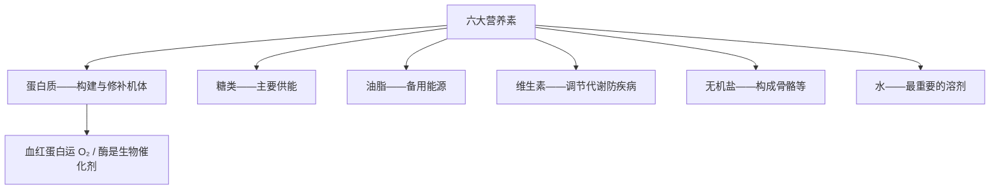

# 课题1 人类重要的营养物质

## 核心概念表

| 营养素 | 主要功能 | 主要食物来源 |
|---|---|---|
| 蛋白质 | 构成细胞的基本物质，机体生长及修补受损组织 | 肉、鱼、蛋、奶、大豆 |
| 糖类 | 人体**主要的供能物质** | 米、面（淀粉）、蔗糖、葡萄糖 |
| 油脂 | 重要的**备用能源**，产热量高 | 植物油、动物脂肪 |
| 维生素 | 调节新陈代谢、预防疾病，需求量小但不可缺 | 蔬菜、水果 |
| 无机盐、水 | 构成机体、参与代谢；水是最重要的溶剂 | 各类食物、饮水 |

## 知识梳理

**蛋白质**：由多种氨基酸构成。血红蛋白（含 Fe²⁺）负责运输 O₂ 和部分 CO₂；**CO 中毒原理**——CO 与血红蛋白的结合能力远强于 O₂（约 200~300 倍），使其失去输氧能力。甲醛、浓硝酸、重金属盐（如可溶性铜盐、钡盐、铅盐）能使蛋白质**变性**，故甲醛溶液不能浸泡水产品保鲜；误服重金属盐可服大量牛奶或蛋清解毒。酶是重要的蛋白质，是生物催化剂（如唾液淀粉酶）。

**糖类**：淀粉 $(\text{C}_6\text{H}_{10}\text{O}_5)_n$ 在体内水解为葡萄糖 C₆H₁₂O₆；葡萄糖在酶作用下缓慢氧化放出能量：

$$\text{C}_6\text{H}_{12}\text{O}_6 + 6\text{O}_2 \xrightarrow{\text{酶}} 6\text{CO}_2 + 6\text{H}_2\text{O}$$

**维生素**：缺乏维生素 A 患夜盲症；缺乏维生素 C 患坏血病（维 C 多存在于蔬菜水果中，受热易被破坏，故蔬菜不宜久煮）。

## 图示：六大营养素

## 实验要点

1. 检验淀粉：滴加**碘液（碘酒）变蓝**。
2. 灼烧闻味鉴别羊毛（蛋白质）与合成纤维：羊毛灼烧有**烧焦羽毛气味**。
3. 观察维 C 的还原性：维 C 溶液可使紫色高锰酸钾溶液褪色（拓展）。

## 易错点

1. 人体主要供能物质是**糖类**，不是油脂（油脂是备用能源）。
2. CO 中毒是化学结合导致缺氧，不是 CO"有毒使人窒息"这么简单的表述。
3. 甲醛能防腐但**严禁**用于食品保鲜（使蛋白质变性、致癌）。
4. 淀粉与葡萄糖都属糖类，但淀粉没有甜味；"糖类"不等于"有甜味的物质"。

## 背记要点

1. 六大营养素：蛋白质、糖类、油脂、维生素、无机盐、水。
2. 蛋白质由氨基酸构成；血红蛋白含铁、运氧；CO 与其结合力更强。
3. 葡萄糖 C₆H₁₂O₆ 缓慢氧化供能。
4. 碘遇淀粉变蓝；缺维 A 夜盲、缺维 C 坏血病。
5. 重金属盐中毒服牛奶或蛋清。

## 自测题

1. 为什么煤气（含 CO）中毒会危及生命？从血红蛋白角度解释。
2. 用什么试剂检验馒头中含有淀粉？现象是什么？
3. 某人长期只吃精米精面、很少吃蔬菜水果，最可能缺乏哪类营养素？可能引发什么疾病？

## 相关知识点

[[课题2 化学元素与人体健康]] [[课题3 有机合成材料]] [[课题3 二氧化碳和一氧化碳]]
