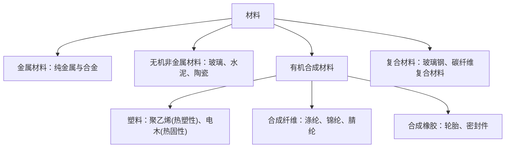

# 课题3 有机合成材料

## 核心概念表

| 概念 | 内容 |
|---|---|
| 有机化合物 | 含碳的化合物（CO、CO₂、碳酸盐等除外），如 CH₄、C₂H₅OH、葡萄糖 |
| 有机高分子化合物 | 相对分子质量很大（几万至几十万）的有机物，如淀粉、蛋白质、聚乙烯 |
| 三大合成材料 | **塑料、合成纤维、合成橡胶** |
| 链状/网状结构 | 链状——热塑性（可反复加热成型）；网状——热固性（一经成型受热不熔化） |

## 知识梳理

**最简单的有机物是甲烷 CH₄**。有机物数目异常庞大的原因：碳原子间连接方式多样（链状、环状等）。

**塑料**：聚乙烯（食品袋，无毒）、聚氯乙烯（含氯，**不能**装食品）。热塑性塑料（聚乙烯）受热软化，可热封口；热固性塑料（电木/酚醛塑料）受热不熔，作插座外壳。

**纤维**：天然纤维——棉、羊毛、蚕丝；合成纤维——涤纶、锦纶（尼龙）、腈纶，强度高、弹性好、耐磨耐腐蚀，但吸水性和透气性差，常与天然纤维混纺。

**橡胶**：天然橡胶与合成橡胶；合成橡胶耐油、耐磨、绝缘性好，用于轮胎等。

**"白色污染"及防治**：废弃塑料难降解造成的污染。措施：减少使用不必要的塑料制品；重复使用；使用可降解塑料；回收利用（塑料具有可回收性，回收标志三角箭头）。

## 图示：材料分类

## 实验要点

1. **灼烧法鉴别羊毛与合成纤维**：羊毛（蛋白质）灼烧有烧焦羽毛气味，灰烬松脆；合成纤维灼烧有特殊气味，熔成硬球。棉灼烧有烧纸气味。
2. 鉴别热塑性与热固性塑料：加热看是否软化。
3. 聚乙烯塑料袋封口利用其**热塑性**。

## 易错点

1. 有机物必含碳，但含碳化合物不一定是有机物（CO、CO₂、H₂CO₃、碳酸盐按无机物处理）。
2. "三大合成材料"不包括棉花、羊毛、天然橡胶等**天然材料**。
3. 乙醇 C₂H₅OH、甲烷 CH₄ 是有机物但**不是**高分子化合物（相对分子质量小）。
4. 玻璃钢、钢筋混凝土是**复合材料**；玻璃、陶瓷是无机非金属材料。

## 背记要点

1. 有机物 = 含碳化合物（除 CO、CO₂、碳酸及碳酸盐）。
2. 三大合成材料：塑料、合成纤维、合成橡胶。
3. 链状热塑可再造，网状热固不再熔。
4. 聚氯乙烯有毒不装食品；聚乙烯无毒可装食品。
5. 治理白色污染：减量、重复用、可降解、回收。

## 自测题

1. 下列物质中属于有机高分子化合物的是：①聚乙烯 ②乙醇 ③蛋白质 ④碳酸钙？
2. 如何用简单方法鉴别某毛衣是纯羊毛还是合成纤维？
3. 举出两条减少"白色污染"的可行措施。

## 相关知识点

[[课题1 人类重要的营养物质]] [[课题2 化学元素与人体健康]] [[课题1 金属材料]]
