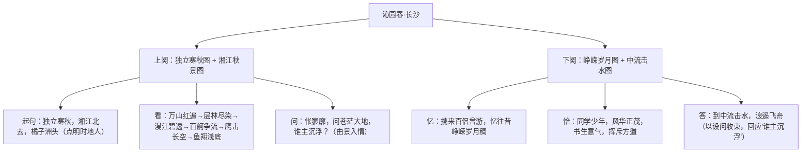

# 1 沁园春·长沙

标签：#词 #毛泽东 #青春 #必背篇目

## 一、作家与背景

- 作者：毛泽东（1893—1976），字润之，湖南湘潭人，伟大的无产阶级革命家、诗人。
- 背景：1925 年秋，毛泽东离开长沙赴广州主持农民运动讲习所，途经橘子洲，重游故地，追忆青年时代的革命岁月，写下此词。
- 文体：词。"沁园春"是词牌名，双调 114 字；"长沙"是题目。上阕写景，下阕抒情言志。

## 二、文本精读

## 三、意象与手法

| 意象/词句 | 手法 | 表达效果 |
| --- | --- | --- |
| 万山红遍、层林尽染 | 远眺、静景 | "遍""染"写秋色之浓烈，一扫悲秋传统 |
| 鹰击长空、鱼翔浅底 | 炼字（击、翔） | "击"显矫健有力，"翔"写鱼游之自由轻快 |
| 万类霜天竞自由 | 由点到面、哲理升华 | 由具体景物概括出万物蓬勃的生命力 |
| 中流击水，浪遏飞舟 | 夸张、象征 | 象征青年革命者搏击时代洪流的豪情壮志 |

## 四、典型例题

1. **题：上阕"看"字统领哪些内容？描绘了怎样的画面？**
   解析："看"领起"万山红遍"至"万类霜天竞自由"七句，按远近、高低、动静顺序（山—林—江—舸—鹰—鱼）描绘出一幅色彩绚丽、生机勃勃的湘江秋景图，为"问谁主沉浮"蓄势。
2. **题：赏析"鹰击长空，鱼翔浅底"中"击""翔"二字。**
   解析："击"写雄鹰搏击长空的迅猛矫健；"翔"以鸟喻鱼，写鱼在清澈见底的水中如飞般自在。二字精准传神，体现万物竞自由的活力，也寄寓诗人对自由解放的向往。

## 五、易错点

- "怅寥廓"的"怅"非惆怅失意，而是因思绪广阔深远而生的感慨激昂。
- "粪土当年万户侯"："粪土"是名词意动用法，"视……为粪土"。
- "浪遏飞舟"易误写"遏"为"揭"；"挥斥方遒"的"遒"（qiú）意为强劲有力。
- 本词一反古诗"悲秋"传统，情感基调是昂扬豪迈，不可答成"悲凉"。

## 六、背记要点（名句默写）

- 看万山红遍，层林尽染；漫江碧透，百舸争流。
- 鹰击长空，鱼翔浅底，万类霜天竞自由。
- 怅寥廓，问苍茫大地，谁主沉浮？
- 恰同学少年，风华正茂；书生意气，挥斥方遒。
- 曾记否，到中流击水，浪遏飞舟？

## 七、自测题

1. "独立寒秋"三句交代了哪些信息？语序有何特点？
2. 上阕景物描写的观察顺序是怎样安排的？
3. 下阕"同学少年"具有怎样的形象特点？
4. 结尾以问句作结有何妙处？与上阕之"问"如何呼应？

## 八、相关知识点

- 与[[2 立在地球边上放号/红烛/峨日朵雪峰之侧/致云雀]]同属青春主题诗歌，比较旧体词与新诗抒情方式；
- 炼字题答题思路可迁移至[[2 梦游天姥吟留别/登高/琵琶行并序]]的诗歌鉴赏；
- 词牌知识联系[[3 念奴娇·赤壁怀古/永遇乐·京口北固亭怀古/声声慢]]。
