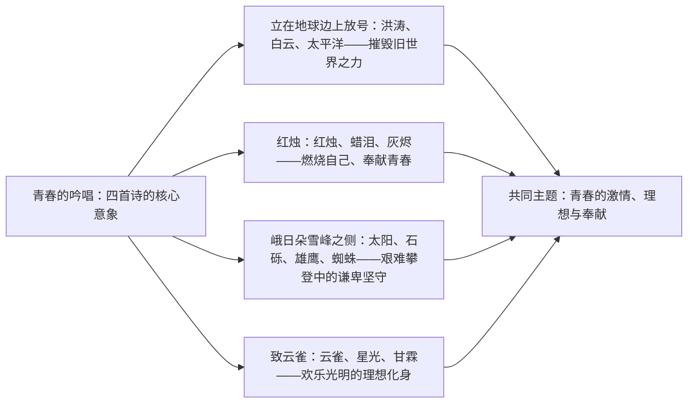

# 2 立在地球边上放号 / 红烛 / 峨日朵雪峰之侧 / 致云雀

标签：#现代诗 #郭沫若 #闻一多 #昌耀 #雪莱

## 一、作家与背景

- 郭沫若《立在地球边上放号》：写于 1919 年五四时期，收入诗集《女神》，是狂飙突进式的自由体新诗。
- 闻一多《红烛》：1923 年诗集《红烛》序诗，化用李商隐"蜡炬成灰泪始干"，体现新格律诗"三美"主张。
- 昌耀《峨日朵雪峰之侧》：写于 1962 年，凝重壮美的西部诗风，写攀登者在艰难中的坚守。
- 雪莱《致云雀》：英国浪漫主义诗人雪莱代表作，以云雀象征欢乐、光明与理想。

## 二、四诗意象群比较

## 三、意象与手法

| 诗篇 | 核心手法 | 赏析要点 |
| --- | --- | --- |
| 立在地球边上放号 | 想象夸张、排比反复 | "力的绘画，力的舞蹈"雷霆万钧，礼赞破坏与创造之力 |
| 红烛 | 托物言志、问答式结构 | 九节以"红烛啊"呼告贯穿，由困惑到彻悟"莫问收获，但问耕耘" |
| 峨日朵雪峰之侧 | 对比反衬、视听结合 | 雄鹰雪豹之"大"与蜘蛛之"小"对比，小生命亦有大坚韧 |
| 致云雀 | 象征、通感、连喻 | 以诗人、少女、萤火虫、玫瑰连环设喻描摹云雀歌声 |

## 四、典型例题

1. **题：《红烛》中"红烛"意象对李商隐诗句有何继承与超越？**
   解析：继承"蜡炬成灰泪始干"的奉献意蕴；超越在于赋予其时代内涵——红是赤诚之色，烧蜡成灰是为"救出灵魂""捣破监狱"，由个人愁绪升华为为理想献身的青春誓言。
2. **题：《峨日朵雪峰之侧》结尾写"小得可怜的蜘蛛"有何作用？**
   解析：与前文期待中的雄鹰、雪豹形成反差；蜘蛛虽微小却与"我"同在锈蚀的岩壁上"默享着这大自然赐予的快慰"，以小衬大，表明生命的价值不在强弱，而在坚守与享受奋斗本身。

## 五、易错点

- "放号"读 fàng háo（呼号），非"号角"之 hào。
- 《红烛》"莫问收获，但问耕耘"是题旨，不可理解为消极认命。
- 《峨日朵雪峰之侧》中"我"并未登顶，写的是"雪峰之侧"的坚持，不可拔高为"征服自然"。
- 《致云雀》的云雀是理想的象征，不是单纯咏鸟；它是翻译诗，鉴赏侧重意象与情感而非格律。

## 六、背记要点（名句默写）

- 啊啊！不断的毁坏，不断的创造，不断的努力哟！（《立在地球边上放号》）
- 红烛啊！莫问收获，但问耕耘。（《红烛》）
- 我小心地探出前额，惊异于薄壁那边朝向峨日朵之雪彷徨许久的太阳。（《峨日朵雪峰之侧》）
- 你好啊，欢乐的精灵！你似乎从不是飞禽。（《致云雀》）

## 七、自测题

1. 《立在地球边上放号》中反复咏叹的"力"包含哪些内涵？
2. 《红烛》九节的情感经历了怎样的起伏变化？
3. 《峨日朵雪峰之侧》如何通过视听结合写攀登之险？
4. 《致云雀》连用哪些比喻描摹云雀的歌声？效果如何？

## 八、相关知识点

- 与[[1 沁园春·长沙]]同属青春价值单元，比较旧体词与新诗的青春书写；
- 托物言志与象征手法可迁移至[[12 拿来主义]]的比喻说理；
- 意象鉴赏方法迁移至[[静女 / 涉江采芙蓉 / 虞美人 / 鹊桥仙]]。
