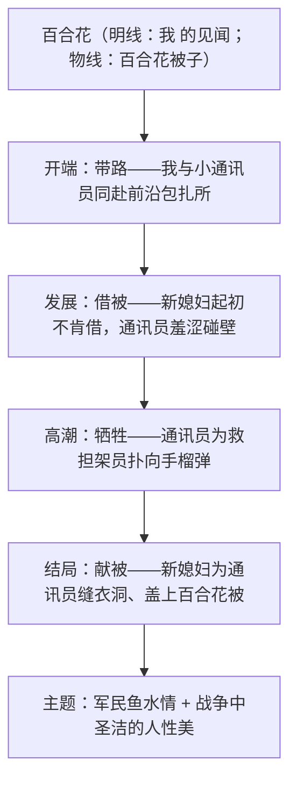

# 3 百合花

标签：#小说 #茹志鹃 #战争与人性

## 一、作家与背景

- 作者：茹志鹃（1925—1998），当代女作家，风格清新俊逸，代表作《百合花》《静静的产院》。
- 背景：写于 1958 年，以 1946 年解放战争中的中秋之夜为背景，通过小通讯员与新媳妇的故事，展现战争年代的人性美与人情美。
- 文体：短篇小说。茅盾评价其"清新、俊逸""富于抒情诗的风味"。

## 二、情节结构与线索

## 三、细节与意象

| 细节/意象 | 出现位置 | 作用 |
| --- | --- | --- |
| 衣肩上的破洞 | 借被时挂破→牺牲后新媳妇细细缝补 | 前后呼应，寄托愧疚与深情 |
| 百合花被子 | 借被→献被，盖在烈士身上 | 象征纯洁美好的人性，点题 |
| 树枝与野菊花 | 通讯员枪筒里插的装饰 | 表现其热爱生活的青春气息 |
| 两个干硬的馒头 | 通讯员留给"我"的 | 睹物思人，以物写情，催人泪下 |

## 四、典型例题

1. **题：小说以"百合花"为题有何妙处？**
   解析：①指被子上的百合花图案，是情节的重要道具；②百合花色白纯洁，象征通讯员与新媳妇美好纯洁的心灵；③象征战争年代圣洁的军民之情；④以花为题，为残酷战争题材增添诗意，奠定清新抒情的基调。
2. **题：新媳妇"细细地、密密地缝着那个破洞"这一细节有何表现力？**
   解析：此时通讯员已牺牲，缝补已无实用意义；"细细、密密"的动作描写，写出新媳妇的悔恨（曾因借被让他碰壁）、痛惜与庄重的敬意，无声胜有声，将情感推向高潮。

## 五、易错点

- 小说主人公是小通讯员与新媳妇，"我"是叙述视角（线索人物），不可答成主人公是"我"。
- "百合花"的象征义须答多层（图案—人性—军民情），只答"被子"不得分。
- 本文写战争却几乎不写战斗场面，属"以侧面写战争"，不可套用"描写战争残酷"。
- 第一人称"我"（女性视角）的作用：增强真实感、便于抒情、串联情节。

## 六、背记要点

- 情节链：带路—借被—牺牲—献被（物线：百合花被子）。
- 人物形象：小通讯员——腼腆羞涩、热爱生活、舍己救人；新媳妇——娴静淳朴、深明大义。
- 风格定评：茅盾"清新、俊逸"。

## 七、自测题

1. 小说开头写通讯员与"我"保持距离、枪筒插花，对塑造人物有何作用？
2. "借被"情节中新媳妇的态度经历了怎样的变化？
3. 找出文中三处前后呼应的细节并说明效果。
4. 比较本文与一般战争小说在选材与风格上的差异。

## 八、相关知识点

- 与[[3* 哦，香雪]]同属青春成长小说，比较女性视角下的诗化叙事；
- 细节描写方法迁移至[[写作：写人要关注事例和细节]]；
- 小说鉴赏思路（情节—人物—环境—主题）为高考小说阅读通用框架。
