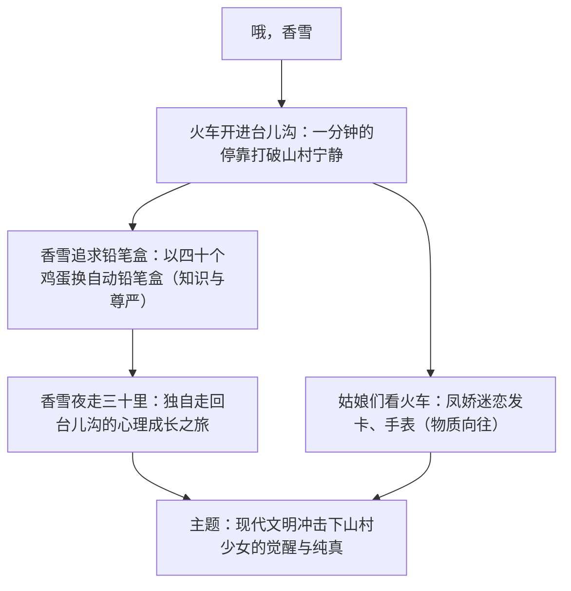

# 3* 哦，香雪

标签：#小说 #铁凝 #改革开放 #诗化小说

## 一、作家与背景

- 作者：铁凝（1957— ），当代作家，曾任中国作协主席，代表作《哦，香雪》《永远有多远》《笨花》。
- 背景：写于 1982 年，改革开放初期。台儿沟是被现代文明遗忘的小山村，每天只停一分钟的火车，成为山村与外部世界的唯一联结。
- 文体：诗化短篇小说，淡化情节，重意境与心理。

## 二、情节脉络与象征体系

## 三、意象与手法

| 意象 | 象征义 | 赏析 |
| --- | --- | --- |
| 火车 | 现代文明、外面的世界 | 一分钟停靠，写文明与封闭的相遇 |
| 铅笔盒 | 知识、文化、尊严 | 香雪不要发卡要铅笔盒，追求高于物质 |
| 三十里夜路 | 成长的仪式 | 由恐惧到坚定，完成心灵的成人礼 |
| 群山、月光、核桃树 | 故乡的纯净 | 诗化景物描写，衬托少女纯美心灵 |

## 四、典型例题

1. **题：香雪用四十个鸡蛋换铅笔盒，这一情节有何深意？**
   解析：鸡蛋是山村的物产，铅笔盒是文明的象征；这场"交换"实质是封闭山村对知识文化的渴望。香雪不为装饰品动心而执着于铅笔盒，表明她追求的是知识与尊严，是摆脱贫困落后的自觉意识。
2. **题：赏析小说结尾香雪走夜路一段的景物描写。**
   解析：月光、群山、树林等景物随香雪心理变化而变化——先是幽暗可怖，后变得柔和亲切；景物描写烘托人物由害怕到坚定自豪的心理历程，情景交融，诗意盎然，深化了"成长"主题。

## 五、易错点

- 主人公是香雪，凤娇是对照人物：凤娇向往物质（发卡），香雪向往知识（铅笔盒），不可混同。
- 小说对"火车/现代文明"的态度是复杂的：既写其吸引力，也隐含对纯真乡土的珍惜，不可简单答"批判"或"歌颂"。
- "哦，香雪"的"哦"是深情赞叹与呼唤，题目饱含抒情意味。
- 本文淡化情节、散文化笔法是特色，答"情节曲折"即误。

## 六、背记要点

- 核心情节：看火车—换铅笔盒—走夜路。
- 香雪形象：纯真自尊、渴求知识、坚韧勇敢的山村少女。
- 艺术特色：诗化小说，心理描写细腻，景物描写与心理交融。

## 七、自测题

1. 小说开头写台儿沟"一分钟"的停车有何作用？
2. 比较香雪与凤娇对火车上物品的不同态度及其意义。
3. 铅笔盒在文中出现多次，梳理其线索作用。
4. 结合时代背景，谈谈小说对"现代文明与乡土"关系的思考。

## 八、相关知识点

- 与[[3 百合花]]同为诗化小说，比较两位女作家的抒情笔法；
- 景物烘托心理的写法可迁移至[[写作：如何做到情景交融]]；
- "乡土与现代"主题与[[《乡土中国》整本书阅读]]互相印证。
