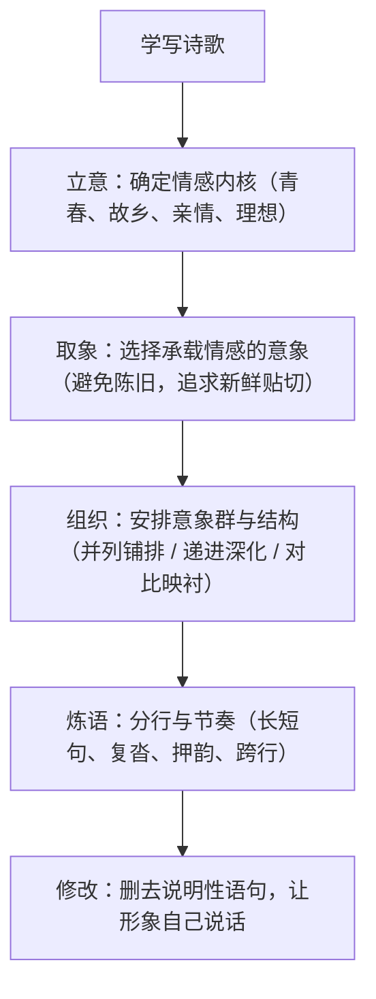

# 写作：学写诗歌

标签：#写作 #现代诗 #意象

## 一、写作要领

- 诗歌是意象的艺术：用具体可感的形象承载情感，忌直白说教。
- 情感是诗歌的灵魂：先有真情实感，再寻找与之契合的意象。
- 语言凝练且有节奏：分行、押韵、复沓都服务于情感的抑扬。
- 本单元课文即范本：《沁园春·长沙》的壮景抒怀、《红烛》的托物言志、《致云雀》的连环设喻。

## 二、技法梳理

## 三、范例分析

以《红烛》为例拆解可学之处：

| 技法 | 课文示例 | 仿写要点 |
| --- | --- | --- |
| 托物言志 | 以红烛自喻，烧蜡成灰喻奉献 | 选一物（如粉笔、路灯、种子）贯穿全诗 |
| 呼告复沓 | 每节以"红烛啊"起头 | 用重复句式形成回环的音乐感 |
| 自问自答 | "为何更须烧蜡成灰？"——层层追问 | 以问句推动情感与思考的深入 |
| 卒章显志 | "莫问收获，但问耕耘" | 结尾凝成警句，忌拖沓解释 |

学生习作常见修改示范：原句"我很想念我的家乡"（直白）→ 改为"炊烟把黄昏拉得很长 / 我的筷子够不着 / 母亲碗里的月亮"（以意象写乡愁）。

## 四、常见问题

1. **有句无象**：通篇抒情口号（"啊，青春多么美好"），缺乏具体意象支撑。
2. **意象陈旧堆砌**：满纸"蜡烛、春蚕、园丁"，缺少个人独特体验。
3. **散文分行**：把大白话切成短行冒充诗，无节奏与张力。
4. **意象与情感脱节**：意象漂亮却与主旨无关，成了装饰。

## 五、实操清单

- [ ] 确定一个真实的情感触发点（一件事、一个瞬间、一个人）。
- [ ] 列出 5 个候选意象，删去最俗的 2 个，保留最贴己的 3 个。
- [ ] 用一种结构（复沓/递进/对比）组织成 3—4 节。
- [ ] 朗读修改：删掉所有"说明情感"的句子，检查分行节奏。
- [ ] 拟一个有张力的标题（可用核心意象命名）。

## 六、相关知识点

- 意象选取参考[[2 立在地球边上放号/红烛/峨日朵雪峰之侧/致云雀]]；
- 炼字与情感基调参考[[1 沁园春·长沙]]；
- 古典意象积累见[[静女/涉江采芙蓉/虞美人/鹊桥仙]]。
