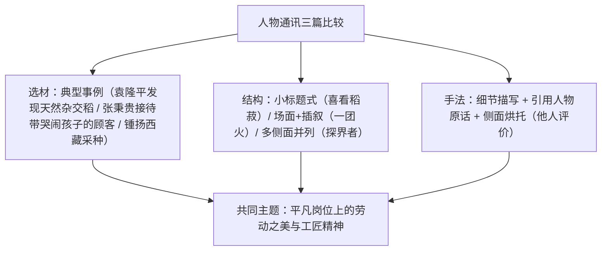

# 4 喜看稻菽千重浪 / 心有一团火，温暖众人心 / "探界者"锺扬

标签：#人物通讯 #劳动 #新闻

## 一、文体知识与背景

- 三篇均为**人物通讯**：用叙述、描写等手法具体报道典型人物事迹的新闻体裁，兼具新闻性（真实、时效）与文学性（形象、生动）。
- 《喜看稻菽千重浪》（沈英甲）：写"杂交水稻之父"袁隆平，标题化用毛泽东诗句。
- 《心有一团火，温暖众人心》（林为民）：写全国劳模、售货员张秉贵的"一抓准""一口清"。
- 《"探界者"锺扬》（叶雨婷）：写植物学家锺扬援藏采集种子、拓展生命边界的事迹。

## 二、知识梳理：人物通讯的写法

## 三、人物与事例对照表

| 人物 | 典型事例 | 精神品质 |
| --- | --- | --- |
| 袁隆平 | 头顶烈日踏泥寻稻、勇敢否定"无优势"权威结论 | 实事求是、勇于创新、扎根实践 |
| 张秉贵 | "一抓准""一口清"，用糖哄哭闹孩子 | 爱岗敬业、全心全意为人民服务 |
| 锺扬 | 16 年援藏收集 4000 万颗种子、培养少数民族学生 | 不畏艰苦、甘为先锋、奉献生命 |

## 四、典型例题

1. **题：《喜看稻菽千重浪》采用小标题结构有何好处？**
   解析：四个小标题（曾记否，到中流击水 / 创新是科学家的灵魂和本质 / 事实是科学家的空气 / 饥饿的威胁在退却）分别从实践、创新、求实、理想四个侧面组织材料，条理清晰，重点突出，多角度立体展现人物精神。
2. **题：通讯中直接引用袁隆平、锺扬本人的话有何作用？**
   解析：①增强新闻的真实性与现场感；②直接呈现人物思想境界，使形象更鲜活；③"我戴着草帽，蹚着水""任何生命都有结束的一天，但我毫不畏惧"等原话即人物精神的自我注脚。

## 五、易错点

- 通讯不同于消息：消息重时效简洁（倒金字塔），通讯重典型细节与形象刻画，可含抒情议论。
- 三篇标题手法各异：化用诗句 / 比喻 / 借"探界"双关（学科边界与生命边界），题目赏析须点明修辞。
- "锺扬"的"锺"是规范写法（人名用字），不写"钟扬"。
- 分析人物精神须"事例+品质"对应，空贴标签不得分。

## 六、背记要点

- 人物通讯特征：真实性、典型性、形象性。
- 常考角度：标题含义与作用、小标题结构、细节描写作用、引用作用、新闻的倾向性。
- 三位人物一句话定位：袁隆平（科技创新）、张秉贵（服务奉献）、锺扬（探界奉献）。

## 七、自测题

1. 三篇通讯在结构安排上各有何特点？
2. 举出每篇中最打动你的一个细节并分析其表现力。
3. "探界者"的"界"有哪几层含义？
4. 通讯的文学性与新闻真实性如何统一？

## 八、相关知识点

- 与[[5 以工匠精神雕琢时代品质]]同属"劳动"单元，通讯与评论文体互补；
- 细节写人方法迁移至[[写作：写人要关注事例和细节]]；
- 劳动主题溯源见[[6 芣苢 / 插秧歌]]。
