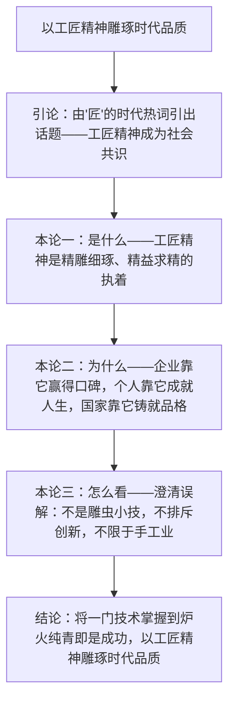

# 5 以工匠精神雕琢时代品质

标签：#新闻评论 #议论文 #工匠精神

## 一、文体知识与背景

- 作者：李斌，新华社记者。本文是发表于《人民日报》的**新闻评论**。
- 背景：2016 年"工匠精神"首次写入《政府工作报告》，本文应时而作，倡导以匠心应对浮躁风气。
- 文体特征：新闻评论=新闻性（针对现实问题）+政论性（观点鲜明、逻辑严密），是高考议论文写作的直接范本。

## 二、论证思路梳理

## 三、论证方法与语言

| 论证方法 | 文中示例 | 作用 |
| --- | --- | --- |
| 引用论证 | 引企业家"没有一流的心性，就没有一流的技术" | 增强权威性与说服力 |
| 对比论证 | 工匠精神与浮躁风气、"差不多"心态对比 | 凸显倡导工匠精神的现实针对性 |
| 比喻论证 | "雕琢"喻打磨品质，"发动机"喻精神驱动 | 化抽象为具体，生动可感 |
| 辩证分析 | 澄清"工匠精神=雕虫小技"等误解 | 使论证严密周全，体现思辨性 |

## 四、典型例题

1. **题：标题"以工匠精神雕琢时代品质"有何妙处？**
   解析：①"雕琢"一词本是工匠动作，用于"时代品质"构成比喻，形象贴切；②标题即中心论点，观点鲜明；③"工匠精神"与"时代品质"对举，将个体技艺提升到时代高度，立意深远。
2. **题：文章为什么要写"工匠精神不是雕虫小技"这一部分？**
   解析：这是驳论性质的辩证分析。先破后立，回应现实中对工匠精神的轻视与误解，使立论更严密；同时将工匠精神从技艺层面提升到"改变世界的现实力量"的高度，深化论点。

## 五、易错点

- 本文是新闻评论而非人物通讯，答文体特征时不可与第 4 课混淆。
- 中心论点是标题本身，不是"工匠精神很重要"这类泛化表述。
- "工匠精神"内涵是多层的：技艺层面（精益求精）+态度层面（专注执着）+境界层面（守拙求进、格物致知的人生哲学）。
- 议论文"针对性"体现在回应浮躁世风，脱离时代背景谈论证即失分。

## 六、背记要点

- 名句："在成为工匠之前，之所以要花很长时间学徒，学的是手艺，磨的是心性。"
- 论证结构：引论（提出话题）—是什么—为什么—怎么看（辩证）—结论。
- 新闻评论三要素：由头（新闻事实）、观点（论点）、论证（分析说理）。

## 七、自测题

1. 本文的中心论点是什么？在结构上如何逐层展开？
2. 找出文中一处对比论证并分析其效果。
3. 工匠精神与创新精神是什么关系？文章如何论述？
4. 结合现实举一例"工匠精神"的当代践行者并简评。

## 八、相关知识点

- 与[[4 喜看稻菽千重浪/心有一团火/探界者锺扬]]互为"评论+通讯"的文体对照；
- 论证的针对性直接服务于[[写作：议论要有针对性]]；
- 驳论方法参考[[12 拿来主义]]的先破后立。
