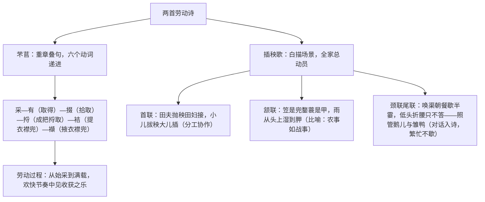

# 6 芣苢 / 插秧歌

标签：#诗经 #杨万里 #劳动诗 #必背篇目

## 一、文体知识与背景

- 《芣苢》：选自《诗经·周南》。《诗经》是我国最早的诗歌总集，分风、雅、颂三类，手法有赋、比、兴（合称"六义"）。芣苢即车前草，此诗是妇女采集芣苢时所唱的劳动歌谣。
- 《插秧歌》：作者杨万里（1127—1206），字廷秀，号诚斋，南宋诗人，"中兴四大诗人"之一，诗风活泼自然，称"诚斋体"。此诗写农家冒雨插秧的繁忙场景。

## 二、文本精读

## 三、手法比较表

| 篇目 | 核心手法 | 效果 |
| --- | --- | --- |
| 芣苢 | 重章叠句、动词变换 | 回环往复有音乐美；六字之变尽显劳动进程 |
| 芣苢 | 赋（直陈其事） | 不加雕饰，再现劳动场面的欢快 |
| 插秧歌 | 比喻（兜鍪、甲） | 以战场喻农田，写抢农时如作战之紧张 |
| 插秧歌 | 白描、对话描写 | "只不答"三字写农人无暇顾及，忙碌如画 |

## 四、典型例题

1. **题：《芣苢》只换六个动词，为何仍有强烈的艺术感染力？**
   解析：采、有、掇、捋、袺、襭六字按劳动进程精心排列，由少到多、由采到盛，暗含收获渐丰的喜悦；重章叠句形成明快的节奏，让人如闻田野歌声，"不必细绎而自得其妙"（方玉润语）。
2. **题：《插秧歌》中"笠是兜鍪蓑是甲"运用了什么手法？有何妙处？**
   解析：比喻。将斗笠比作头盔、蓑衣比作铠甲，把插秧比作一场紧张的战斗，既写出冒雨劳作的艰辛，又暗含抢农时如军情的紧迫感，构思新颖，是"诚斋体"活法的典型体现。

## 五、易错点

- 芣苢读 fú yǐ；掇（duō）拾取；捋（luō）；袺（jié）；襭（xié）。
- 兜鍪（móu）指头盔；胛（jiǎ）指肩胛。
- 《芣苢》的手法是"赋"，不是"比"或"兴"。
- 《插秧歌》"低头折腰只不答"并非冷漠，而是忙得顾不上答话，且答的内容在下句（照管鹅鸭），细读语境。

## 六、背记要点（名句默写）

- 采采芣苢，薄言采之。采采芣苢，薄言有之。
- 采采芣苢，薄言掇之。采采芣苢，薄言捋之。
- 田夫抛秧田妇接，小儿拔秧大儿插。
- 笠是兜鍪蓑是甲，雨从头上湿到胛。

## 七、自测题

1. 《诗经》"六义"指什么？《芣苢》属于哪一类、用了哪种手法？
2. 按顺序默写《芣苢》中的六个动词并解释。
3. 《插秧歌》如何表现"忙"？从描写角度分析。
4. 两首诗对劳动的情感态度有何异同？

## 八、相关知识点

- 《诗经》知识联系[[静女/涉江采芙蓉/虞美人/鹊桥仙]]中的《静女》；
- 劳动主题与[[4 喜看稻菽千重浪/心有一团火/探界者锺扬]]古今呼应；
- 白描与炼字鉴赏迁移至[[8 梦游天姥吟留别/登高/琵琶行并序]]。
