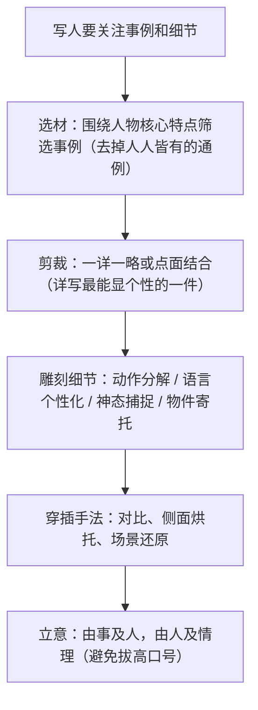

# 写作：写人要关注事例和细节

标签：#写作 #记叙文 #细节描写

## 一、写作要领

- 写人的核心是"立起来"：让人物可见、可感、可信，靠的是典型事例与传神细节，而非形容词堆砌。
- 事例要**典型**：最能体现人物个性与精神的事，一两件写透胜过五六件罗列。
- 细节要**传神**：外貌、动作、语言、神态、心理中的独特之处，是"这一个"区别于"那一类"的关键。
- 本单元通讯即范本：袁隆平"蹚水踏泥"、张秉贵"一抓准"、锺扬的牛仔裤双肩包。

## 二、技法梳理

## 三、范例分析

| 细节类型 | 课文示例 | 可学之处 |
| --- | --- | --- |
| 动作细节 | 袁隆平"迈步跨过水渠，蹲下身子翻看着土壤" | 连续动词分解，写出科学家的实干 |
| 语言细节 | 张秉贵对顾客说"您别急"，用糖哄孩子 | 个性化口语，见职业温度 |
| 物件细节 | 锺扬的旧双肩包、29 元的牛仔裤 | 以物写人，朴素中见精神 |
| 侧面细节 | 学生、同事对锺扬的追忆 | 他人之口，烘托更可信 |

修改示范：原句"爷爷很勤劳"（贴标签）→ 改为"天没亮，爷爷的锄头已在地里磕出第一声响，裤脚卷到膝盖，泥点溅到白发上也不擦"（事例+动作细节）。

## 四、常见问题

1. **有评价无事例**：满纸"善良、勤奋、乐于助人"，却无一事支撑。
2. **事例通用化**：写母亲必"雨夜送医"，写老师必"带病上课"，缺乏独属细节。
3. **细节失真**：为感人而编造夸张情节，违背生活逻辑。
4. **详略不当**：多件事平均用力，篇篇蜻蜓点水。

## 五、实操清单

- [ ] 确定人物的一个核心特点（一句话概括）。
- [ ] 列出 3 件相关事例，保留最典型的 1—2 件。
- [ ] 为详写事例设计至少 3 处细节（动作分解、一句个性化的话、一个标志性物件）。
- [ ] 加入一处侧面烘托（他人反应或环境映衬）。
- [ ] 通读检查：删掉直接贴标签的评价句，让细节自己说话。

## 六、相关知识点

- 通讯中的细节运用见[[4 喜看稻菽千重浪 / 心有一团火 / 探界者钟扬]]；
- 小说细节的呼应艺术见[[3 百合花]]（衣肩破洞、百合花被）；
- 场景白描参考[[6 芣苢 / 插秧歌]]。
