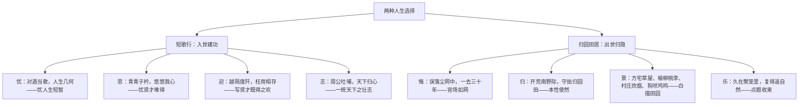

# 7 短歌行 / 归园田居（其一）

标签：#古诗 #曹操 #陶渊明 #必背篇目

## 一、作家与背景

- 曹操（155—220）：字孟德，东汉末政治家、军事家、诗人，建安文学代表，诗风"慷慨悲凉"（建安风骨）。《短歌行》为乐府旧题，抒发求贤建业之志。
- 陶渊明（约 365—427）：名潜，字元亮，自号五柳先生，东晋诗人，田园诗派开创者。《归园田居（其一）》写于辞去彭泽令归隐后，抒归返自然之乐。

## 二、文本精读

## 三、意象与手法

| 诗句 | 手法 | 赏析 |
| --- | --- | --- |
| 譬如朝露，去日苦多 | 比喻 | 以朝露喻人生短促，忧思深沉 |
| 青青子衿 / 呦呦鹿鸣 | 用典（引《诗经》） | 借情诗写思贤，借宴饮写礼遇贤才 |
| 月明星稀，乌鹊南飞 | 比兴 | 以乌鹊择木喻贤才择主，含蓄劝归 |
| 山不厌高，海不厌深 | 用典（化用《管子》）、比喻 | 表明广纳贤才的博大胸襟 |
| 羁鸟恋旧林，池鱼思故渊 | 比喻、对偶 | 以羁鸟池鱼自比，写对田园的眷恋 |
| 狗吠深巷中，鸡鸣桑树颠 | 白描、以动衬静 | 平常景物写出田园宁静温馨 |

## 四、典型例题

1. **题：《短歌行》中的"忧"有哪几层内涵？"忧"与"志"是什么关系？**
   解析：三层——忧人生短暂（譬如朝露）、忧贤才难得（青青子衿）、忧功业未成（天下归心之愿未遂）。忧非消沉，恰因壮志而生；诗以忧起、以志结，慷慨悲凉中见进取，是建安风骨的典型。
2. **题：《归园田居》中间八句写景用了什么手法？营造了怎样的意境？**
   解析：白描；远近结合（方宅草屋为近，村庄炊烟为远）、动静相衬（狗吠鸡鸣衬静）。不加藻饰，如话家常，营造出宁静淳朴、恬淡自然的田园意境，与"尘网""樊笼"形成对照。

## 五、易错点

- "对酒当歌"的"当"意为"对着"，非"应当"。
- "何时可掇"的"掇"意为拾取、摘取；"契阔谈讌"的"讌"通"宴"。
- "守拙归园田"的"拙"指不善逢迎的本性，是自谦亦是自守，非"笨拙"。
- 《短歌行》情感基调是"慷慨"而非"消极及时行乐"；《归园田居》是主动选择而非仕途失败的无奈。

## 六、背记要点（名句默写）

- 对酒当歌，人生几何！譬如朝露，去日苦多。
- 青青子衿，悠悠我心。但为君故，沉吟至今。
- 月明星稀，乌鹊南飞。绕树三匝，何枝可依？
- 山不厌高，海不厌深。周公吐哺，天下归心。
- 羁鸟恋旧林，池鱼思故渊。
- 暧暧远人村，依依墟里烟。狗吠深巷中，鸡鸣桑树颠。
- 久在樊笼里，复得返自然。

## 七、自测题

1. 《短歌行》共用了哪些典故？各表达什么情感？
2. "绕树三匝，何枝可依"从谁的角度设喻？有何深意？
3. 《归园田居》中哪些词语表达了对官场的厌弃？
4. 比较曹操与陶渊明人生选择的不同及其时代原因。

## 八、相关知识点

- 用典手法深化于[[9 念奴娇·赤壁怀古 / 永遇乐·京口北固亭怀古 / 声声慢]]；
- 陶渊明的归隐与[[16 赤壁赋 / 登泰山记]]中苏轼的旷达可比较；
- 白描写景迁移至[[写作：如何做到情景交融]]。
