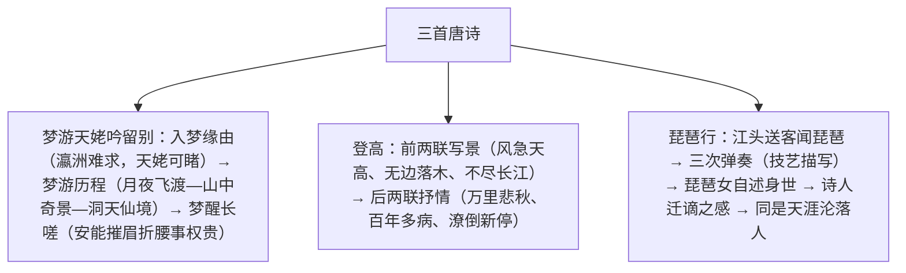

# 8 梦游天姥吟留别 / 登高 / 琵琶行并序

标签：#唐诗 #李白 #杜甫 #白居易 #必背篇目

## 一、作家与背景

- 李白《梦游天姥吟留别》：诗仙，浪漫主义巅峰。744 年被"赐金放还"后作，借记梦游仙抒蔑视权贵之志。"吟"为歌行体。
- 杜甫《登高》：诗圣，现实主义巅峰。767 年流寓夔州、重阳登高而作，被誉为"古今七言律第一"。
- 白居易《琵琶行》：中唐诗人，倡新乐府运动。816 年贬江州司马，浔阳江头闻琵琶，感"同是天涯沦落人"。"行"为歌行体。

## 二、结构脉络

## 三、鉴赏要点表

| 篇目 | 核心手法 | 名句赏析 |
| --- | --- | --- |
| 梦游天姥吟留别 | 想象夸张、虚实相生 | "列缺霹雳，丘峦崩摧"梦境雄奇；卒章显志直斥权贵 |
| 登高 | 情景交融、对仗精工 | "无边落木萧萧下"写宇宙之壮阔，反衬人生之渺小悲凉 |
| 登高 | 一联多悲（宋人评"十四字之间含八意"） | 万里、悲秋、作客、常、百年、多病、独、登台，层层加悲 |
| 琵琶行 | 以声喻声、侧面烘托 | "大珠小珠落玉盘"摹声如画；"唯见江心秋月白"以静衬乐止 |

## 四、典型例题

1. **题：《琵琶行》如何描写琵琶声？请归纳手法。**
   解析：①比喻（以声喻声）：急雨、私语、珠落玉盘、莺语、泉流、裂帛，化抽象为具体；②对比与起伏：由急切到冷涩、凝绝，再到银瓶乍破的爆发，摹写乐曲的旋律变化；③侧面烘托："东船西舫悄无言，唯见江心秋月白"，以听者沉醉与环境寂静衬音乐魅力。
2. **题：《登高》颈联"万里悲秋常作客，百年多病独登台"为何被称为悲情之极？**
   解析：十四字含多层悲意——离乡万里之悲、秋景萧瑟之悲、长年漂泊（常作客）之悲、人生迟暮（百年）之悲、体衰多病之悲、孤独无依（独）之悲、登高触景之悲；层层叠加，沉郁顿挫，尽显杜诗风格。

## 五、易错点

- 天姥（mǔ）；剡（shàn）溪；渌（lù）水；殷（yǐn）岩泉；栗（lì）深林；澹澹（dàn）。
- 《琵琶行》"行"是古诗体裁（歌行），非"行走"。
- "梦游"之梦既是对自由仙境的向往，也隐含对宫廷经历的反思，主旨落在"安能摧眉折腰事权贵"的傲骨。
- 《登高》是七言律诗，格律严整；《梦游》《琵琶行》是古体（歌行），句式自由，不可混称。

## 六、背记要点（名句默写）

- 天姥连天向天横，势拔五岳掩赤城。
- 安能摧眉折腰事权贵，使我不得开心颜！
- 风急天高猿啸哀，渚清沙白鸟飞回。无边落木萧萧下，不尽长江滚滚来。
- 万里悲秋常作客，百年多病独登台。
- 大弦嘈嘈如急雨，小弦切切如私语。嘈嘈切切错杂弹，大珠小珠落玉盘。
- 别有幽愁暗恨生，此时无声胜有声。
- 同是天涯沦落人，相逢何必曾相识！

## 七、自测题

1. 《梦游天姥吟留别》中梦境经历了哪几个阶段？各有何特点？
2. 《登高》前两联写了哪些意象？营造了怎样的意境？
3. 《琵琶行》中琵琶女三次弹奏在写法上有何不同（详略、正侧）？
4. "同是天涯沦落人"中诗人与琵琶女的命运有哪些相通之处？

## 八、相关知识点

- 浪漫与现实两种诗风的比较可延伸至[[9 念奴娇·赤壁怀古/永遇乐·京口北固亭怀古/声声慢]]的豪放与婉约；
- 情景交融的典范分析支撑[[写作：如何做到情景交融]]；
- 音乐描写的侧面烘托手法可迁移至小说场景鉴赏如[[3 百合花]]。
