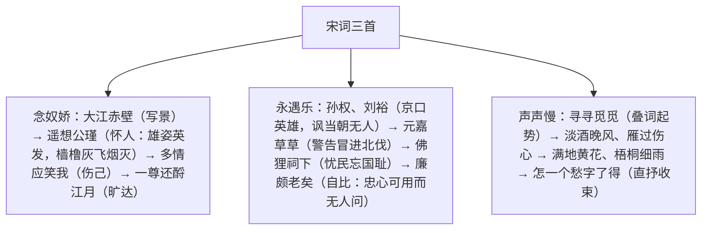

# 9 念奴娇·赤壁怀古 / 永遇乐·京口北固亭怀古 / 声声慢

标签：#宋词 #苏轼 #辛弃疾 #李清照 #必背篇目

## 一、作家与背景

- 苏轼《念奴娇·赤壁怀古》：北宋文学家，豪放词开创者。1082 年贬黄州游赤壁矶而作，借周瑜功业抒壮志难酬之慨。
- 辛弃疾《永遇乐·京口北固亭怀古》：南宋爱国词人，豪放词集大成者。1205 年 66 岁镇江知府任上作，忧北伐冒进，抒报国无门之愤。
- 李清照《声声慢》：宋代婉约词大家，号易安居士。南渡后国破家亡夫死，此词写晚年孤苦愁绝，是"易安体"代表。

## 二、结构与用典梳理

## 三、意象与手法比较

| 篇目 | 风格 | 核心手法 | 关键意象/典故 |
| --- | --- | --- | --- |
| 念奴娇·赤壁怀古 | 豪放旷达 | 借古抒怀、映衬（周瑜之得意衬己之失意） | 大江、乱石、惊涛、江月 |
| 永遇乐·京口北固亭怀古 | 豪放悲愤 | 用典密集（五典）、借古讽今 | 孙权、刘裕、刘义隆、佛狸祠、廉颇 |
| 声声慢 | 婉约凄戚 | 叠词、意象叠加、以景写愁 | 淡酒、过雁、黄花、梧桐、细雨 |

## 四、典型例题

1. **题：《永遇乐》用典繁多，是否"掉书袋"？请分析用典作用。**
   解析：非也。五个典故各有所指：孙权、刘裕赞京口英雄，暗讽南宋无人；"元嘉草草"以刘义隆惨败警告韩侂胄勿冒进；"佛狸祠下"忧沦陷区民众安于异族统治；"廉颇老矣"自比，抒老当益壮却不被信用之悲愤。典典切合时事身世，含蓄深沉，正是怀古词"借古讽今"的典范。
2. **题：《声声慢》开头十四个叠字有何妙处？**
   解析："寻寻觅觅"写神态动作，若有所失；"冷冷清清"写环境氛围，孤寂无依；"凄凄惨惨戚戚"写心境层层加深。由外而内、由浅入深，奠定全词愁苦基调；音韵上齿舌音交错，如泣如诉，徐虹亭誉为"千古创格"。

## 五、易错点

- "羽扇纶巾"（guān）指周瑜（从"遥想公瑾当年"语境判断），不少资料误作诸葛亮。
- "樯橹灰飞烟灭"以樯橹借代曹军战船（一作"强虏"）。
- "封狼居胥"是霍去病典，词中借指刘义隆想建此功而"赢得仓皇北顾"，感情色彩是警告而非赞颂。
- "人道寄奴曾住"的"寄奴"是刘裕小名；"佛狸"（bì lí）是北魏太武帝拓跋焘小名。
- 《声声慢》"怎敌他晚来风急"一作"晓来"；"憔悴损"指黄花凋零也自况憔悴。

## 六、背记要点（名句默写）

- 大江东去，浪淘尽，千古风流人物。
- 乱石穿空，惊涛拍岸，卷起千堆雪。
- 羽扇纶巾，谈笑间，樯橹灰飞烟灭。
- 人生如梦，一尊还酹江月。
- 千古江山，英雄无觅，孙仲谋处。
- 想当年，金戈铁马，气吞万里如虎。
- 凭谁问：廉颇老矣，尚能饭否？
- 寻寻觅觅，冷冷清清，凄凄惨惨戚戚。
- 梧桐更兼细雨，到黄昏、点点滴滴。这次第，怎一个愁字了得！

## 七、自测题

1. 《念奴娇》上阕写景有何特点？与下阕怀人有何联系？
2. 苏轼"多情应笑我，早生华发"与"一尊还酹江月"的情感是否矛盾？
3. 《永遇乐》五个典故分别表达什么用意？
4. 《声声慢》选取了哪些意象写愁？"雁过也"为何"正伤心"？

## 八、相关知识点

- 与[[1 沁园春·长沙]]同为词，比较词牌、章法与豪放气象；
- 用典手法上承[[7 短歌行 / 归园田居（其一）]]的《短歌行》；
- 苏轼的旷达人生观详见[[16 赤壁赋 / 登泰山记]]的《赤壁赋》。
