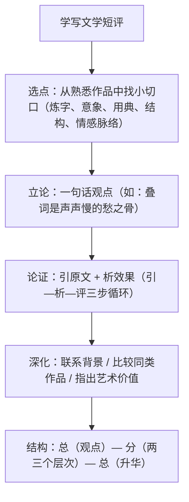

# 写作：学写文学短评

标签：#写作 #文学短评 #鉴赏

## 一、写作要领

- 文学短评是**议论文**：以文学作品为评论对象，有明确观点、有文本论据、有分析论证。
- "短"而"专"：篇幅短小，切口宜小——评一个意象、一种手法、一处结构，忌面面俱到。
- "评"而有"据"：观点必须从文本细读中来，引用原文并分析，不能架空抒情。
- 评论与读后感的区别：读后感重"我"的感受，短评重"作品"的特点与价值。

## 二、技法梳理

## 三、范例分析

以评《声声慢》叠词为例，示范"引—析—评"：

| 步骤 | 示例 | 要点 |
| --- | --- | --- |
| 观点 | 十四叠字奠定全词凄婉基调 | 一句话，可争鸣，可论证 |
| 引 | "寻寻觅觅，冷冷清清，凄凄惨惨戚戚" | 精准引用，不大段抄录 |
| 析 | 由动作到环境到心境，层层递进；齿音字急促如泣 | 分析怎么写、写出什么 |
| 评 | 未言愁而愁溢纸面，为下文意象铺排定调 | 指出其在全篇中的作用与价值 |

常见选题示例：《登高》的沉郁顿挫如何炼成 / 《念奴娇》中"江月"的收束艺术 / 《归园田居》白描的力量。

## 四、常见问题

1. **复述代替评论**：大量概括情节内容，没有观点与分析。
2. **面面俱到**：主题、手法、语言、结构全都谈，每点浅尝辄止。
3. **架空分析**：满纸"生动形象、感情真挚"套话，不引原文。
4. **感想化**：写成"我读后深受感动"的读后感，偏离文体。

## 五、实操清单

- [ ] 选定一部（篇）精读过的作品，确定一个小切口。
- [ ] 写出一句话中心观点（判断句式）。
- [ ] 找出 3 处支撑观点的原文，各配一段"引—析—评"。
- [ ] 设计总分总结构，分论点之间有逻辑层次（由表及里）。
- [ ] 通读删改：删复述、删套话，检查每段是否扣住中心观点。

## 六、相关知识点

- 评论素材直接取自[[7 短歌行/归园田居（其一）]]、[[8 梦游天姥吟留别/登高/琵琶行并序]]、[[9 念奴娇·赤壁怀古/永遇乐·京口北固亭怀古/声声慢]]；
- 议论的观点与论证意识联系[[写作：议论要有针对性]]；
- 鉴赏术语积累参考[[词语积累与词语解释]]。
