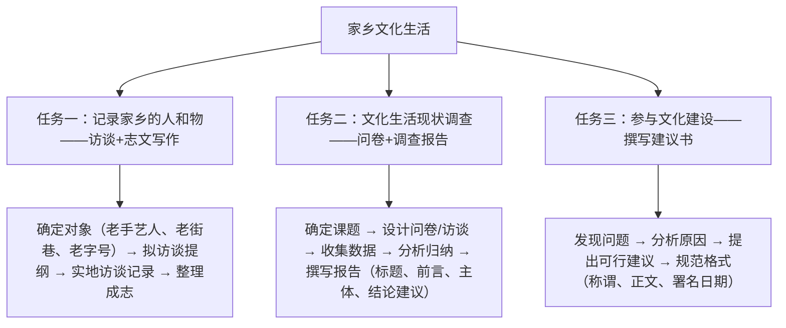

# 家乡文化生活（记录·调查·参与）

标签：#活动课 #调查报告 #家乡文化

## 一、活动要领

- 本单元是"当代文化参与"学习任务群的实践活动，包含三项任务：**记录家乡的人和物**（写人物志、风物志）、**家乡文化生活现状调查**（写调查报告）、**参与家乡文化建设**（写建议书）。
- 核心能力：访谈、观察、查阅文献等信息搜集能力 + 志、报告、建议书等实用文写作能力。
- 北京学生可选题材：胡同与四合院、京剧与曲艺、庙会民俗、中轴线申遗、老字号、非遗手艺等。

## 二、活动流程梳理

## 三、文体格式要点

| 文体 | 结构要素 | 注意事项 |
| --- | --- | --- |
| 访谈提纲 | 目的、对象、问题清单 | 问题由浅入深，开放式为主，尊重受访者 |
| 人物（风物）志 | 名称、历史沿革、特征、价值 | 语言平实客观，材料真实有出处 |
| 调查报告 | 标题、前言（目的方法）、主体（数据分析）、结论建议 | 用数据说话，图表辅助，避免主观臆断 |
| 建议书 | 标题、称谓、正文（问题—理由—建议）、署名日期 | 建议具体可操作，语气诚恳得体 |

## 四、范例分析

以"胡同文化生活现状调查"为例：

- **前言**：交代调查目的（了解胡同居民文化生活变迁）、时间地点、方法（问卷 120 份+访谈 5 人）。
- **主体**：分点呈现发现——传统活动（下棋、遛鸟）参与者老龄化；新型空间（胡同书店、咖啡馆）吸引青年；居民对保护与商业化的态度分化（附数据）。
- **结论建议**：在保护胡同肌理前提下引入公共文化空间；建立口述史档案。
- 可学之处：观点从数据中来；建议针对调查发现，不空谈。

## 五、常见问题

1. **选题过大**："北京文化研究"无从下手，应缩小为"某胡同""某庙会"。
2. **材料失实**：网上抄资料代替实地调查，报告缺乏一手信息。
3. **有数据无分析**：罗列问卷百分比，不归纳原因与趋势。
4. **建议空泛**："加强宣传、加大投入"式套话，缺乏可操作性。

## 六、实操清单

- [ ] 三人小组选定一个小切口课题，明确分工。
- [ ] 拟出 8—10 个访谈/问卷问题，先小范围试测再修改。
- [ ] 实地走访至少一次，拍照、录音（征得同意）、做笔记。
- [ ] 按规范结构完成调查报告或风物志初稿。
- [ ] 小组互评：检查真实性、针对性、格式规范，修改定稿。

## 七、相关知识点

- 乡土社会的理论视角参考[[《乡土中国》整本书阅读]]（差序格局、礼俗社会可用作分析工具）；
- 访谈中的细节记录方法联系[[写作：写人要关注事例和细节]]；
- 报告的针对性论述联系[[写作：议论要有针对性]]。
