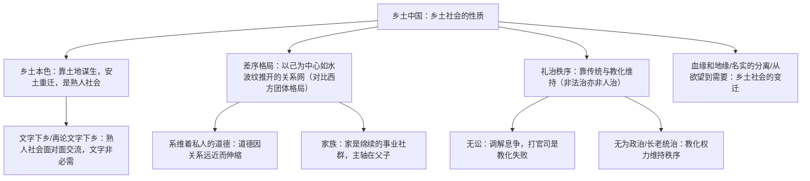

# 《乡土中国》整本书阅读

标签：#整本书阅读 #费孝通 #学术著作

## 一、作者与成书

- 作者：费孝通（1910—2005），著名社会学家、人类学家，代表作《江村经济》《乡土中国》。
- 成书：1948 年出版，由西南联大和云南大学"乡村社会学"讲稿整理而成，共 14 篇，是研究中国基层传统社会的经典学术著作。
- 阅读定位：高中整本书阅读任务书目，训练学术著作的阅读方法——抓核心概念、理清论证思路、联系现实检验。

## 二、全书概念体系

## 三、核心概念表

| 概念 | 含义 | 现实对照 |
| --- | --- | --- |
| 乡土本色 | 中国基层社会是乡土性的：不流动、聚村而居、熟人社会 | "熟人好办事"的社会心理 |
| 差序格局 | 以己为中心、按亲疏远近层层外推的关系结构 | 称呼"自家人"范围可伸可缩 |
| 礼治秩序 | 依靠世代累积的传统规范（礼）自动维持秩序 | 乡规民约、红白喜事的规矩 |
| 长老统治 | 依靠年长者的教化权力治理 | "不听老人言，吃亏在眼前" |
| 名实分离 | 社会变迁中表面遵旧名、实际行新实 | 传统形式与现代内容的错位 |

## 四、阅读方法与范例

- **概念阅读法**：每章先找核心概念的定义句，再看作者用什么事例、比喻论证（如"水波纹"喻差序格局，"捆柴"喻团体格局）。
- **比较阅读法**：全书贯穿"乡土社会 vs 现代社会（西方社会）"的对比框架，列对照表事半功倍。
- **联系现实法**：用"差序格局"分析亲戚圈层、用"无讼"理解调解文化，检验理论解释力。

## 五、常见问题

1. **只记结论不理思路**：背了"差序格局"名词却说不出论证过程与比喻。
2. **误读作者态度**：费孝通是客观分析而非贬低乡土社会，"土气"是特点不是缺点。
3. **概念混淆**：礼治不等于人治，也不是"文明礼貌"；"无为政治"非道家思想的简单套用。
4. **脱离文本空谈**：论述题必须援引书中概念与例证，不能仅凭生活经验。

## 六、实操清单

- [ ] 通读全书，为 14 篇各写一句话概括（核心概念+基本观点）。
- [ ] 绘制全书概念关系图（可参照上方流程图扩充）。
- [ ] 摘录 5 个经典比喻并说明其论证功能。
- [ ] 用一个概念分析一种身边现象，写 300 字短文。
- [ ] 小组讨论：乡土社会的特征在城市化今天是否仍然存在？

## 七、自测题

1. "差序格局"与"团体格局"的区别是什么？作者各用什么比喻？
2. 为什么说乡土社会是"礼治社会"而非"法治"或"人治"社会？
3. 作者为何认为"文字下乡"在乡土社会中并不迫切？
4. 举例说明"名实分离"在社会变迁中的表现。

## 八、相关知识点

- 概念可作为[[家乡文化生活（记录·调查·参与）]]调查分析的理论工具；
- 学术文的概念界定与论证思路联系[[写作：议论要有针对性]]；
- 乡土与现代文明的碰撞主题呼应[[3* 哦，香雪]]。
