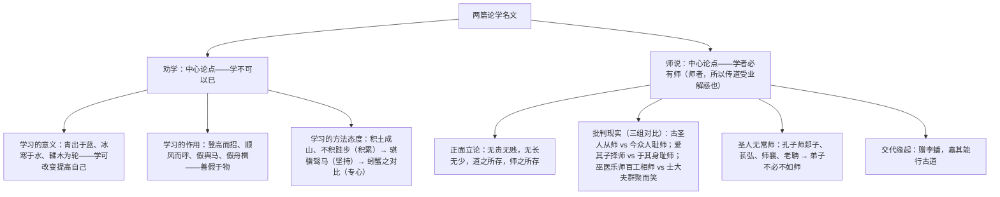

# 10 劝学 / 师说

标签：#文言文 #荀子 #韩愈 #必背篇目

## 一、作家与背景

- 《劝学》：荀子（约前 313—前 238），名况，战国末思想家，儒家代表，主张"性恶论"，故强调后天学习。《劝学》是《荀子》首篇（节选）。
- 《师说》：韩愈（768—824），字退之，世称韩昌黎，唐代文学家，古文运动倡导者，"唐宋八大家"之首。针对当时士大夫"耻学于师"的风气，赠李蟠而作。"说"是议论文体。

## 二、论证思路

## 三、文言知识梳理

| 类别 | 例句 | 解释 |
| --- | --- | --- |
| 通假字 | 輮以为轮 / 虽有槁暴 / 则知明而行无过 / 君子生非异也 | 輮通煣；有通又；知通智；生通性 |
| 通假字 | 师者，所以传道受业解惑也 | 受通授 |
| 古今异义 | 君子博学而日参省乎己 | 博学：广泛地学习（今指学问渊博） |
| 古今异义 | 小学而大遗 / 今之众人 | 小学：小的方面学习；众人：一般人 |
| 词类活用 | 假舟楫者，非能水也 / 吾从而师之 | 水：名作动，游泳；师：意动，以……为师 |
| 词类活用 | 上食埃土，下饮黄泉 / 圣益圣，愚益愚 | 上、下：名作状；前"圣""愚"：形作名 |
| 虚词 | 于：青取之于蓝而青于蓝 / 不拘于时 | 从；比；表被动 |
| 虚词 | 而：顺风而呼（修饰）/ 而致千里（转折→顺承辨析） | 结合语境判断连接关系 |

## 四、典型例题

1. **题：《劝学》的比喻论证有何特色？**
   解析：①数量多、设喻密集，全文近二十喻；②方式灵活：正面设喻（青出于蓝）、正反对比设喻（骐骥与驽马、蚓与蟹）、层递设喻（积土—积水—积跬步）；③喻体皆日常事物，深入浅出，把抽象学理讲得具体可感。
2. **题：《师说》第二段三组对比的批判层次是怎样的？**
   解析：由古及今、由家及己、由下层及上层：古圣人与今众人对比，批耻师之风违背传统；为子择师与自身耻师对比，揭其自相矛盾；百工相师与士大夫嘲笑对比，讽其见识反不及百工。层层深入，锋芒直指士大夫阶层，感情愈发激愤。

## 五、易错点

- "君子生非异也，善假于物也"的"生"通"性"（资质），不读 shēng 之本义。
- "师者，所以传道受业解惑也"："所以"表凭借（用来……的），非因果连词。
- "句读之不知，惑之不解"是宾语前置（之为标志）。
- "不拘于时"的"于"表被动；"学于余"的"于"表对象（向）。
- 默写高频错字：跬（非"硅"）、锲（非"契"）、骐骥、驽马、郯子、苌弘、老聃。

## 六、背记要点（名句默写）

- 青，取之于蓝，而青于蓝；冰，水为之，而寒于水。
- 故不积跬步，无以至千里；不积小流，无以成江海。
- 锲而舍之，朽木不折；锲而不舍，金石可镂。
- 君子生非异也，善假于物也。
- 师者，所以传道受业解惑也。
- 是故无贵无贱，无长无少，道之所存，师之所存也。
- 是故弟子不必不如师，师不必贤于弟子，闻道有先后，术业有专攻。

## 七、自测题

1. 《劝学》从哪三个层面论证"学不可以已"？各用哪些比喻？
2. 解释"而"在"吾尝终日而思矣""登高而招""而闻者彰"中的用法。
3. 《师说》中"师"字有哪几种含义与用法？
4. 韩愈提出的择师标准是什么？在当时有何进步意义？

## 八、相关知识点

- 文言实词虚词积累方法见[[词语积累与词语解释]]；
- 议论文的对比论证、比喻论证迁移至[[写作：议论要有针对性]]；
- 批判现实的杂文笔法下启[[12 拿来主义]]。
