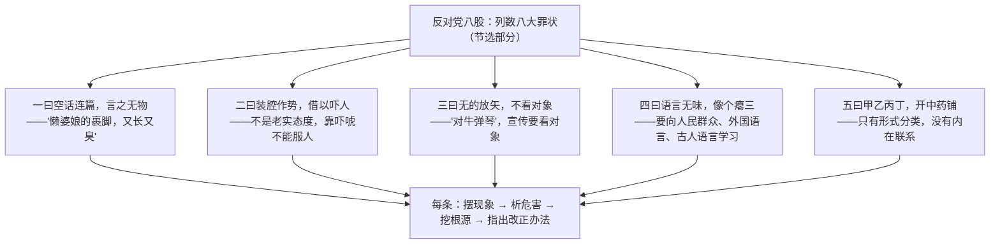

# 11 反对党八股（节选）

标签：#议论文 #毛泽东 #延安整风

## 一、作家与背景

- 作者：毛泽东。本文是 1942 年延安整风运动中的著名讲演，与《改造我们的学习》《整顿党的作风》并称整风运动的基本文献。
- "党八股"：指党内盛行的空洞死板、装腔作势的坏文风，因类似明清科举"八股文"的僵化格式而得名。
- 文体：讲演稿（驳论性议论文），针对性极强，语言通俗泼辣。

## 二、论证思路：逐条批驳八大罪状

## 三、论证方法与语言特色

| 特色 | 示例 | 效果 |
| --- | --- | --- |
| 比喻论证 | 懒婆娘的裹脚 / 瘪三 / 开中药铺 / 对牛弹琴 | 俗语设喻，化抽象为形象，嬉笑怒骂皆成文章 |
| 对比论证 | 党八股文风 vs 生动活泼的马克思主义文风 | 是非分明，破中有立 |
| 引用论证 | 引俗语、成语，化用典故 | 通俗而有文化底蕴 |
| 逐条批驳 | 一曰、二曰……条分缕析 | 结构清晰，批驳全面而有序 |

## 四、典型例题

1. **题：本文用"懒婆娘的裹脚，又长又臭"作比有何妙处？**
   解析：以生活中人人厌恶之物比空洞冗长的文章，形象揭示"长而空"文风的可憎；语言辛辣幽默，态度鲜明，体现讲演稿面向大众、务求生动的特点；先声夺人，为下文分析危害张本。
2. **题：文章批驳每一条罪状的思路有何共同点？对议论文写作有何启示？**
   解析：均按"摆现象—析危害—挖根源—给办法"展开，既破且立。启示：批驳性议论不能只骂现象，要分析危害、追究原因，更要提出建设性主张，这正是"议论的针对性"的典范。

## 五、易错点

- "党八股"是文风问题，其思想根源是主观主义、宗派主义，不可仅理解为"文章写得长"。
- 本文语言通俗却非随意，俗语背后是严密的逻辑层次。
- "无的放矢"的"的"读 dì（箭靶），指讲话作文不看对象。
- 文章态度是"反对"中有"建设"——提出学习人民语言、外国语言、古人语言中有生命力的东西。

## 六、背记要点

- 八股文风的核心弊病：空、假、僵（言之无物、装腔作势、形式主义）。
- 名句："射箭要看靶子，弹琴要看听众，写文章做演说倒可以不看读者不看听众么？"
- 改进文风三学习：向人民群众学、向外国语言中有用的东西学、向古人语言中有生命的东西学。

## 七、自测题

1. 节选部分批驳了党八股的哪几条罪状？各用了什么比喻？
2. 分析"到什么山上唱什么歌"在文中的论证作用。
3. 本文作为讲演稿，语言上有哪些适应听众的特点？
4. 联系当下"标题党""空话套话"现象，谈本文的现实意义。

## 八、相关知识点

- "看对象、有的放矢"直接支撑[[写作：议论要有针对性]]；
- 破立结合的杂文笔法与[[12 拿来主义]]同源；
- 语言的锤炼与规范联系[[词语积累与词语解释]]。
