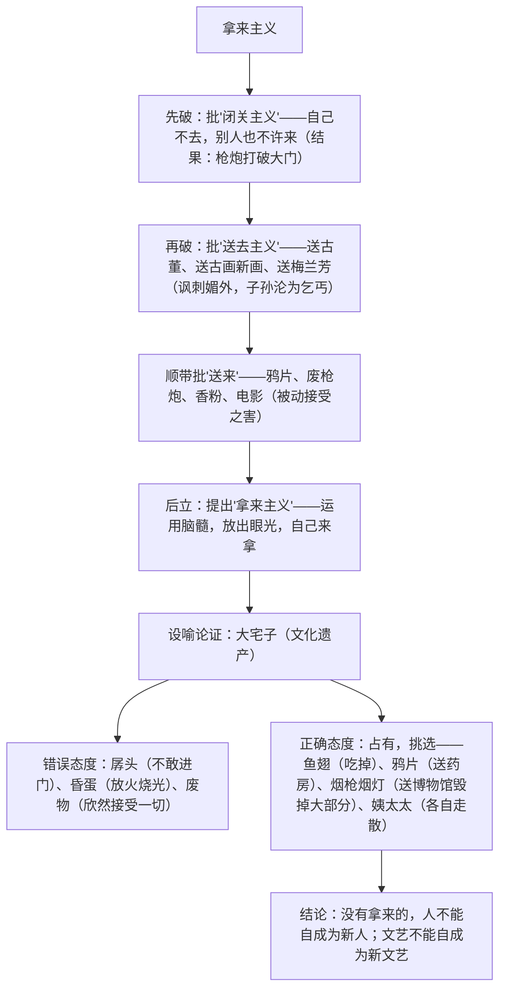

# 12 拿来主义

标签：#杂文 #鲁迅 #驳论

## 一、作家与背景

- 作者：鲁迅（1881—1936），原名周树人，伟大的文学家、思想家、革命家，杂文是其"匕首与投枪"。
- 背景：写于 1934 年，针对当时对待外来文化与文化遗产的两种错误态度——一味"送去"（媚外）与一味排斥或全盘接受，提出"拿来主义"主张。
- 文体：杂文（驳论文），先破后立，嬉笑怒骂，讽刺犀利。

## 二、论证思路

## 三、比喻论证体系表

| 喻体 | 本体 | 主张的态度 |
| --- | --- | --- |
| 大宅子 | 文化遗产（含外来文化） | 占有，挑选 |
| 鱼翅 | 文化中的精华 | 吸收（吃掉） |
| 鸦片 | 精华与糟粕并存者 | 批判地吸收（送药房供治病） |
| 烟枪烟灯 | 旧文化的形式（可留少量作反面教材） | 大部分清除 |
| 姨太太 | 纯粹的封建糟粕 | 坚决抛弃 |
| 孱头 / 昏蛋 / 废物 | 逃避主义 / 虚无主义 / 投降主义 | 均为错误态度 |

## 四、典型例题

1. **题：文章题为"拿来主义"，为何先用大量篇幅写"闭关主义""送去主义"？**
   解析：先破后立的驳论结构。①破是立的前提：揭露闭关、送去之害（亡国、贻害子孙），说明"拿来"的必要性与紧迫性；②对比反衬，使"拿来主义"的正确性不言自明；③体现杂文针砭时弊的战斗性。
2. **题：分析"大宅子"这一比喻论证的妙处。**
   解析：以"得了一所大宅子"喻面对文化遗产，将抽象的文化态度问题化为具体的处置难题；孱头、昏蛋、废物三种人对应三种错误态度，鱼翅、鸦片、烟枪、姨太太对应遗产中不同性质的成分；整套比喻系统连贯、生动幽默，说理深入浅出。

## 五、易错点

- "送去主义"讽刺的是当局的媚外行径，"送去"与平等的文化交流不同，不可混淆。
- "送来"与"拿来"的区别：送来是被动接受（列强倾销），拿来是主动挑选，这是理解主旨的关键。
- "拿来主义"不是全盘照搬，核心是"占有，挑选"，取其精华、去其糟粕。
- 结尾"没有拿来的，人不能自成为新人"中"新人"指有创造力的新文化主体，须结合语境作答。

## 六、背记要点

- 核心主张："运用脑髓，放出眼光，自己来拿！"
- 态度八字："占有，挑选"；结果："或使用，或存放，或毁灭。"
- 结论句："总之，我们要拿来。我们要或使用，或存放，或毁灭。……没有拿来的，人不能自成为新人，没有拿来的，文艺不能自成为新文艺。"

## 七、自测题

1. 梳理全文"破—立"结构，说明各部分的逻辑关系。
2. "孱头""昏蛋""废物"分别比喻怎样的文化态度？
3. 文中"抛来""抛给""送来"三词含义有何区别？
4. 用"拿来主义"的观点，谈谈今天应如何对待外来流行文化。

## 八、相关知识点

- 先破后立的结构与[[11 反对党八股（节选）]]互为印证；
- 比喻论证的系统性上承[[10 劝学 / 师说]]的《劝学》；
- 批判的针对性服务于[[写作：议论要有针对性]]。
