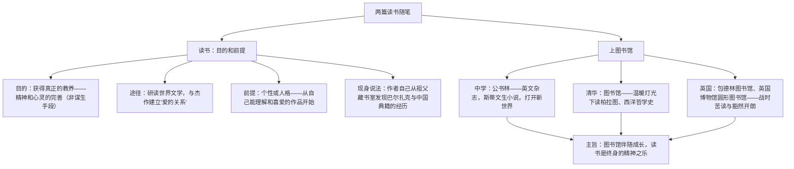

# 13 读书：目的和前提 / 上图书馆

标签：#随笔 #黑塞 #王佐良 #读书

## 一、作家与背景

- 《读书：目的和前提》：作者黑塞（1877—1962），德国作家，1946 年诺贝尔文学奖得主，代表作《荒原狼》《悉达多》。本文是其谈读书的随笔，主张通过研读"世界文学"获得教养。
- 《上图书馆》：作者王佐良（1916—1995），著名英语文学专家、翻译家、诗人。本文回忆自己不同人生阶段的图书馆经历，写读书之乐。
- 文体：均为**随笔**——形式自由、夹叙夹议、有个人色彩的散文。

## 二、思路梳理

## 三、观点与材料对照

| 篇目 | 核心观点 | 支撑材料 | 手法 |
| --- | --- | --- | --- |
| 读书：目的和前提 | 教养是精神心灵的完善，读书出于内心需要 | 自己少年读书经历（巴尔扎克、《道德经》） | 现身说法、对比（虚荣式读书 vs 真诚读书） |
| 上图书馆 | 图书馆之光照亮求知人生 | 四个图书馆的时间线回忆 | 以空间串时间、细节描写（灯光、书香） |

## 四、典型例题

1. **题：黑塞所说"真正的教养"有哪些特征？**
   解析：①目的性上"不追求任何具体目的"，是精神与心灵完善的自我追求，而非谋生技能；②过程性上是"永远都在半道上"的动态努力，无终点；③个体性上须以个人的爱好与个性为出发点，强迫的义务式阅读适得其反。
2. **题：《上图书馆》按什么顺序组织材料？这样写有何好处？**
   解析：按人生阶段的时间顺序（中学—大学—留学），以四个图书馆为空间节点串联。好处：脉络清晰；图书馆的升级与精神成长同步，暗示读书对人生的塑造；首尾以"上图书馆之乐"呼应，形散神聚。

## 五、易错点

- 黑塞并不反对读"杂书"，他反对的是为装点门面的虚荣式阅读；从个人兴趣出发是"前提"而非"降低要求"。
- "世界文学"指各民族经典杰作的总和，不是"外国文学"。
- 《上图书馆》引用《哈姆莱特》"人是宇宙的精华、万物的灵长"意在礼赞人类创造知识的理性之光，非单纯掉书袋。
- 随笔"形散神聚"：两文材料看似闲谈，均紧扣"读书与精神成长"之神。

## 六、背记要点

- 黑塞金句：真正的修养"永远都在半道上"；教养是"精神和心灵的完善"。
- 王佐良笔下四馆：公书林（中学）—清华图书馆—包德林图书馆—英国博物馆圆形图书馆。
- 随笔文体特征：自由、真实、个性化、夹叙夹议。

## 七、自测题

1. 黑塞认为读书获得教养的前提是什么？为什么？
2. 两位作者的读书经历有何相似之处？
3. 找出《上图书馆》中一处环境细节描写并分析其作用。
4. 结合两文，谈谈你对"功利性阅读"与"教养性阅读"的看法。

## 八、相关知识点

- 学习之道的古今对话：与[[10 劝学 / 师说]]比较古人劝学与今人谈读书；
- 整本书阅读的实践参考[[《乡土中国》整本书阅读]]；
- 随笔的个性化表达可借鉴于[[写作：议论要有针对性]]（用自身经验增强说服力）。
