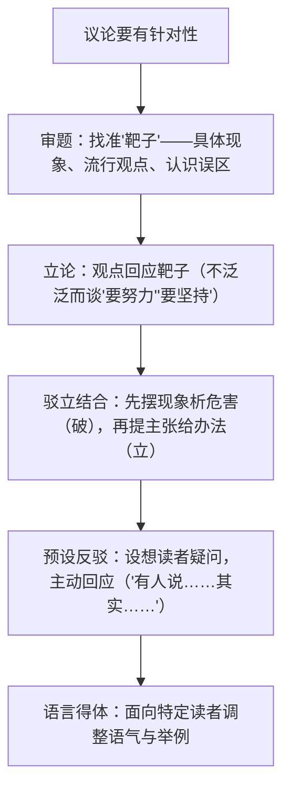

# 写作：议论要有针对性

标签：#写作 #议论文 #针对性

## 一、写作要领

- 针对性是议论文的生命：文章须回应真实的问题、现象或错误观点，做到"有的放矢"。
- 两个维度：**针对现实**（为解决某个现实问题而写，有现实意义）+ **针对读者**（考虑读者的疑问与可能的反驳，增强说服力）。
- 本单元课文即范本：《反对党八股》针对不良文风、《拿来主义》针对错误文化态度、《师说》针对耻学于师的风气。

## 二、技法梳理

## 三、范例分析

| 课文 | 靶子（针对什么） | 针对性体现 |
| --- | --- | --- |
| 师说 | 士大夫"耻学于师"的风气 | 三组对比直指时弊，赠李蟠更见现实指向 |
| 反对党八股 | 空洞僵化的文风 | 逐条罪状皆有现象、危害、办法 |
| 拿来主义 | 闭关、送去、全盘接受等错误态度 | 先破三种错误再立正确主张 |
| 以工匠精神雕琢时代品质 | 浮躁风气与"差不多"心态 | 应时而作，回应政府工作报告热词 |

修改示范：泛泛之论"我们要珍惜时间"（无靶子）→ 有针对性的立论"当'刷短视频五分钟，人间已过两小时'成为常态，我们需要重建对时间的掌控感"（针对具体现象，观点有指向）。

## 四、常见问题

1. **无靶放箭**：通篇正确的废话，看不出针对什么问题而写。
2. **靶子虚假**：树一个无人持有的极端观点来批驳（稻草人谬误）。
3. **破而不立**：批评现象痛快淋漓，却提不出建设性主张。
4. **不看对象**：给同学写倡议书却满纸文件腔，语言与读者错位。

## 五、实操清单

- [ ] 写作前用一句话写明："本文针对……现象（观点），主张……"。
- [ ] 开头用具体现象或材料引出问题（由头意识）。
- [ ] 至少安排一处"有人认为……但是……"的让步反驳段。
- [ ] 结尾落到"怎么办"，给出可操作的主张。
- [ ] 检查语言是否适配预设读者（同学、师长、公众）。

## 六、相关知识点

- 破立结合范例见[[12 拿来主义]]与[[11 反对党八股（节选）]]；
- 对比论证的针对性见[[10 劝学 / 师说]]的《师说》；
- 观点与论据的扣合训练见[[写作：学写文学短评]]。
