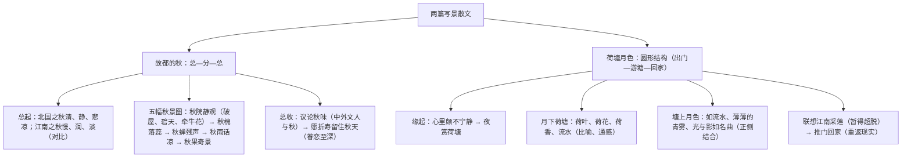

# 14 故都的秋 / 荷塘月色

标签：#散文 #郁达夫 #朱自清 #写景抒情

## 一、作家与背景

- 郁达夫《故都的秋》：郁达夫（1896—1945），现代作家，创造社发起人之一，代表作《沉沦》《春风沉醉的晚上》。1934 年重回北平（故都）而作，以"清、静、悲凉"总领全篇。
- 朱自清《荷塘月色》：朱自清（1898—1948），字佩弦，现代散文家、诗人。1927 年大革命失败后作于清华园，以"这几天心里颇不宁静"为文眼。
- 文体：写景抒情散文，均为中国现代散文经典。

## 二、结构与画面

## 三、语言鉴赏表

| 名句 | 手法 | 赏析 |
| --- | --- | --- |
| 像花而又不是花的那一种落蕊……声音也没有，气味也没有 | 视听嗅触多感官 | 极写"静"与细腻，落蕊之景含悲凉之味 |
| 泡一碗浓茶，向院子一坐……细数一丝一丝漏下来的日光 | 细节白描 | 闲适中见落寞，故都秋味在平常景中 |
| 微风过处，送来缕缕清香，仿佛远处高楼上渺茫的歌声似的 | 通感（嗅觉通听觉） | 以歌声之渺茫写荷香之若有若无 |
| 塘中的月色并不均匀；但光与影有着和谐的旋律，如梵婀玲上奏着的名曲 | 通感（视觉通听觉） | 光影之和谐如乐曲，朦胧美臻于极致 |
| 叶子出水很高，像亭亭的舞女的裙 | 比喻 | 写荷叶舒展轻盈之姿态 |

## 四、典型例题

1. **题：《故都的秋》为何用大量笔墨写江南之秋？**
   解析：对比衬托。江南之秋"草木凋得慢，空气来得润……只能感到一点点清凉"，色彩不浓、回味不永，反衬北国之秋清、静、悲凉的醇厚秋味，突出作者对故都之秋的向往与眷恋；首尾两处对比呼应，结构圆合。
2. **题：《荷塘月色》中"心里颇不宁静"在全文中的作用？**
   解析：文眼。①交代夜游缘起，统摄全篇感情基调；②游塘赏月是寻求宁静的过程——荷香月色中暂得片刻超脱（"什么都可以想，什么都可以不想"）；③联想采莲盛景是对自由快乐的向往；④结尾回家，宁静终不可得，情感线索"不宁静—求静—得静—出静"因之而立。

## 五、易错点

- 《故都的秋》的"悲凉"是审美体验而非消极哀伤，作者是"以悲凉为美"，眷恋而非厌弃。
- 牵牛花"以蓝色或白色者为佳"体现作者清冷的审美趣味，答题须联系"清、静、悲凉"。
- 通感不同于一般比喻：感觉的挪移（嗅觉→听觉），答题须点明两种感觉。
- 《荷塘月色》中"热闹是它们的，我什么也没有"不可忽略——蝉声蛙声反衬内心依旧孤寂。

## 六、背记要点

- 《故都的秋》文眼："可是啊，北国的秋，却特别地来得清，来得静，来得悲凉。"
- 五幅秋景图名称：秋院静观、秋槐落蕊、秋蝉残声、秋雨话凉、秋果奇景。
- 《荷塘月色》文眼："这几天心里颇不宁静。"
- 两处通感名句（荷香如歌声、光影如名曲）须能默写并指明手法。

## 七、自测题

1. "清、静、悲凉"分别在五幅图景中如何体现？
2. 《荷塘月色》的感情线索是怎样起伏的？
3. 比较两文写景的选材倾向（平常之景 vs 优美之景）与语言风格。
4. 各找一处叠词运用（如"曲曲折折""田田"）并分析音韵效果。

## 八、相关知识点

- 情景交融技法总结于[[写作：如何做到情景交融]]；
- "悲秋"传统的反用比较[[1 沁园春·长沙]]；
- 生命体验与景物观照的深化见[[15 我与地坛（节选）]]。
