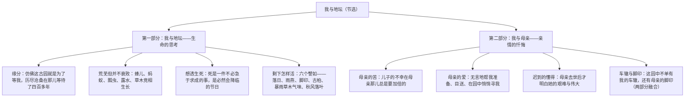

# 15 我与地坛（节选）

标签：#散文 #史铁生 #生命哲思

## 一、作家与背景

- 作者：史铁生（1951—2010），当代作家，21 岁双腿瘫痪，后又患尿毒症，自称"职业是生病，业余在写作"，代表作《我与地坛》《病隙碎笔》《务虚笔记》。
- 背景：残疾之初，作者摇着轮椅日日到家附近的地坛（北京明清皇家祭坛，已成荒园）沉思，十五年间完成了对生死的思考。课文节选第一、二部分。
- 文体：哲理抒情散文，将景物、身世、哲思熔于一炉。

## 二、文本脉络

## 三、景物描写三层次

| 段落 | 景物 | 与生命思考的关系 |
| --- | --- | --- |
| 园子初印象 | 剥蚀的琉璃、淡褪的朱红、坍圮的高墙 | 古园褪去浮华，恰似"我"跌入人生谷底 |
| 荒芜不衰败 | 蜂儿如小雾、蚂蚁疾行、瓢虫升空、露水轰然坠地 | 卑微生命自在活泼，启示"我"生之意味 |
| 六个"譬如" | 落日灿烂、雨燕高歌、孩子脚印、苍黑古柏 | 万物历经风霜仍镇静坦然，指引"怎样活" |

## 四、典型例题

1. **题：如何理解"死是一件不必急于求成的事，死是一个必然会降临的节日"？**
   解析：作者想透了死是必然结局，无须焦虑亦无须刻意求死；称之为"节日"，是以豁达之心接纳死亡，从而卸下轻生念头，把问题从"要不要死"转向"怎样活"。语言冷静而幽默，是绝望后大彻大悟的生命哲学。
2. **题：第二部分中母亲形象是如何刻画的？**
   解析：①动作细节：帮我上轮椅时的无言、望我拐出小院的目送、在园中"端着眼镜像在寻找海上的一条船"般找我；②心理揣摩：以"我"之心反推母亲"整日整夜处在痛苦、惊恐当中"；③对比忏悔：当年倔强沉默与如今追悔莫及。一位疼爱而理解儿子、坚忍而毫不张扬的母亲跃然纸上。

## 五、易错点

- 地坛不只是背景：它是"精神家园"与"生命导师"，"我与地坛"是相互成全的关系。
- "荒芜但并不衰败"是理解第一部分的钥匙：荒芜对应"我"的残疾困境，不衰败对应生命的顽强。
- 母亲的"苦"有双重：儿子残疾之痛+不知如何帮助又不敢表露的煎熬，答题勿只答其一。
- 结尾"车辙"与"脚印"的交叠是两部分的结构性缝合，象征母爱始终默默相随。

## 六、背记要点

- "它等待我出生，然后又等待我活到最狂妄的年龄上忽地残废了双腿。"
- "死是一件不必急于求成的事，死是一个必然会降临的节日。"
- "儿子的不幸在母亲那儿总是要加倍的。"
- "这园中不单是处处都有过我的车辙，有过我的车辙的地方也都有过母亲的脚印。"

## 七、自测题

1. 地坛的"荒芜但并不衰败"体现在哪些景物描写中？
2. 作者在地坛想清了哪三个问题？哪一个"不是能一次性解决的事"？
3. 母亲"艰难的命运、坚忍的意志和毫不张扬的爱"各体现在何处？
4. 六个"譬如"的排比在内容与形式上各有何作用？

## 八、相关知识点

- 与[[14 故都的秋/荷塘月色]]同属自然情怀单元，景物中的生命观照更进一层；
- 面对困境的旷达可与[[16 赤壁赋/登泰山记]]中苏轼比较；
- 细节写母爱的手法呼应[[写作：写人要关注事例和细节]]。
