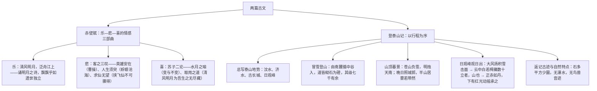

# 16 赤壁赋 / 登泰山记

标签：#文言文 #苏轼 #姚鼐 #必背篇目

## 一、作家与背景

- 苏轼《赤壁赋》：北宋文学家，"唐宋八大家"之一。1082 年因"乌台诗案"贬黄州，与客泛舟黄州赤壁（赤鼻矶）下作此赋。文体是**文赋**（主客问答、骈散结合）。
- 姚鼐《登泰山记》：姚鼐（1731—1815），字姬传，清代桐城派集大成者，主张义理、考据、辞章合一。1774 年辞官后冒雪登泰山观日出而作。文体是**山水游记**。

## 二、结构脉络

## 三、文言知识梳理

| 类别 | 例句 | 解释 |
| --- | --- | --- |
| 通假字 | 浩浩乎如冯虚御风 / 山川相缪 | 冯通凭（乘）；缪通缭（盘绕） |
| 通假字 | 须臾成五采 / 多平方，少圜 | 采通彩；圜通圆 |
| 古今异义 | 徘徊于斗牛之间 / 白露横江 | 斗牛：星宿名；白露：白茫茫的水汽 |
| 词类活用 | 舞幽壑之潜蛟，泣孤舟之嫠妇 | 舞、泣：使动用法 |
| 词类活用 | 侣鱼虾而友麋鹿 / 明烛天南 | 侣、友：意动；烛：名作动，照 |
| 句式 | 而今安在哉 / 何为其然也 | 宾语前置 |
| 句式 | 月出于东山之上 / 当其南北分者，古长城也 | 状语后置；判断句 |
| 虚词"乎" | 浩浩乎 / 相与枕藉乎舟中 | 形容词词尾；相当于"于" |

## 四、典型例题

1. **题：《赤壁赋》中苏子如何以"水月之喻"化解客之悲？**
   解析：从"变"的角度看，水逝月盈虚，天地曾不能以一瞬；从"不变"的角度看，水月与万物皆无尽藏，"物与我皆无尽也"，何必羡长江之无穷？再进一层：非吾所有者一毫莫取，而江上清风、山间明月取之无禁、用之不竭。以辩证眼光超越个体生命的短暂之悲，体现儒道兼融的旷达。
2. **题：《登泰山记》写日出运用了怎样的观察与描写顺序？**
   解析：按时间推移分层：日出前（大风扬积雪、云漫、白若樗蒱之山峰）→日将出（云一线异色，须臾成五采）→日出时（正赤如丹，红光动摇承之）→回视日观以西峰（绛皓驳色，而皆若偻）。层次分明，色彩变幻如画，且以西峰"若偻"侧面烘托日观峰之尊，是桐城派简洁雅正文风的典范。

## 五、易错点

- 苏轼所游黄州赤壁并非三国赤壁之战故地，借地怀古而已。
- "客"与"苏子"实为作者内心两面，主客问答是赋体传统手法，非实录对话。
- "壬戌之秋，七月既望"："既望"是农历十六，"望"是十五。
- 《登泰山记》"戊申晦，五鼓"："晦"是农历每月最后一天；"五鼓"即五更。
- 默写高频错字：舳舻、酾酒、横槊、蜉蝣、樗蒱、绛皓驳色、若偻。

## 六、背记要点（名句默写）

- 清风徐来，水波不兴。举酒属客，诵明月之诗，歌窈窕之章。
- 白露横江，水光接天。纵一苇之所如，凌万顷之茫然。
- 寄蜉蝣于天地，渺沧海之一粟。哀吾生之须臾，羡长江之无穷。
- 盖将自其变者而观之，则天地曾不能以一瞬；自其不变者而观之，则物与我皆无尽也。
- 惟江上之清风，与山间之明月，耳得之而为声，目遇之而成色。
- 苍山负雪，明烛天南。望晚日照城郭，汶水、徂徕如画，而半山居雾若带然。
- 极天云一线异色，须臾成五采。日上，正赤如丹，下有红光动摇承之。

## 七、自测题

1. 《赤壁赋》的情感线索如何流转？"客"之悲有哪三层？
2. 解释"侣鱼虾而友麋鹿""舞幽壑之潜蛟"中的活用现象。
3. 《登泰山记》按什么顺序写登山？"苍山负雪，明烛天南"妙在何处？
4. 比较两文面对自然时的人生态度（旷达超脱 vs 静观赏鉴）。

## 八、相关知识点

- 苏轼的旷达与其词作[[9 念奴娇·赤壁怀古 / 永遇乐·京口北固亭怀古 / 声声慢]]互证（同年同地所作）；
- 文言实词积累方法见[[词语积累与词语解释]]；
- 写景与哲理交融的笔法服务于[[写作：如何做到情景交融]]。
