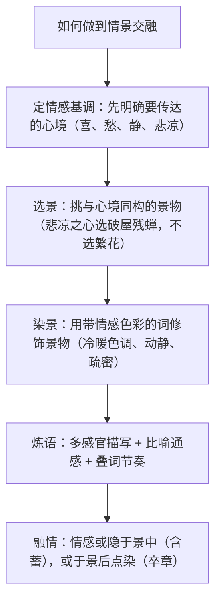

# 写作：如何做到情景交融

标签：#写作 #散文 #情景交融

## 一、写作要领

- 情景交融是写景散文的最高追求："一切景语皆情语"（王国维），景是情的载体，情是景的灵魂。
- 三种基本形态：**触景生情**（景在先，情由景发）、**融情入景**（情在先，以情选景染景）、**情景相生**（情与景互相激发、层层深化）。
- 本单元课文即范本：郁达夫以悲凉之心选故都秋景，朱自清以不宁静之情看荷塘月色，史铁生于荒园中悟生命。

## 二、技法梳理

## 三、范例分析

| 课文示例 | 技法 | 分析 |
| --- | --- | --- |
| 故都的秋：破屋、浓茶、碧天、驯鸽的飞声 | 以情选景 | "清、静、悲凉"的心境决定了选取平常、清冷之景 |
| 荷塘月色：光与影如梵婀玲上奏着的名曲 | 通感染景 | 朦胧月色映照求静的心境，感觉挪移强化诗意 |
| 我与地坛：露水在草叶上滚动、聚集，压弯草叶轰然坠地 | 微观观照 | 卑微生命的郑重，正是作者重新打量生命的目光 |
| 登泰山记：苍山负雪，明烛天南 | 炼字赋情 | "负""烛"二字使雪山有了精神气象，暗含登临之豪兴 |

修改示范：原句"公园很美，我心情很好"（情景两张皮）→ 改为"风把湖面揉出细碎的金子，柳条低下来，替我把烦恼一根根梳走"（景中含情，物我交融）。

## 四、常见问题

1. **情景两张皮**：写完景硬贴一句"我很感动"，景与情无内在关联。
2. **景物无选择**：见什么写什么，景物色调与情感基调冲突。
3. **滥情**：形容词与感叹号堆砌，情浓而景虚。
4. **有景无我**：纯客观写景如说明文，缺少观察者的心境投射。

## 五、实操清单

- [ ] 动笔前写下一个词的情感基调（如"怅惘"）。
- [ ] 列出 6 个候选景物，删去与基调不合的，保留 3—4 个。
- [ ] 为每个景物配一个带情感色彩的动词或修饰语。
- [ ] 至少使用一处多感官描写或通感。
- [ ] 检查：遮住抒情句，读景物描写能否感到那种情绪？能，则交融成功。

## 六、相关知识点

- 直接范本见[[14 故都的秋/荷塘月色]]与[[15 我与地坛（节选）]]；
- 古典诗文的情景理论印证于[[8 梦游天姥吟留别/登高/琵琶行并序]]的《登高》；
- 炼字赋情参考[[16 赤壁赋/登泰山记]]的写景名句。
