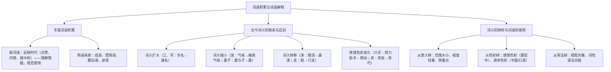

# 词语积累与词语解释

标签：#语言运用 #词语 #成语

## 一、学习要领

- 本单元是"语言积累、梳理与探究"任务群：把零散的词语知识系统化，学会**丰富词语积累**、**把握古今词义的联系与区别**、**辨析词义（准确使用词语）**。
- 高考对接点：成语运用题、近义词辨析、文言实词推断、病句中的用词不当。
- 核心方法：分类梳理建立"词语档案"+ 语境辨析。

## 二、知识体系梳理

## 三、辨析方法与示例

| 辨析角度 | 示例词组 | 区别要点 |
| --- | --- | --- |
| 程度轻重 | 批评 / 批判 | 批判程度更重，多针对错误思想 |
| 范围大小 | 边疆 / 边境 | 边疆范围大，边境指沿边界的狭长地区 |
| 侧重点 | 化装 / 化妆 | 化装侧重改扮成他人，化妆侧重修饰容貌 |
| 感情色彩 | 成果 / 后果 / 结果 | 褒 / 贬 / 中性 |
| 语体色彩 | 商量 / 磋商 | 口语 / 书面（外交）语体 |
| 搭配习惯 | 发扬传统 / 发挥作用 | 固定搭配不可互换 |

成语误用常见类型：望文生义（如"首当其冲"误为"首先"）、褒贬误用（"趋之若鹜"作褒义）、对象错配（"美轮美奂"形容歌声）、重复赘余（"忍俊不禁地笑了"）。

## 四、范例分析

以"爪牙"为例做一份词语档案：

- 本义：鸟兽的爪和牙。
- 古义（褒）：《劝学》"蚓无爪牙之利"用本义；古又喻武臣、得力助手（"将军者，国之爪牙也"）。
- 今义（贬）：坏人的帮凶。
- 启示：文言阅读不能以今律古；档案法=本义+引申脉络+古今色彩对照。

## 五、常见问题

1. **以今律古**：用现代义解释文言词（把"妻子"解作"配偶"）。
2. **积累无系统**：零散记词，不按"同义群、反义群、语义场"归类。
3. **只记不辨**：知道词义却不会在语境中选择（近义词填空失分）。
4. **滥用新词流行语**：作文中不分场合使用网络语，语体失当。

## 六、实操清单

- [ ] 建立个人词语本：按"新词语 / 成语 / 古今异义 / 易混近义词"四栏积累。
- [ ] 每周为 3 个文言常用实词（如"走、汤、去、间"）做古今词义档案。
- [ ] 收集 10 个常被误用的成语，注明误用类型与正确用法。
- [ ] 做一组近义词语境填空并从意义、色彩、用法三角度写辨析理由。
- [ ] 从本学期文言课文中整理通假字、古今异义词汇总表。

## 七、自测题

1. 词义演变有哪四种基本类型？各举一例。
2. 辨析"截止 / 截至"、"启用 / 起用"的区别并造句。
3. 指出"他侃侃而谈，同学们都对他侧目而视"中的成语误用类型。
4. 从《劝学》《师说》中各找两个古今异义词并说明其变化类型。

## 八、相关知识点

- 文言词语档案直接服务于[[10 劝学/师说]]与[[16 赤壁赋/登泰山记]]的实词积累；
- 词语的规范使用联系[[11 反对党八股（节选）]]对语言文风的要求；
- 准确用词是[[写作：学写文学短评]]等一切写作的语言基础。
