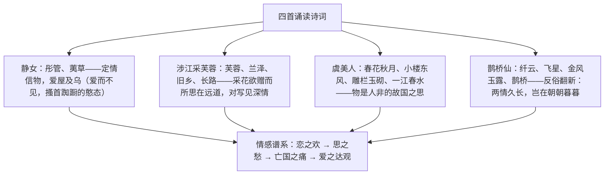

# 古诗词诵读：静女 / 涉江采芙蓉 / 虞美人 / 鹊桥仙

标签：#古诗词诵读 #诗经 #古诗十九首 #李煜 #秦观 #必背篇目

## 一、文体知识与背景

- 《静女》：选自《诗经·邶风》，四言诗，写青年男女约会的活泼情态，用"赋"的手法直陈其事。
- 《涉江采芙蓉》：选自《古诗十九首》（东汉文人五言诗，刘勰誉为"五言之冠冕"），写游子思乡怀人。
- 《虞美人》（春花秋月何时了）：李煜（937—978），南唐后主，亡国被俘后作，相传为其绝命词，"变伶工之词为士大夫之词"。
- 《鹊桥仙》（纤云弄巧）：秦观（1049—1100），字少游，北宋婉约词人。借牛郎织女传说翻出新意。

## 二、意象群与情感梳理

## 三、手法鉴赏表

| 篇目 | 核心手法 | 赏析 |
| --- | --- | --- |
| 静女 | 细节描写、双关 | "搔首踟蹰"传神写急态；"匪女之为美，美人之贻"——爱物实为爱人 |
| 涉江采芙蓉 | 对写法（悬想） | "还顾望旧乡"转从对方落笔，两地相思一笔双写 |
| 虞美人 | 设问、比喻、对比 | "问君能有几多愁？恰似一江春水向东流"以水喻愁，无穷无尽 |
| 鹊桥仙 | 议论入词、反衬 | "金风玉露一相逢，便胜却人间无数"以短暂胜长久，翻案出新 |

## 四、典型例题

1. **题：赏析"问君能有几多愁？恰似一江春水向东流"。**
   解析：设问引出比喻，将抽象之愁化为滚滚东流的春水——写出愁之多（一江）、愁之长（向东流不尽）、愁之起伏汹涌；且春水暗承"春花""东风"意象，物是人非之痛贯注其中，遂成千古写愁绝唱。
2. **题：《鹊桥仙》"两情若是久长时，又岂在朝朝暮暮"为何被称为翻案之笔？**
   解析：历代写七夕多悲叹牛郎织女聚少离多，秦观却议论翻新：只要感情坚贞久长，不必贪求朝暮厮守。将悲情故事升华为对忠贞爱情的礼赞，立意超逸，议论与抒情水乳交融。

## 五、易错点

- 《静女》通假字密集：爱通薆（隐藏）、见通现、说通悦、女通汝、归通馈（kuì，赠送）、匪通非。
- "洵美且异"的"洵"意为诚然、实在；踟蹰（chí chú）。
- 《涉江采芙蓉》"还顾望旧乡"的主语是远方的"所思"还是采芙蓉者，学界有两解，答"对写法"最稳妥。
- 《虞美人》"雕栏玉砌应犹在，只是朱颜改"："朱颜"多解为宫女容颜（亦可指故国容颜），"改"字凝聚物是人非之痛。
- "金风玉露"指秋风白露（七夕时节），非黄金美玉。

## 六、背记要点（名句默写）

- 静女其姝，俟我于城隅。爱而不见，搔首踟蹰。
- 自牧归荑，洵美且异。匪女之为美，美人之贻。
- 涉江采芙蓉，兰泽多芳草。采之欲遗谁？所思在远道。
- 同心而离居，忧伤以终老。
- 春花秋月何时了？往事知多少。小楼昨夜又东风，故国不堪回首月明中。
- 问君能有几多愁？恰似一江春水向东流。
- 金风玉露一相逢，便胜却人间无数。
- 两情若是久长时，又岂在朝朝暮暮。

## 七、自测题

1. 《静女》刻画了男女主人公怎样的形象？细节描写有何作用？
2. 《涉江采芙蓉》的"对写法"如何增强抒情效果？
3. 《虞美人》中哪些意象构成"宇宙永恒"与"人生无常"的对比？
4. 比较《鹊桥仙》与传统七夕诗词在立意上的不同。

## 八、相关知识点

- 《诗经》知识联系[[6 芣苢 / 插秧歌]]的《芣苢》（同为四言、赋法）；
- 以水喻愁可比较[[9 念奴娇·赤壁怀古 / 永遇乐·京口北固亭怀古 / 声声慢]]中李清照的写愁艺术；
- 意象鉴赏与情感把握方法通用于[[8 梦游天姥吟留别 / 登高 / 琵琶行并序]]。
