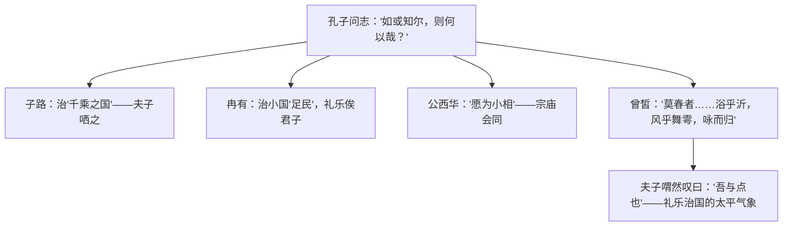

# 1 子路、曾皙、冉有、公西华侍坐 / 齐桓晋文之事 / 庖丁解牛

## 作者与背景

- 《侍坐》选自《论语·先进》。《论语》为语录体，记录孔子及其弟子言行，儒家经典"四书"之一。孔子（前551—前479），名丘，字仲尼，春秋末期思想家、教育家，儒家学派创始人。
- 《齐桓晋文之事》选自《孟子·梁惠王上》。孟子（约前372—前289），名轲，战国中期儒家代表，主张"仁政""民贵君轻"，其文以雄辩、善用比喻著称。
- 《庖丁解牛》选自《庄子·养生主》。庄子（约前369—前286），名周，战国中期道家代表，主张顺应自然，其文汪洋恣肆，善以寓言说理。

## 内容梳理

- 《齐桓晋文之事》论证思路：由"以羊易牛"见齐宣王有"不忍之心"（保民而王的基础）→ 指出王"不为"而非"不能"（"挟太山以超北海"与"为长者折枝"之喻）→ 破"霸道"之妄（"缘木求鱼"）→ 正面铺陈仁政蓝图（制民之产、谨庠序之教）。
- 《庖丁解牛》：以解牛之技喻养生之道——"臣之所好者道也，进乎技矣"；由"所见无非牛者"到"以神遇而不以目视"，揭示"依乎天理""因其固然"、遇难处"怵然为戒"的处世智慧。

## 文言知识

| 类别 | 例句 | 说明 |
| --- | --- | --- |
| 通假字 | 鼓瑟希，铿尔 | "希"通"稀"，稀疏 |
| 通假字 | 莫春者，春服既成 | "莫"通"暮" |
| 通假字 | 刑于寡妻 | "刑"通"型"，做榜样 |
| 通假字 | 砉然向然 | "向"通"响" |
| 词类活用 | 端章甫，愿为小相焉 | 名词作动词，穿礼服、戴礼帽 |
| 词类活用 | 风乎舞雩 | 名词作动词，吹风 |
| 词类活用 | 是以君子远庖厨也 | 形容词作动词，远离 |
| 词类活用 | 良庖岁更刀 | 名词作状语，每年 |
| 特殊句式 | 不吾知也 | 宾语前置，"不知吾" |
| 特殊句式 | 加之以师旅，因之以饥馑 | 状语后置 |
| 特殊句式 | 百姓之不见保 | 被动句，"见"表被动 |
| 特殊句式 | 技经肯綮之未尝 | 宾语前置 |

## 典型例题

**例1** 孔子为何"哂"子路而"与"曾皙？
**解析**：子路"率尔而对"，言志虽有才干却"其言不让"，不合礼的要求，故孔子微笑含蓄批评；曾皙描绘的暮春咏归图，是礼乐教化下人民安乐、社会和谐的太平景象，暗合孔子以礼乐治国的政治理想，故喟然赞叹"吾与点也"。

**例2** 分析《齐桓晋文之事》中孟子的论辩艺术。
**解析**：①善于因势利导：避谈"霸道"，从"以羊易牛"小事切入，肯定宣王"不忍之心"，拉近距离；②善用比喻：以"挟太山以超北海""为长者折枝"区分"不能"与"不为"，以"缘木求鱼"喻武力求霸必败；③层层推进：由心理剖析到破斥霸道，再到正面陈述仁政措施，逻辑严密，气势充沛。

## 易错点

- "夫子哂之"的"哂"是微笑（含委婉批评），并非嘲笑否定子路之志本身。
- "以吾一日长乎尔，毋吾以也"：后一"以"通"已"，止——不要因我年长就不敢说。
- "明足以察秋毫之末，而不见舆薪"是设喻，指宣王恩及禽兽而功不至百姓，是"不为"非"不能"。
- 《庖丁解牛》主旨是"养生"（顺应自然规律以保全天性），不能只理解为熟能生巧。
- "官知止而神欲行"："官知"指感官认知，非官职。

## 背记要点

1. 《侍坐》名句（背诵）："莫春者，春服既成，冠者五六人，童子六七人，浴乎沂，风乎舞雩，咏而归。""为国以礼，其言不让，是故哂之。"
2. 《齐桓晋文之事》名句："老吾老，以及人之老；幼吾幼，以及人之幼。""谨庠序之教，申之以孝悌之义，颁白者不负戴于道路矣。"
3. 《庖丁解牛》名句："臣之所好者道也，进乎技矣。""以无厚入有间，恢恢乎其于游刃必有余地矣。"成语：游刃有余、目无全牛、踌躇满志、切中肯綮。
4. 高考视角：三篇分属儒家问志、孟子论辩、庄子寓言，常考文言实词虚词（如"与""为""乎"）、翻译与思想内涵比较（儒道人生观差异）。

## 自测题

1. 四位弟子各自的志向是什么？孔子的态度分别如何？
2. 翻译："吾力足以举百钧，而不足以举一羽；明足以察秋毫之末，而不见舆薪。"
3. 孟子提出的"保民而王"包括哪些具体措施？
4. 庖丁解牛经历了哪三个阶段？"依乎天理""因其固然"对我们处事有何启示？

## 相关知识点

先秦诸子思想背景参见 [[第2课 诸侯纷争与变法运动]]；史传散文的劝谏艺术参见 [[2 烛之武退秦师]]；儒家进谏传统的延续参见 [[15 谏太宗十思疏 / 答司马谏议书]]。
