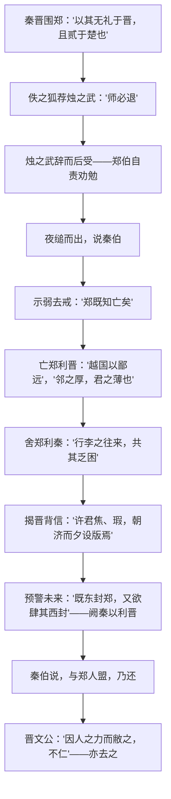

# 2 烛之武退秦师

## 作者与背景

- 选自《左传·僖公三十年》。《左传》全称《春秋左氏传》，相传为春秋末鲁国史官左丘明所作，是我国第一部叙事详备的编年体史书，与《公羊传》《穀梁传》合称"春秋三传"。
- 背景：公元前630年，晋文公联合秦穆公围攻郑国，理由是郑"无礼于晋"（晋文公流亡时郑未以礼相待）且"贰于楚"（依附楚国）。郑国危在旦夕，烛之武临危受命，夜缒出城，凭三寸之舌说退秦师。

## 内容梳理

说辞艺术：通篇站在秦国立场，先示弱消除戒备，再层层剖析利害——亡郑于秦无利、舍郑于秦有利、晋人背信不可靠、晋强必将损秦，句句为秦着想而处处为郑谋，终使秦晋联盟瓦解。

## 文言知识

| 类别 | 例句 | 说明 |
| --- | --- | --- |
| 通假字 | 共其乏困 | "共"通"供"，供给 |
| 通假字 | 秦伯说，与郑人盟 | "说"通"悦"，高兴 |
| 通假字 | 失其所与，不知 | "知"通"智"，明智 |
| 词类活用 | 晋军函陵，秦军氾南 | 名词作动词，驻军 |
| 词类活用 | 越国以鄙远 | 鄙：名词意动，把……当作边邑；远：形容词作名词，远地 |
| 词类活用 | 既东封郑 | 东：名词作状语；封：名词使动，使……成为疆界 |
| 词类活用 | 阙秦以利晋 | 使动用法，使……削减、使……获利 |
| 词类活用 | 夜缒而出 | 名词作状语，在夜里 |
| 特殊句式 | 以其无礼于晋 | 状语后置 |
| 特殊句式 | 夫晋，何厌之有 | 宾语前置，即"有何厌" |
| 特殊句式 | 是寡人之过也 | 判断句 |

## 典型例题

**例1** 烛之武的说辞为什么能打动秦穆公？
**解析**：①立场巧妙：全从秦国利益着眼，无一语为郑乞怜；②逻辑严密：先承认郑亡的可能以消除戒心，继而论证"越国以鄙远"之难、亡郑实为"邻之厚，君之薄"，再以"东道主""行李往来"展示存郑之利；③善用历史与预见：举晋惠公"朝济而夕设版"揭其背信，推断晋"既东封郑，又欲肆其西封"必将阙秦——利害对举，从根本上瓦解秦晋同盟。

**例2** 翻译并分析："因人之力而敝之，不仁；失其所与，不知；以乱易整，不武。"
**解析**：译文：依靠别人的力量却去损害他，不仁义；失掉自己的同盟者，不明智；用混乱相攻代替联合一致，不符合武德。这是晋文公拒绝子犯请击秦军的理由，表现其清醒克制、着眼霸业大局的政治家风度，也从侧面印证烛之武退秦之功已不可逆转。

## 易错点

- "若舍郑以为东道主"："东道主"指东方道路上（招待过客）的主人，古今异义。
- "行李之往来"："行李"指外交使者，非今之行装物品。
- "微夫人之力不及此"："夫人"是"那个人"（指秦穆公）；"微"意为"没有"。
- "贰于楚"指从属于晋的同时又依附楚，并非背叛楚国。
- 秦退兵是烛之武说辞之功，晋撤军是晋文公权衡利弊的决定，二者原因不同。

## 背记要点

1. 名句："臣之壮也，犹不如人；今老矣，无能为也已。""越国以鄙远，君知其难也。""夫晋，何厌之有？""因人之力而敝之，不仁。"
2. 人物形象：烛之武——深明大义、临危受命、机智善辩的爱国辩士；郑伯——勇于自责、善于纳谏；晋文公——理智克制。
3. 《左传》地位：我国第一部叙事详备的编年体史书，长于叙事与外交辞令。
4. 高考视角：文言劝说艺术的典范，常与《谏逐客书》《谏太宗十思疏》比较设题；"鄙""封""阙""与""微"等实词为高频考点。

## 自测题

1. 秦晋围郑的两条理由是什么？与秦国有直接利害关系吗？
2. 概括烛之武说辞的四个层次。
3. 指出"既东封郑""越国以鄙远"中的词类活用现象。
4. 晋文公为什么不肯攻击秦军？体现了他怎样的性格？

## 相关知识点

同为史传叙事名篇参见 [[3 鸿门宴]]；劝谏说理艺术参见 [[11 谏逐客书 / 与妻书]] 与 [[15 谏太宗十思疏 / 答司马谏议书]]。
