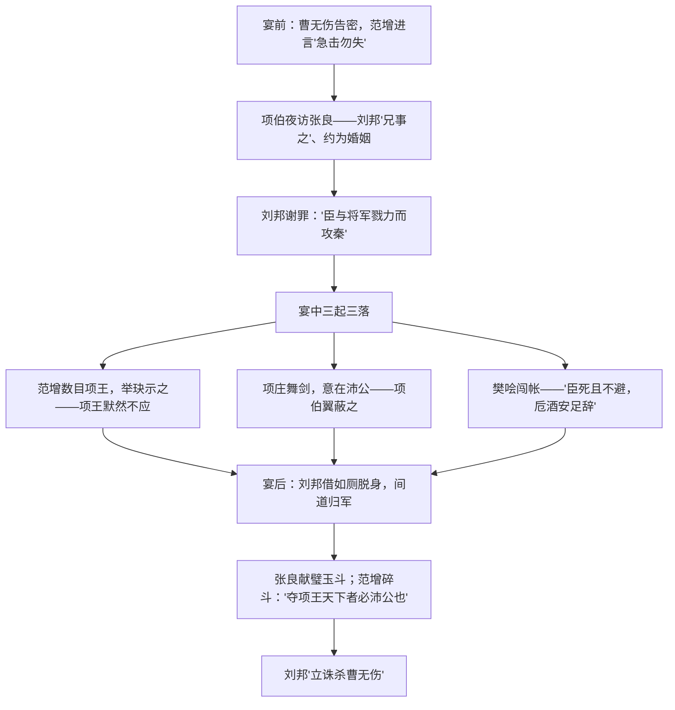

# 3 鸿门宴

## 作者与背景

- 选自《史记·项羽本纪》。司马迁（约前145—？），字子长，西汉史学家、文学家，因李陵之祸受宫刑而发愤著《史记》。《史记》是我国第一部纪传体通史，记黄帝至汉武帝约三千年史事，鲁迅誉之为"史家之绝唱，无韵之《离骚》"。
- 背景：公元前206年，刘邦先入关中，"距关，毋内诸侯"；项羽率四十万大军破关至鸿门，曹无伤告密，范增劝项羽"急击勿失"，楚汉矛盾一触即发。鸿门宴是楚汉相争的序幕和转折点。

## 内容梳理

人物对比：项羽——自矜功伐、寡谋轻信、优柔寡断（出卖曹无伤、不应范增）；刘邦——能屈能伸、机变果断、善用人才；范增老谋深算而不见用，张良沉稳多智，樊哙勇中有谋。

## 文言知识

| 类别 | 例句 | 说明 |
| --- | --- | --- |
| 通假字 | 距关，毋内诸侯 | "距"通"拒"，"内"通"纳" |
| 通假字 | 张良出，要项伯 | "要"通"邀"，邀请 |
| 通假字 | 令将军与臣有郤 | "郤"通"隙"，隔阂 |
| 通假字 | 旦日不可不蚤自来谢项王 | "蚤"通"早" |
| 词类活用 | 沛公军霸上 | 名词作动词，驻军 |
| 词类活用 | 项伯乃夜驰之沛公军 | 名词作状语，在夜里 |
| 词类活用 | 吾得兄事之 | 名词作状语，像对待兄长那样 |
| 词类活用 | 常以身翼蔽沛公 | 名词作状语，像鸟张开翅膀一样 |
| 词类活用 | 沛公旦日从百余骑来见项王 | 使动用法，使……跟从 |
| 特殊句式 | 此天子气也 | 判断句 |
| 特殊句式 | 大王来何操 | 宾语前置，"操何" |
| 特殊句式 | 若属皆且为所虏 | 被动句，"为所"表被动 |
| 特殊句式 | 得复见将军于此 | 状语后置 |

## 典型例题

**例1** 分析鸿门宴上的座次描写及其作用。
**解析**："项王、项伯东向坐；亚父南向坐……沛公北向坐；张良西向侍。"古时室内以东向为尊。项羽自居尊位，范增次之，刘邦位卑近于臣属，张良只能侍立——座次安排既写实又传神，凸显项羽的骄矜自大、目中无人，也表现刘邦隐忍屈从的策略，为其成功脱身作铺垫。

**例2** 有人说项羽不杀刘邦是"妇人之仁"，也有人认为是"君人之度"，你怎么看？
**解析**：从性格看，项羽自矜功伐，认为杀谢罪之人"不义"，且轻视刘邦，不听范增之谋，属政治上幼稚短视；从形势看，当时项羽实力远胜，未把刘邦视为对手。这一"不忍"错失良机，埋下垓下之败的种子。答题时应结合文本细节（默然不应、出卖曹无伤）辩证分析，言之成理即可。

## 易错点

- "沛公居山东时"："山东"指崤山以东，非今山东省。
- "约为婚姻"：指结为儿女亲家，古今异义。
- "备他盗之出入与非常也"："非常"指意外变故；"出入"为偏义复词，偏"入"。
- "再拜献大王足下"："再拜"是拜两次，非再次拜。
- 竖子成不了大事的"竖子"明骂项庄，实指项羽（一说兼指项伯）。

## 背记要点

1. 名句成语："项庄舞剑，意在沛公""人为刀俎，我为鱼肉""大行不顾细谨，大礼不辞小让""秋毫无犯（秋毫不敢有所近）""劳苦功高"。
2. 《史记》：第一部纪传体通史，十二本纪、三十世家、七十列传、十表、八书。
3. 情节线索：无伤告密（开端）→项伯夜访（发展）→宴会斗争（高潮）→刘邦脱身、诛杀曹无伤（结局）。
4. 高考视角：人物形象对比分析、座次文化常识、"为""因""且"等虚词与被动句宾语前置句是高频考点。

## 自测题

1. 概括宴会上"三起三落"的紧张情节。
2. 从鸿门宴看项羽、刘邦性格的差异及其对楚汉相争结局的影响。
3. 翻译："所以遣将守关者，备他盗之出入与非常也。"
4. 指出"若属皆且为所虏""大王来何操"的句式特点。

## 相关知识点

《左传》外交辞令参见 [[2 烛之武退秦师]]；秦亡背景与楚汉相争参见 [[第3课 秦统一多民族封建国家的建立]]；借古讽今的史论参见 [[16 阿房宫赋 / 六国论]]。
