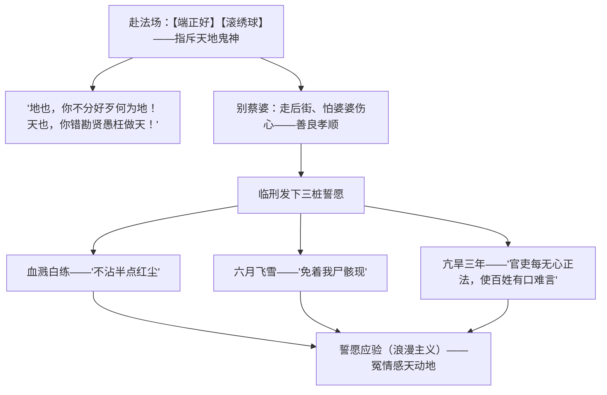

# 4 窦娥冤（节选）

## 作者与背景

- 关汉卿，号已斋叟，元代大都人，元杂剧奠基人，与马致远、郑光祖、白朴并称"元曲四大家"，代表作有《窦娥冤》《救风尘》《单刀会》等。
- 《感天动地窦娥冤》是元杂剧悲剧的典范。课文节选第三折（法场一折），是全剧矛盾冲突的高潮。元代吏治黑暗、司法腐败，底层百姓冤狱遍地，剧作正是这一社会现实的艺术反映。
- 元杂剧常识：一本通常四折一楔子；角色分旦、末、净、丑等；一折由同一宫调的一套曲子构成，由主角一人主唱（本剧为正旦窦娥）；剧本包括唱（曲词）、科（动作表情）、白（宾白）。

## 内容梳理

三桩誓愿层层递进：由个人明冤（白练）到感动天地（飞雪）再到惩罚世道（亢旱），反抗的对象从一己冤屈上升到整个黑暗吏治，窦娥的反抗精神达到顶点。

## 艺术特色

1. **现实主义与浪漫主义结合**：冤狱的成因是写实的（流氓横行、贪官滥刑），三桩誓愿的应验是浪漫的想象，借"感天动地"强化控诉力量，寄托人民伸冤的愿望。
2. **人物形象**：窦娥集善良（怕婆婆看见伤心而走后街、替婆婆招认）与刚烈（骂天骂地、发誓愿）于一身，善良愈显其冤，冤愈深则反抗愈烈。
3. **曲词本色当行**：【滚绣球】直抒胸臆，语言通俗泼辣而富于抒情性，是"本色派"语言的代表。
4. **矛盾冲突**：表层是窦娥与张驴儿、桃杌太守的冲突，深层是善良百姓与黑暗社会的冲突。

## 典型例题

**例1** 【滚绣球】一曲中窦娥为何指斥天地？这与她临刑发誓愿要"天"应验是否矛盾？
**解析**：窦娥原本相信"天地也，只合把清浊分辨"，但自身蒙冤让她看清"衙门自古向南开，就中无个不冤哉"的现实，故愤而怒斥"地也，你不分好歹何为地！天也，你错勘贤愚枉做天"。不矛盾：指斥是绝望中的抗议，发誓愿仍求天地为其作证，反映了封建时代百姓既怀疑"天理"又只能寄望"天理"的深刻悲剧性，也是作者浪漫主义手法的需要。

**例2** 分析"三桩誓愿"的典故运用及递进关系。
**解析**：血溅白练化用苌弘化碧、望帝啼鹃之典；六月飞雪用"邹衍下狱，六月飞霜"之典；亢旱三年用"东海孝妇"之典。三愿由证己冤（现于己身）→ 显天怒（现于天象）→ 惩官吏（祸及一方），范围渐广、时间渐长、指向渐深，把对个人命运的悲愤升华为对整个吏治社会的控诉。

## 易错点

- 关汉卿是元代作家，"元曲四大家"不含王实甫（《西厢记》）。
- 课文节选的是第三折（高潮），不是结局；全剧结局为窦天章重审昭雪。
- "科"是戏曲动作提示，"白"是道白，勿混淆。
- 三桩誓愿的顺序是白练—飞雪—亢旱，答题勿颠倒（递进关系依赖顺序）。
- 窦娥的悲剧根源是元代黑暗的吏治与社会制度，不能简单归为张驴儿个人作恶。

## 背记要点

1. 名句："地也，你不分好歹何为地！天也，你错勘贤愚枉做天！哎，只落得两泪涟涟。""有日月朝暮悬，有鬼神掌着生死权。"
2. 元杂剧四要素：四折一楔子、一人主唱、曲科白结合、旦末净丑。
3. 窦娥形象：善良孝顺+刚烈反抗的底层妇女，中国古典悲剧的典型。
4. 高考视角：戏曲常识（折、楔子、宫调、科白）、浪漫主义手法的作用、悲剧冲突的社会根源常考；王国维称《窦娥冤》"列之于世界大悲剧中，亦无愧色"。

## 自测题

1. 简述元杂剧的体制特点。
2. 【滚绣球】表达了窦娥怎样的思想感情？其语言有何特色？
3. 三桩誓愿分别用了什么典故？为什么说它们是递进的？
4. 结合"走后街"的细节，说明窦娥性格中善良与反抗的统一。

## 相关知识点

中外戏剧比较参见 [[5 雷雨（节选）]] 与 [[6 哈姆莱特（节选）]]；元代社会状况参见 [[第11课 辽宋夏金元的经济、社会与文化]]；明清戏曲名段参见 [[登岳阳楼 / 桂枝香·金陵怀古 / 念奴娇·过洞庭 / 游园（皂罗袍）]]。
