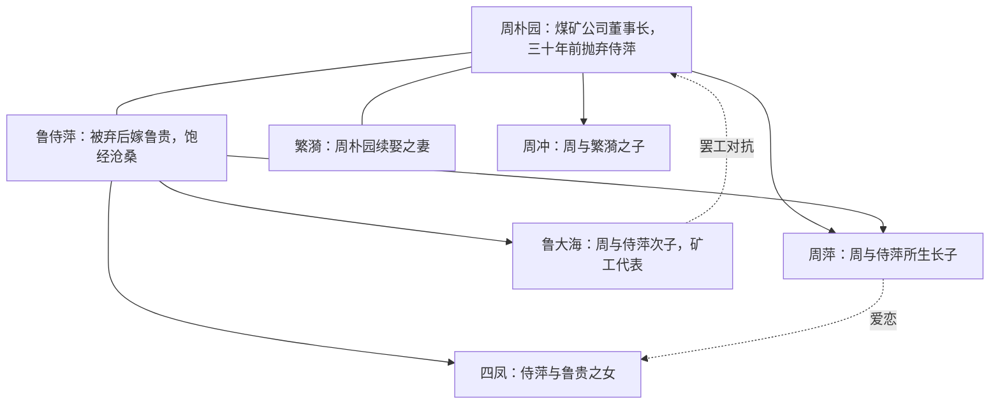

# 5 雷雨（节选）

## 作者与背景

- 曹禺（1910—1996），原名万家宝，中国现代杰出剧作家，代表作《雷雨》《日出》《原野》《北京人》。《雷雨》创作于1933年，是中国现代话剧成熟的标志。
- 全剧写周、鲁两家三十年的恩怨纠葛，在一个雷雨之日集中爆发。课文节选第二幕：三十年后周朴园与侍萍意外重逢、周朴园与鲁大海父子相认而对立的两场戏。
- 话剧特点：以对话（台词）和舞台说明为主要手段；《雷雨》遵循"三一律"式的紧凑结构，一天之内、两个场景，浓缩三十年矛盾。

## 内容梳理

节选剧情：周朴园由"无锡口音—关窗动作—梅家小姐"步步追问，认出侍萍后态度骤变——由怀念转为惊惧提防（"你来干什么？""谁指使你来的？"），继而想用支票了断；侍萍撕毁支票，控诉"我这些年的苦不是你拿钱算得清的"。随后鲁大海代表罢工工人前来交涉，被周朴园开除，周萍动手打大海——骨肉相残而不自知，悲剧氛围达到高潮。

## 艺术特色

1. **尖锐集中的戏剧冲突**：爱情恩怨与劳资对立交织，家庭悲剧与社会悲剧同构。
2. **个性化、动作性的语言**：周朴园的话由温情到冷酷急转，潜台词丰富（"你来干什么？"隐含恐惧与提防）；侍萍欲言又止的台词（"你是萍……凭什么打我的儿子？"）以谐音双关写尽悲怆。
3. **舞台说明的作用**：郁热、低沉的雷雨前氛围既交代环境，又象征人物郁结的情绪和即将爆发的冲突。
4. **周朴园形象的复杂性**：保留旧家具、记着侍萍生日的"怀念"有一定真实性，但当侍萍活着站在面前威胁其名誉利益时，自私冷酷立刻压倒温情——虚伪、专制的资本家兼封建家长。

## 典型例题

**例1** 周朴园对侍萍的怀念是真是假？
**解析**：应辩证分析。真的一面：侍萍已"死"，怀念无损其利益，且是对自己"体面"过去的美化与情感慰藉，保留旧摆设、旧习惯多年可证；假（有限）的一面：一旦发现侍萍活着并可能危及名誉地位，立即翻脸警惕、以金钱打发。这种"真情"以不妨碍现实利益为限，恰恰暴露其自私虚伪的本质。

**例2** 分析"你是萍，——凭什么打我的儿子？"一句的潜台词。
**解析**：侍萍认出周萍是自己的亲生儿子，脱口而出"你是萍"，母子相认之情几欲夺口而出；但身份不能揭穿，急中转为谐音"凭什么打我的儿子"。一句之中三十年辛酸、骨肉不能相认之痛、对周家的怨愤交织，是个性化语言与潜台词艺术的经典范例。

## 易错点

- 《雷雨》是话剧（多幕剧），不是戏曲；曹禺原名万家宝。
- 鲁大海是周朴园与侍萍之子，周萍与鲁大海是同母兄弟，人物关系勿弄错。
- 节选部分没有出现繁漪，分析节选冲突勿脱离文本扩展到全剧乱套用。
- 侍萍撕支票表现的是人格尊严与控诉，不是"清高不要钱"的简单标签。
- "雷雨"既是自然环境，又象征郁积待发的矛盾与摧毁旧秩序的力量，答题需点出双重含义。

## 背记要点

1. 关键台词："（惊愕）梅花？""你来干什么？""谁指使你来的？""我这些年的苦不是你拿钱算得清的。"
2. 冲突双线：周朴园—侍萍（情感恩怨线）；周朴园—鲁大海（劳资冲突线）。
3. 曹禺"四大名剧"：《雷雨》《日出》《原野》《北京人》。
4. 高考视角：潜台词分析、人物形象复杂性、舞台说明作用、戏剧冲突概括是话剧阅读的四大常考题型。

## 自测题

1. 周朴园认出侍萍前后态度发生了怎样的变化？说明了什么？
2. 举例说明节选中舞台说明的作用。
3. 侍萍为什么撕毁五千块钱的支票？
4. 概括节选部分的两组主要矛盾冲突及其社会意义。

## 相关知识点

古典悲剧比较参见 [[4 窦娥冤（节选）]]；西方悲剧参见 [[6 哈姆莱特（节选）]]；同写旧家庭崩溃的小说参见 [[12 祝福]]。
