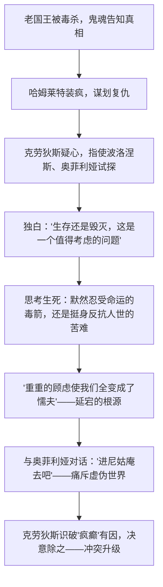

# 6 哈姆莱特（节选）

## 作者与背景

- 莎士比亚（1564—1616），文艺复兴时期英国伟大的戏剧家、诗人，代表作有"四大悲剧"（《哈姆莱特》《奥赛罗》《李尔王》《麦克白》）及喜剧《威尼斯商人》《仲夏夜之梦》等。
- 《哈姆莱特》约作于1601年。丹麦王子哈姆莱特为被叔父克劳狄斯毒杀的父王复仇，在复仇中审视人性与时代。课文节选第三幕第一场：克劳狄斯指使奥菲利娅试探哈姆莱特，包含著名独白"生存还是毁灭"。
- 时代背景：文艺复兴后期，人文主义理想与黑暗现实发生尖锐冲突，哈姆莱特的忧郁与延宕正是人文主义者精神危机的写照。

## 内容梳理

独白剖析：由"生存还是毁灭"的抉择，到对人世苦难（压迫者的凌辱、法律的迁延、官吏的横暴）的列举，再到"对死后的恐惧"使人踌躇——展示了一个思想者在行动与思考之间的深刻矛盾。

## 艺术特色

1. **内心独白刻画人物**："生存还是毁灭"的独白把外部冲突内化为灵魂的自我辩论，使哈姆莱特成为世界文学中最富思想深度的形象之一。
2. **多重矛盾交织**：哈姆莱特与克劳狄斯的复仇冲突（主线）、与奥菲利娅的爱情悲剧、与自身延宕性格的内在冲突层层交织。
3. **语言诗化而富哲理**：素体诗与散文交错，妙语、双关与激烈的诅咒并存（对奥菲利娅忽冷忽热的语言既是装疯也是真痛）。
4. **悲剧性格**：歌德称其"一件伟大的事业担负在一个不能胜任的人身上"；哈姆莱特的忧郁源于理想幻灭，延宕源于对行动意义的不断追问——"时代脱节了，倒霉的我却要负起重整乾坤的责任"。

## 典型例题

**例1** 如何理解"生存还是毁灭，这是一个值得考虑的问题"这段独白的内涵？
**解析**：①表层是生死抉择：忍受苦难地活着，还是以死（反抗）求解脱；②深层是行动与思想的矛盾：死亡如"睡眠"诱人，但"死后的梦"不可知，"重重的顾虑使我们全变成了懦夫"；③时代内涵：独白列举的社会不公表明哈姆莱特之思已超越个人复仇，上升为对整个时代罪恶的审视，体现人文主义者面对黑暗现实的困惑与求索。

**例2** "一千个读者就有一千个哈姆莱特"，结合节选谈谈哈姆莱特形象的多面性。
**解析**：他是敏锐的思想者（独白中对生死、世道的哲学思辨）、深情而痛苦的恋人（对奥菲利娅爱恨交织）、机警的复仇者（装疯试探、识破试探）；同时又忧郁延宕、言多于行。多面性源于人文主义理想与"颠倒混乱的时代"的冲突，这正是形象具有永恒阐释空间的原因。

## 易错点

- 莎士比亚属文艺复兴时期（16—17世纪之交），不是启蒙运动时期。
- "四大悲剧"不含《罗密欧与朱丽叶》（早期爱情悲剧）。
- 哈姆莱特的延宕不是怯懦无能，而是思想者对行动意义的追问，答题勿简单化。
- 对奥菲利娅说"进尼姑庵去吧"，既有装疯成分，也有对女性乃至污浊世界的激愤，需双面理解。
- 课文通行译本为朱生豪译本，人名译法（克劳狄斯、波洛涅斯、奥菲利娅）以课本为准。

## 背记要点

1. 名句："生存还是毁灭，这是一个值得考虑的问题。""重重的顾虑使我们全变成了懦夫。"（朱生豪译）
2. 四大悲剧：《哈姆莱特》《奥赛罗》《李尔王》《麦克白》。
3. 形象定位：人文主义者的典型——忧郁王子，理想与现实冲突下的延宕的复仇者。
4. 高考视角：中外戏剧比较（窦娥之冤诉诸天地、哈姆莱特之痛诉诸内心）、独白的作用、悲剧根源分析是常考角度。

## 自测题

1. 克劳狄斯为什么安排奥菲利娅与哈姆莱特"偶遇"？结果如何？
2. 概括"生存还是毁灭"独白的思路层次。
3. 哈姆莱特"延宕"的原因是什么？
4. 比较窦娥、哈姆莱特两个悲剧形象反抗方式的不同。

## 相关知识点

中国古典悲剧参见 [[4 窦娥冤（节选）]]；现代话剧冲突艺术参见 [[5 雷雨（节选）]]；文艺复兴背景参见 [[第8课 欧洲的思想解放运动]]。
