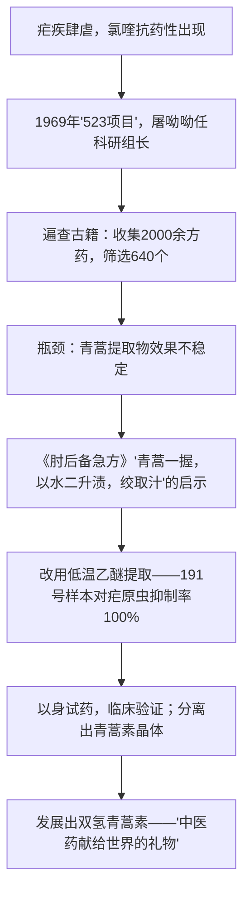

# 7 青蒿素：人类征服疾病的一小步 / 一名物理学家的教育历程

## 作者与背景

- 《青蒿素：人类征服疾病的一小步》作者屠呦呦，中国药学家，2015年因发现青蒿素获诺贝尔生理学或医学奖，是首位获诺贝尔科学类奖项的中国本土科学家。本文根据其2011年获拉斯克奖时的演讲整理，回顾青蒿素的发现历程。
- 《一名物理学家的教育历程》作者加来道雄，美籍日裔理论物理学家，超弦理论奠基人之一，著有《超越时空》等科普名作。本文讲述童年两件事——观察鲤鱼世界的遐想与探究爱因斯坦未竟事业——如何引导他走上理论物理之路。

## 内容梳理

《一名物理学家的教育历程》思路：观察水池鲤鱼→想象"鲤鱼科学家"对水面之外世界的无知→类比人类对高维空间的认知局限；听闻爱因斯坦未完成的统一场论→"侦探小说"般的好奇→自建云室、加速器实验→走向理论物理。核心：想象力、好奇心（兴趣）与实验（实践）精神是科学生涯的基石。

## 艺术特色

1. **《青蒿素》**：以时间为线索的科学叙事，语言平实准确；小标题结构清晰（发现青蒿素的抗疟疗效、从分子到药物、中医药学的贡献等）；处处体现团队协作与"关键一步"的谦逊（"一小步"呼应阿姆斯特朗名言）。
2. **《教育历程》**：以两个童年趣事组织全篇，叙事生动，善用类比（鲤鱼世界之于人类世界）把高维空间等抽象概念讲得通俗有趣，体现科普文的形象化表达。
3. 两文共性：真实的科学精神——尊重事实、大胆想象、勇于实践、甘于寂寞。

## 典型例题

**例1** 东晋葛洪《肘后备急方》对青蒿素的发现起了什么作用？这给我们什么启示？
**解析**：作用："绞取汁"的记载提示常规加热煎煮可能破坏青蒿有效成分，屠呦呦由此改用低温乙醚提取，突破了实验瓶颈，获得抑制率100%的提取物。启示：①传统中医药是尚待发掘的宝库，古代文献可为现代科研提供灵感；②科学发现需要细致的文献功夫与敏锐的联想；③传统经验须经现代科学方法验证转化。

**例2** 加来道雄为什么详写"鲤鱼科学家"的遐想？
**解析**：①以鲤鱼囿于水池、无法理解水面之外的世界，类比人类可能囿于三维时空、难以想象高维空间，将抽象前沿理论形象化；②表明作者自童年起就具有超越常识的想象力与好奇心，这正是其日后研究超弦理论（高维时空理论）的思维起点；③照应"教育历程"的主题——真正的科学教育始于兴趣与想象，而非课堂灌输。

## 易错点

- 屠呦呦获2015年诺贝尔生理学或医学奖，此前2011年获拉斯克奖，两奖勿混。
- 《肘后备急方》作者是东晋葛洪，不是李时珍（《本草纲目》为明代）。
- 青蒿素发现是"523项目"集体协作的成果，屠呦呦的贡献是关键性突破，答题应兼顾。
- 加来道雄是美籍日裔物理学家，研究方向是超弦理论（统一场论方向），不是实验物理学家。
- 两篇是知识性读物（科普/科学传记），阅读重点是梳理科学过程与科学精神，勿当文学散文分析。

## 背记要点

1. 关键事实：青蒿素—低温乙醚提取—191号样本—双氢青蒿素；"青蒿素是中医药学给予人类的一份珍贵礼物"。
2. 科学精神要点：目标坚定、文献奠基、实验求证、以身试药的奉献、团队协作。
3. 《教育历程》两件事：鲤鱼世界的遐想（想象力）＋建造电子感应加速器（实践与毅力）。
4. 高考视角：实用类文本阅读常考信息筛选整合、科学发现过程的概括、科学精神的归纳与启示类主观题。

## 自测题

1. 按时间顺序概括青蒿素发现的关键节点。
2. 屠呦呦团队"以身试药"体现了怎样的精神？
3. "鲤鱼科学家"的类比说明了什么道理？
4. 两篇文章共同体现了哪些科学素养？对你的学习有何启示？

## 相关知识点

科学性说明文的写法参见 [[8 中国建筑的特征]]；学术随笔的思辨参见 [[9 说“木叶”]]；信息筛选能力训练参见 [[信息时代的语文生活（认识·善用·辨识多媒介）]]。
