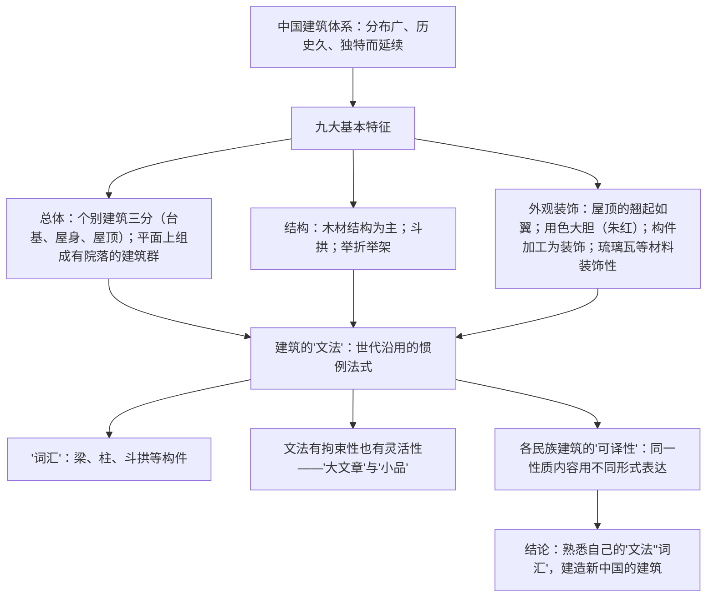

# 8 中国建筑的特征

## 作者与背景

- 梁思成（1901—1972），梁启超之子，中国现代建筑学家、建筑史学家，中国建筑教育奠基人之一，主持参与人民英雄纪念碑、中华人民共和国国徽的设计，著有《中国建筑史》《清式营造则例》。
- 本文是一篇自然科学小论文（科学说明文），发表于1954年。作者以建筑学家的眼光系统总结中国建筑体系的基本特征，并提出建筑的"文法"与"可译性"理论，呼吁在新建筑中继承民族传统。

## 内容梳理

九大特征的说明顺序：由整体到局部、由主（结构）到次（装饰），逻辑严密。

## 艺术特色

1. **善用比喻说明**：以语言学的"文法""词汇"喻建筑的法式与构件，以"可译性"喻各民族建筑对同类功能的不同表达，把专业知识讲得通俗易懂。
2. **说明顺序清晰**：先概说体系地位，再分述九大特征（总体布局→结构方法→装饰外观），后提炼理论（文法—可译性），最后落到现实主张。
3. **说明方法多样**：举例子（天坛、宫殿）、作比较（中外建筑对比）、打比方（屋顶"如鸟斯革，如翚斯飞"引《诗经》）、下定义（斗拱等）。
4. **科学性与人文情怀统一**：字里行间洋溢对民族建筑的珍视与文化自信。

## 典型例题

**例1** 如何理解中国建筑的"文法"与"词汇"？
**解析**："文法"指中国建筑在世代实践中形成、为匠师遵守的惯例法式（如梁架组合规则、彩画作法），是建筑的组织规律；"词汇"指构成建筑的基本构件与要素（梁、柱、斗拱、门窗等）。二者关系如同语言：以有限"词汇"依"文法"组合，既有拘束性（保证风格统一）又有灵活性（可创作出多样的"文章"——从"大文章"宫殿庙宇到"小品"山亭水榭）。这一比喻揭示了传统的规律性与创造空间的统一。

**例2** 怎样理解各民族建筑之间的"可译性"？
**解析**：指不同民族的建筑用各自的"语言"（形式、手法）表达同样的功能与内容，如同一个意思可用不同语言翻译——罗马凯旋门与北京琉璃牌楼、巴黎纪念柱与我国华表，功能性质相同而形式各异。其意义在于：既承认人类建筑需求的共通性，又强调民族形式的独特价值，为"继承传统、建造新中国建筑"的主张提供理论依据。

## 易错点

- 本文是科学论文/说明文，不是散文；分析语言重"准确"，兼及生动。
- 九大特征中"木材结构""斗拱""举折举架"属结构特征，是中国建筑体系的核心，勿与装饰特征混淆。
- "文法"具有拘束性与灵活性两面，只答一面不完整。
- 梁思成主张的是继承传统精神以创造新建筑，不是复古照搬。
- "如鸟斯革，如翚斯飞"出自《诗经·小雅·斯干》，形容屋顶（屋角）如翼轻展。

## 背记要点

1. 九大特征分类记忆：布局二（三分、院落群）＋结构三（木结构、斗拱、举折举架）＋装饰四（屋顶、色彩、构件装饰、材料装饰）。
2. 核心概念：建筑的"文法""词汇"、各民族建筑的"可译性"。
3. 作者身份：建筑学家梁思成，参与国徽与人民英雄纪念碑设计。
4. 高考视角：实用类/论述类文本常考概念理解（文法、可译性）、说明顺序与方法、筛选整合九大特征等信息。

## 自测题

1. 中国建筑的九大基本特征可归为哪三类？
2. 举例说明本文使用的三种说明方法。
3. 建筑"文法"的拘束性与灵活性分别指什么？
4. 作者写作本文的现实目的是什么？

## 相关知识点

科学类文本阅读参见 [[7 青蒿素：人类征服疾病的一小步 / 一名物理学家的教育历程]]；文艺随笔的概念辨析参见 [[9 说木叶]]。
