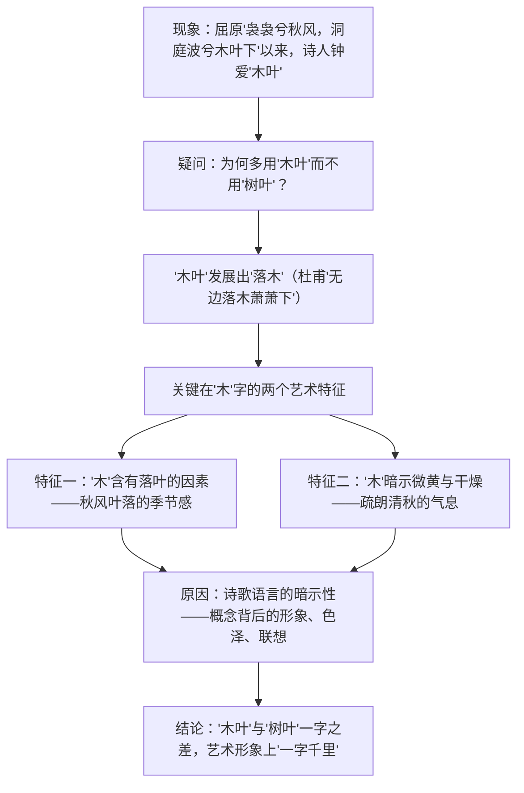

# 9 说“木叶”

## 作者与背景

- 林庚（1910—2006），字静希，现代诗人、古典文学学者，北京大学教授，著有《唐诗综论》《诗人屈原及其作品研究》等，提出盛唐诗歌"少年精神""盛唐气象"等著名论断。
- 本文是一篇文艺随笔（文艺评论），从"木叶"这一古典诗歌常见意象入手，探讨诗歌语言的暗示性问题，是诗歌鉴赏理论的经典篇目。

## 内容梳理

对比链条："树叶"（枝叶繁茂、饱含水分、浓阴湿润）↔"木叶"（落叶纷飞、微黄干燥、疏朗爽朗）↔"落木"（连"叶"的缠绵也洗净，更显空阔）。

## 艺术特色

1. **小切口大问题**：由一个意象的用字差异切入，引出"诗歌语言暗示性"的普遍规律，以小见大。
2. **例证丰赡**：大量征引屈原、谢庄、陆厥、王褒、杜甫、黄庭坚等诗句，在比较中辨析毫厘。
3. **比较分析法**："木叶"与"树叶"、"木叶"与"落叶"、"木叶"与"落木"层层比对，逐步逼近结论。
4. **语言亲切灵动**：随笔笔调，设问引路，理论文章而无枯涩之感。

## 典型例题

**例1** 什么是诗歌语言的"暗示性"？请结合"木"字说明。
**解析**：暗示性指词语在概念意义之外所潜藏的形象、色彩与联想意义，它"仿佛是概念的影子，常常躲在概念的背后"。"木"作为概念与"树"相去无几，但艺术形象上，"木"让人想起木头、木料，暗示落叶、微黄、干燥，带来疏朗的清秋气息；"树"则使人联想枝繁叶茂、湿润浓阴。诗人正是敏感于这种潜在力量，故"木叶"成为秋之绝唱的用字。

**例2** 有人认为本文实质是谈诗歌鉴赏方法，你如何理解？
**解析**：同意。文章表面辨析"木叶"一词，实则示范了鉴赏路径：①抓住意象用字的细微差别；②调动联想比较其形象效果；③理解"一字千里"背后的语言暗示性。启示我们读诗须从语言的细微处入手，体察言外之意、象外之旨，这正是古典诗歌鉴赏的核心能力。

## 易错点

- "袅袅兮秋风，洞庭波兮木叶下"出自屈原《九歌·湘夫人》，勿误记为《离骚》。
- "无边落木萧萧下，不尽长江滚滚来"是杜甫《登高》名句。
- "木"的两个艺术特征（含落叶因素；暗示微黄干燥）须完整记忆，只答其一常失分。
- 作者并非说"树叶"不能入诗，而是说不同语境中二者暗示的形象氛围不同，勿绝对化。
- 本文文体是文艺随笔（论述类），不是说明文。

## 背记要点

1. 核心观点：诗歌语言具有暗示性；"木叶"与"树叶"在概念上相差无几，在艺术形象领域却"一字千里"。
2. "木"的两个艺术特征：①含有落叶的因素；②有微黄、干燥之感，带来疏朗的清秋气息。
3. 关键引诗："袅袅兮秋风，洞庭波兮木叶下"（屈原）、"无边落木萧萧下"（杜甫）、"高树多悲风，海水扬其波"（曹植）。
4. 高考视角：论述类文本常考概念理解（暗示性）、论证方法（举例、比较）与迁移运用（分析"梅""柳""月"等意象的暗示义）。

## 自测题

1. 文章围绕"木叶"提出并解决了什么问题？行文思路如何？
2. "木"的两个艺术特征分别是什么？
3. 如何理解"这暗示性仿佛是概念的影子"？
4. 运用本文观点，分析"杨柳"意象在古诗中的暗示意义。

## 相关知识点

意象鉴赏实践参见 [[登岳阳楼 / 桂枝香·金陵怀古 / 念奴娇·过洞庭 / 游园（皂罗袍）]]；同单元知识性读物参见 [[8 中国建筑的特征]]；语言敏感性的培养参见 [[信息时代的语文生活（认识·善用·辨识多媒介）]]。
