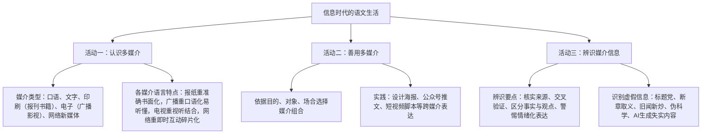

# 信息时代的语文生活（认识·善用·辨识多媒介）

## 单元定位与背景

- 本单元属"跨媒介阅读与交流"学习任务群，是活动类单元，围绕三个学习活动展开：认识多媒介、善用多媒介、辨识媒介信息。
- 目标：了解不同媒介的传播特点与语言特征，学会依据情境选择合适媒介表达交流，提高辨识媒介信息真伪与立场的能力，做有媒介素养的信息时代公民。

## 内容梳理

### 媒介比较表

| 媒介 | 传播特点 | 语言特征 | 局限 |
| --- | --- | --- | --- |
| 报纸书刊 | 深度、可保存 | 严谨、书面化 | 时效较慢 |
| 广播 | 伴随性、迅捷 | 口语化、简明上口 | 转瞬即逝、无画面 |
| 电视 | 视听兼备、直观 | 解说与画面配合 | 线性收看、互动弱 |
| 网络新媒体 | 即时、海量、交互、个性推送 | 简短活泼、多模态（文字图片视频弹幕） | 碎片化、真伪混杂、信息茧房 |

## 核心方法

1. **辨识信息"四问法"**：谁发布的（来源权威性）？有无证据（事实核查）？是事实还是观点（表述性质）？为何发布（立场动机）？
2. **交叉验证**：重要信息至少查证两个以上独立权威信源；留意发布时间，防"旧闻新炒"。
3. **警惕"信息茧房"**：算法个性化推送使人只见同质信息，应主动接触多元观点。
4. **负责任地表达**：不造谣、不信谣、不传谣；网络表达同样要守法律边界与文明底线。

## 典型例题

**例1** 某公众号文章标题为"震惊！这种常见食物竟致癌，99%的人还在吃！"请从媒介素养角度分析并给出应对。
**解析**：该标题具有典型"标题党"特征：①"震惊""竟"等词煽动情绪；②"99%"数据无来源，夸大其词；③以恐惧诱导点击转发。应对：查证信息源是否权威（有无医学机构、论文依据）；到权威平台交叉验证；区分"含有某物质"与"达到致癌剂量"的事实差异；不轻易转发，可举报失实内容。

**例2** 班级要宣传校园读书节，请为"海报+公众号推文+短视频"的组合方案各拟一条设计要点。
**解析**：海报——视觉冲击优先：主题语精炼醒目（如"共赴一场纸上山海"），配图与色彩统一，信息（时间地点）一目了然；公众号推文——深度与互动：正文分板块介绍活动亮点，嵌入报名链接与往届图片，结尾设留言互动；短视频——15至60秒内以镜头语言呈现"书页翻动+同学荐书"场景，配字幕与音乐，结尾引导关注。要点在于依据各媒介传播特点分配内容。

## 易错点

- "跨媒介"不等于简单把文字搬上屏幕，而是依据媒介特性重组内容与语言形式。
- 事实与观点的区分：可验证的陈述是事实，含评价推断的是观点；新闻报道中二者常混杂。
- 网络信息并非一律不可信，权威机构官方发布同样通过网络传播，关键在核查信源。
- "信息茧房"是算法与个人选择共同造成的，破解之道在主动多元获取，而非拒用网络。

## 背记要点

1. 三大活动：认识多媒介、善用多媒介、辨识媒介信息。
2. 辨识四问：来源、证据、事实/观点、动机。
3. 媒介选择原则：看目的、看对象、看场合，扬各媒介之长。
4. 高考视角：语言文字运用题常考新闻压缩、标题拟写、辨析网络语言得体性；论述类与实用类文本亦考信息真伪与观点态度辨析。

## 自测题

1. 比较报纸与网络新媒体在传播特点、语言特征上的差异。
2. 什么是"信息茧房"？如何避免？
3. 举例说明"事实"与"观点"的区别。
4. 为学校运动会设计一个跨媒介宣传方案（至少两种媒介）并说明理由。

## 相关知识点

科学信息的筛选整合参见 [[7 青蒿素：人类征服疾病的一小步 / 一名物理学家的教育历程]]；语言的暗示与修辞敏感参见 [[9 说“木叶”]]；演讲这一传统媒介形式参见 [[10 在《人民报》创刊纪念会上的演说 / 在马克思墓前的讲话]]。
