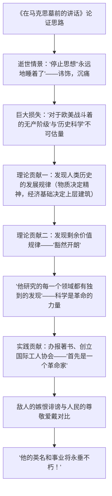

# 10 在《人民报》创刊纪念会上的演说 / 在马克思墓前的讲话

## 作者与背景

- 《在〈人民报〉创刊纪念会上的演说》：马克思（1818—1883），马克思主义创始人。1856年4月14日在伦敦《人民报》创刊四周年宴会上发表演说，揭示19世纪工业与科学的巨大力量同社会衰颓并存的矛盾，指出无产阶级革命的历史必然。
- 《在马克思墓前的讲话》：恩格斯（1820—1895），马克思的亲密战友。1883年3月17日马克思葬于伦敦海格特公墓，恩格斯以此悼词总结马克思一生的理论贡献与革命实践，抒发深切悼念。文体为悼词（属演讲辞），兼具议论、记叙、抒情。

## 内容梳理

《演说》思路：以19世纪对比开篇——机器、科学的伟力与饥饿、衰颓并存→"一切发明和进步，似乎结果是使物质力量成为有智慧的生命，而人的生命则化为愚钝的物质力量"→历史本身是审判官，无产阶级是执刑者（"狡狯的精灵""好人儿罗宾"的比喻）。

## 艺术特色

1. **结构严谨**（《讲话》）：由"损失"总起，按理论贡献→实践贡献递进（"因为马克思首先是一个革命家"承上启下），层层推进，过渡自然。
2. **情感深沉而克制**：讳饰手法（"停止思想""安静地睡着了"）以平静语言写巨大悲痛。
3. **高度凝练的评价语言**："不可估量的损失""空白""不久""繁芜丛杂"等措辞分寸精准。
4. **《演说》善用比喻与对比**：以"狡狯的精灵"喻在旧社会内部孕育的革命力量，以工业科学之"光"对比社会之"暗"，气势磅礴，思辨深刻。

## 典型例题

**例1** 《在马克思墓前的讲话》第一段"停止思想""永远地睡着了"用了什么修辞？有何效果？
**解析**：讳饰（婉曲）。不忍直言"死"，以"停止思想"突出马克思思想家的身份——他的逝世首先是人类思想的巨大损失；"睡着了"以安详之语寄托无限痛惜。措辞平静而情感深挚，奠定全文沉痛而崇敬的基调。

**例2** 为什么说马克思"首先是一个革命家"？这样安排层次有何用意？
**解析**：因为在马克思看来，科学是"一种在历史上起推动作用的、革命的力量"，理论研究的最终目的是指导无产阶级解放实践；他毕生办报、组织国际工人协会，直接投身斗争。先讲理论贡献再突出革命实践，以"首先"强调其理论与实践统一、以改造世界为使命的本质，使评价层层升高，逻辑与情感同步推进。

## 易错点

- 两篇作者勿混：《演说》是马克思本人所作，《讲话》是恩格斯悼念马克思之作。
- 马克思的"两大发现"：人类历史发展规律＋剩余价值规律，顺序与内容须记准。
- 《讲话》文体是悼词（演讲辞），以议论为主，兼有记叙抒情，不是新闻。
- "各国政府……驱逐他，资产者……诽谤他，诅咒他"与"千百万革命战友……尊敬、爱戴和悼念"是对比，反衬其伟大，勿孤立摘句理解。
- 《演说》中"历史本身是审判官，无产阶级是执刑者"是核心结论句。

## 背记要点

1. 《讲话》名句："他的英名和事业将永垂不朽！""正像达尔文发现有机界的发展规律一样，马克思发现了人类历史的发展规律。"
2. 两大发现：历史唯物主义（人类历史发展规律）、剩余价值规律。
3. 《演说》名句："一切发明和进步，似乎结果是使物质力量成为有智慧的生命，而人的生命则化为愚钝的物质力量。"
4. 高考视角：演讲辞的针对性、鼓动性与结构层次是常考点；讳饰、对比等修辞的表达效果常设题。

## 自测题

1. 《讲话》从哪两个方面总结马克思的贡献？其间如何过渡？
2. 分析"这位巨人逝世以后所形成的空白，不久就会使人感觉到"中"空白""不久"的表达效果。
3. 《演说》开篇为什么从"19世纪的特征"谈起？
4. 悼词一般包含哪些部分？本文情感表达有何特点？

## 相关知识点

马克思主义诞生的历史背景参见 [[第11课 马克思主义的诞生与传播]]；书信体的抒情与说理参见 [[11 谏逐客书 / 与妻书]]；媒介与演讲传播参见 [[信息时代的语文生活（认识·善用·辨识多媒介）]]。
