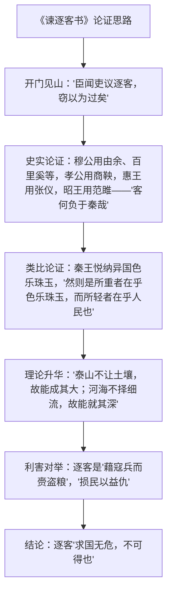

# 11 谏逐客书 / 与妻书

## 作者与背景

- 《谏逐客书》：李斯（？—前208），楚国上蔡人，秦代政治家、文学家，官至丞相。公元前237年，秦宗室借郑国渠事件建议驱逐一切客卿，李斯（楚人，亦在被逐之列）上此书谏秦王嬴政，秦王读后废除逐客令。"书"为奏疏类公文。鲁迅评："秦之文章，李斯一人而已。"
- 《与妻书》：林觉民（1887—1911），福建闽县人，黄花岗七十二烈士之一。1911年4月广州起义（黄花岗起义）前三天，在香港写给妻子陈意映的绝笔信，写于一方手帕之上，情理交融，被誉为"百年情书"。

## 内容梳理

《与妻书》情感脉络："吾今以此书与汝永别矣"（诀别之痛）→ 回忆夫妻恩爱（后街之屋、疏梅筛月影之景）→ 说明赴死之由："吾至爱汝，即此爱汝一念，使吾勇于就死也""吾充吾爱汝之心，助天下人爱其所爱"→ 嘱托后事，"吾平生未尝以吾所志语汝"之憾——由儿女之情升华为为天下人谋永福的大爱。

## 文言知识

| 类别 | 例句 | 说明 |
| --- | --- | --- |
| 通假字 | 遂散六国之从 | "从"通"纵"，合纵 |
| 通假字 | 向使四君却客而不内 | "内"通"纳"，接纳 |
| 通假字 | 几家能彀 | "彀"通"够" |
| 词类活用 | 西取由余于戎 | 名词作状语，向西 |
| 词类活用 | 蚕食诸侯 | 名词作状语，像蚕那样 |
| 词类活用 | 却宾客以业诸侯 | 却：使动，使……退却；业：使动，使……成就功业 |
| 词类活用 | 瓜分之日可以死 | 名词作状语，像切瓜一样 |
| 词类活用 | 当亦乐牺牲吾身与汝身之福利 | 意动，以……为乐 |
| 特殊句式 | 西取由余于戎 | 状语后置 |
| 特殊句式 | 此非所以跨海内、制诸侯之术也 | 判断句（否定判断） |
| 特殊句式 | 称心快意，几家能彀 | 主谓倒装（感叹） |

## 典型例题

**例1** 《谏逐客书》为什么能说服秦王收回成命？
**解析**：①立足点高：全文不为客卿（含自己）鸣冤，而始终紧扣秦国"跨海内、制诸侯"的统一大业立论，处处为秦谋；②论证充分：铺陈四代先君用客成功的史实，再以秦王喜爱异国色乐珠玉类比，指出"重物轻人"的自相矛盾；③正反对举："泰山不让土壤"喻纳客之利，"藉寇兵而赍盗粮"喻逐客之害，利害昭然；④辞采飞扬：排比铺陈，气势充沛，兼具说服力与感染力。

**例2** 《与妻书》中"吾至爱汝，即此爱汝一念，使吾勇于就死也"如何统摄全文？
**解析**：此句是全文情与理的枢纽：正因至爱妻子，深知离别之痛，才推己及人，不忍天下人受生离死别之苦；"以天下人为念""为天下人谋永福"是小爱的扩展与升华。全信忆恩爱愈深，则就死之志愈见崇高，儿女情长与革命豪情非但不矛盾，反而互相成就，这正是本文感人至深的原因。

## 易错点

- 《谏逐客书》的"书"是上行公文（奏疏），非书信；《与妻书》才是家书。
- 李斯是秦代（战国末入秦）政治家，上书时嬴政尚未称帝，称"秦王"。
- "太山不让土壤"的"让"是辞让、拒绝；"河海不择细流"的"择"同义。
- 《与妻书》"司马春衫"用白居易《琵琶行》"江州司马青衫湿"之典（"春衫"系林觉民笔误或有意化用，考试从课本）；"太上之忘情"化用"圣人忘情"语。
- 黄花岗起义在1911年4月，早于同年10月的武昌起义，勿混。

## 背记要点

1. 《谏逐客书》名句："泰山不让土壤，故能成其大；河海不择细流，故能就其深；王者不却众庶，故能明其德。""此所谓藉寇兵而赍盗粮者也。"
2. 《与妻书》名句："吾至爱汝，即此爱汝一念，使吾勇于就死也。""吾充吾爱汝之心，助天下人爱其所爱，所以敢先汝而死，不顾汝也。"
3. 文体对照：奏疏重理（铺陈利害）、家书重情（以情驭理），同为"至情至理"之文。
4. 高考视角：《谏逐客书》的铺陈排比与劝说策略、《与妻书》情理关系是主观题热点；两篇实词（让、择、内、业）与句式常入文言小题。

## 自测题

1. 《谏逐客书》列举了哪四位秦君用客的史实？各成就了什么功业？
2. 分析"藉寇兵而赍盗粮"的比喻义。
3. 林觉民从哪几个方面向妻子解释"敢先汝而死"的原因？
4. 比较两篇文章说理方式的异同。

## 相关知识点

劝谏艺术源流参见 [[2 烛之武退秦师]] 与 [[15 谏太宗十思疏 / 答司马谏议书]]；辛亥革命背景参见 [[第19课 辛亥革命]]。
